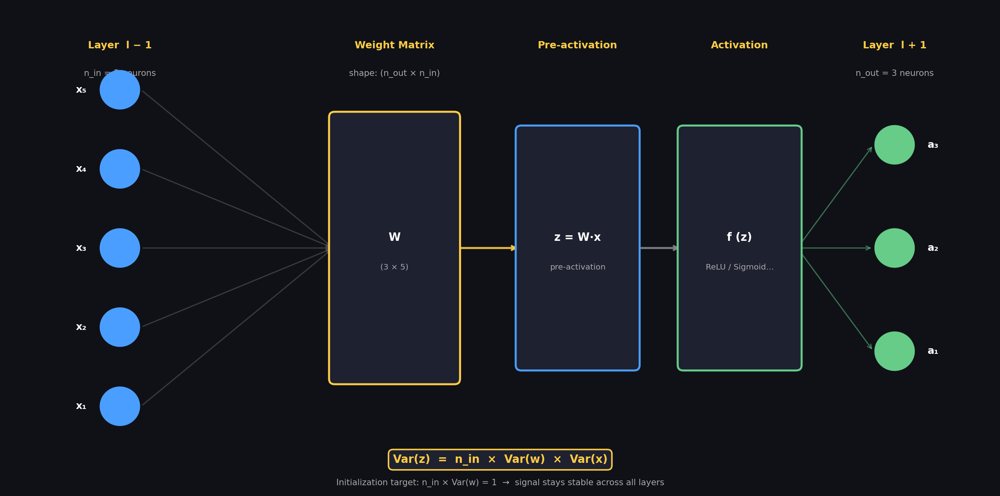

# Activation Functions — Interview Q&A

---

## Notation Reference — One Layer of a Neural Network



| Symbol | What it is | In the diagram |
|--------|-----------|----------------|
| $x$ | Input vector (activations from previous layer) | $x_1 \dots x_{n_{\text{in}}}$ on the left |
| $n_{\text{in}}$ | Number of inputs to this layer | width of the left side |
| $n_{\text{out}}$ | Number of outputs this layer produces | width of the right side |
| $W$ | Weight matrix — shape $(n_{\text{out}} \times n_{\text{in}})$ | the connections between inputs and pre-activation |
| $z = W \cdot x$ | Pre-activation — raw weighted sum, before $f$ | inside the box |
| $f(z)$ | Activation function (ReLU, Sigmoid, Tanh …) | applied after the box |
| $a = f(z)$ | Post-activation output fed into the next layer | $a$ on the right |
| $\text{Var}(w)$ | Variance of individual weight values in $W$ | what initialization tunes |

> **Key equation:** $\text{Var}(z) = n_{\text{in}} \cdot \text{Var}(w) \cdot \text{Var}(x)$
> Each output neuron sums $n_{\text{in}}$ terms — so variance scales linearly with $n_{\text{in}}$.
> Initialization schemes pick $\text{Var}(w)$ to make this product $= 1$,
> keeping the signal stable across every layer.

---

## Q1: What is the range of the derivative of the sigmoid function?

The derivative of the standard logistic sigmoid ranges over $(0, 0.25]$.

- As $x \to \pm\infty$, $\sigma'(x) \to 0$.
- The maximum value of **0.25** is reached at $x = 0$.

**Derivative formula:**
$$\sigma'(x) = \sigma(x)(1 - \sigma(x))$$

**Why 0.25 is the max:** substituting $y = \sigma(x)$, the derivative is the parabola $y(1 - y)$, which peaks at $y = 0.5$:
$$\text{max} = 0.5 \times (1 - 0.5) = 0.25$$

---

## Q2: Prove that $\sigma'(x) = \sigma(x)(1 - \sigma(x))$

**Setup:**
$$\sigma(x) = \frac{1}{1 + e^{-x}} = (1 + e^{-x})^{-1}$$

**Chain rule:**
$$\sigma'(x) = -(1 + e^{-x})^{-2} \cdot (-e^{-x}) = \frac{e^{-x}}{(1 + e^{-x})^2}$$

**Split the fraction:**
$$\sigma'(x) = \frac{1}{1 + e^{-x}} \cdot \frac{e^{-x}}{1 + e^{-x}}$$

The first factor is $\sigma(x)$. Rewrite the second:
$$\frac{e^{-x}}{1 + e^{-x}} = \frac{(1 + e^{-x}) - 1}{1 + e^{-x}} = 1 - \sigma(x)$$

**Result:**
$$\boxed{\sigma'(x) = \sigma(x)(1 - \sigma(x))}$$

---

## Q3: What is the vanishing gradient problem and how does sigmoid cause it?

During backpropagation, gradients are multiplied by the activation derivative at each layer. Because $\sigma'(x) \leq 0.25$, stacking $n$ sigmoid layers multiplies gradients by at most $0.25^n$:

| Layers | Max gradient scale |
|-------:|-------------------:|
| 4 | $0.004$ |
| 8 | $1.5 \times 10^{-5}$ |
| 16 | $2.3 \times 10^{-10}$ |

Early layers receive near-zero gradients and learn extremely slowly. This was a fundamental blocker for deep networks before ReLU.

---

## Q4: How does ReLU solve the vanishing gradient problem?

$$f(x) = \max(0, x)$$

**Derivative:**
$$f'(x) = \begin{cases} 1 & x > 0 \\ 0 & x < 0 \end{cases}$$

For any active neuron ($x > 0$), the gradient is multiplied by **1** — it passes through the layer completely intact, no matter how many layers deep. There is no exponential decay.

---

## Q5: Why is ReLU non-linear despite looking like two straight lines?

A function is linear only if it satisfies:
1. **Additivity:** $f(a + b) = f(a) + f(b)$
2. **Homogeneity:** $f(c \cdot a) = c \cdot f(a)$

ReLU violates additivity. With $a = 5$, $b = -5$:
- Left: $\text{ReLU}(5 + (-5)) = \text{ReLU}(0) = 0$
- Right: $\text{ReLU}(5) + \text{ReLU}(-5) = 5 + 0 = 5$

$0 \neq 5$, so ReLU is non-linear.

ReLU is a **piecewise linear** function. Its "kink" at $x = 0$ is the source of non-linearity. Stacking thousands of such bends across layers lets the network approximate arbitrarily complex boundaries — the **Universal Approximation Theorem**.

**Why pure linearity fails:** stacking purely linear layers ($f(x) = x$) collapses to a single matrix multiplication regardless of depth. The network becomes equivalent to single-layer linear regression and cannot learn non-linear patterns.

---

## Q6: What is the dying ReLU problem?

If a neuron's input $x$ is consistently negative:
- Output is $0$ (neuron inactive).
- Gradient is $0$ (weights never update).

The neuron is permanently "dead". Causes include large negative weight updates or high learning rates.

**Fixes:**

| Variant | Formula | Negative-side gradient |
|---------|---------|------------------------|
| Leaky ReLU | $\max(0.01x,\ x)$ | $0.01$ — gradient always flows |
| ELU | $x$ if $x>0$, else $\alpha(e^x - 1)$ | Smooth, non-zero |
| GELU | $x \cdot \Phi(x)$ | Smooth; used in Transformers (GPT, BERT) |

---

## Q7: Prove mathematically why a linear activation collapses a deep network

Consider a 3-layer network with weight matrices $W_1, W_2, W_3$ (biases omitted — the conclusion is identical with them):

$$h_1 = f(W_1 \cdot x), \quad h_2 = f(W_2 \cdot h_1), \quad \hat{y} = W_3 \cdot h_2$$

**With $f(x) = x$ (linear activation):** the activation does nothing, so substitute directly:

$$\hat{y} = W_3 \cdot (W_2 \cdot (W_1 \cdot x))$$

Matrix multiplication is associative, so group the weight matrices:

$$\hat{y} = (W_3 \cdot W_2 \cdot W_1) \cdot x$$

Define $W_{\text{collapsed}} = W_3 \cdot W_2 \cdot W_1$. Then:

$$\boxed{\hat{y} = W_{\text{collapsed}} \cdot x}$$

This is exactly the equation for a **single-layer linear model**. All hidden layers, all extra parameters, the entire depth — gone. A 100-layer linear network is mathematically equivalent to one-layer linear regression.

**Why non-linear activations prevent this:** ReLU's kink at $x = 0$ breaks the associativity trick. You cannot fold $\text{ReLU}(W_2 \cdot \text{ReLU}(W_1 \cdot x))$ into a single matrix product because the ReLU applied to the intermediate result depends on the actual values flowing through — not just the weight matrices.

---

## Q8: Which activation function should you pick?

| Use case | Recommended |
|----------|-------------|
| Hidden layers (MLP, CNN) | ReLU (fast, simple) |
| Deep networks prone to dead neurons | Leaky ReLU or ELU |
| Transformer / attention models | GELU |
| Binary output layer | Sigmoid |
| Multi-class output layer | Softmax |
| Regression output | Linear (no activation) |

---

## Q9: What is the exploding gradient problem?

The exact opposite of vanishing gradients. Instead of shrinking to zero, gradients grow exponentially during backpropagation, causing catastrophically large weight updates. The loss fluctuates wildly or overflows to `NaN`.

**The math (scalar simplification):** the chain rule forces repeated multiplication of weight matrices across layers:

$$\text{Gradient} \approx \text{Loss Gradient} \times (W_L \times W_{L-1} \times \cdots \times W_1)$$

If weights are slightly above 1 (e.g., $W = 1.5$):

| Depth | $1.5^n$ | Effect |
|------:|--------:|--------|
| 10 layers | $\approx 57$ | Manageable |
| 50 layers | $\approx 637{,}621{,}500$ | Explosion |

In real networks, the condition is: if the **spectral radius** (largest eigenvalue) of the weight matrix is $> 1$, gradients grow exponentially with depth.

**Why RNNs suffer most:** a standard RNN applies the *same* weight matrix $W$ at every time step. Backpropagating through $T$ time steps means multiplying $W$ by itself $T$ times — equivalent to a $T$-layer deep network with shared weights. A single weight matrix with spectral radius $> 1$ guarantees explosion over long sequences.

---

## Q10: How is the exploding gradient problem solved?

### 1. Gradient Clipping (most direct fix)

Cap gradient magnitude before the weight update. Two variants:

- **Value clipping** — clamp each scalar gradient individually: if $g > 0.5$, set $g = 0.5$.
- **Norm clipping** — scale the entire gradient vector so its L2 norm never exceeds a threshold. Preserves direction, caps magnitude:

$$g \leftarrow g \cdot \frac{\text{max\_norm}}{\|g\|_2} \quad \text{if } \|g\|_2 > \text{max\_norm}$$

```python
torch.nn.utils.clip_grad_norm_(model.parameters(), max_norm=1.0)
```

### 2. Proper Weight Initialization

Exploding gradients often start at step zero from bad initialization. Modern schemes scale initial weights so activation variance stays $\approx 1$ across layers:

| Initialization | Formula (variance) | Best for |
|---------------|-------------------|---------|
| **Xavier / Glorot** | $\dfrac{2}{n_{\text{in}} + n_{\text{out}}}$ | Sigmoid, Tanh |
| **He (Kaiming)** | $\dfrac{2}{n_{\text{in}}}$ | ReLU, Leaky ReLU |

**Intuition:** ReLU kills ~50% of neurons (negative side → 0), so He initialization doubles the variance to compensate and keep the signal alive. Xavier assumes symmetric activations that preserve variance without that correction.

### 3. Batch Normalization

Normalizes layer outputs to mean $= 0$, variance $= 1$ across each mini-batch. Prevents activations from drifting large, which in turn keeps gradient scales stable — and allows higher learning rates without explosion.

### 4. Architecture: LSTMs and Residual Connections

**LSTMs (for RNNs):** replace the pure multiplicative recurrence with an *additive* cell state:

$$c_t = f_t \odot c_{t-1} + i_t \odot \tilde{c}_t$$

The $+$ means gradients flow back through the cell state additively (like a highway) rather than through repeated matrix multiplication. This breaks the exponential growth chain.

**Residual / skip connections (for CNNs and Transformers):** covered in Q11.

---

## Q11: How do skip connections prevent exploding and vanishing gradients?

A residual block adds the block's input directly to its output:

$$\text{output} = F(x) + x$$

where $F(x)$ is the learned transformation (conv layers, BN, ReLU, etc.).

**During backpropagation**, the chain rule through this block gives:

$$\frac{\partial \text{output}}{\partial x} = \frac{\partial F(x)}{\partial x} + 1$$

The $+1$ term is the key. No matter how small or large $\frac{\partial F(x)}{\partial x}$ is, the total derivative is at least $1$. This creates a **direct gradient highway** from the loss all the way back to early layers that bypasses the multiplicative chain entirely.

- **Vanishing:** even if $F$'s gradient shrinks to near zero, the $+1$ ensures a clean gradient signal still reaches earlier layers.
- **Exploding:** the additive structure breaks the pure multiplicative chain that causes runaway growth.

This is why ResNets (He et al., 2015) could successfully train 100–1000 layer networks where plain deep nets failed completely.

---

## Q12: Which weight initialization goes with which activation?

| Activation | Initialization | Why |
|-----------|---------------|-----|
| ReLU | **He (Kaiming)** — variance $\frac{2}{n_{\text{in}}}$ | ReLU zeros ~50% of inputs; doubling variance keeps signal magnitude stable |
| Leaky ReLU | He with slope correction — variance $\frac{2}{(1+a^2) \cdot n_{\text{in}}}$ | Same as ReLU but corrects for the small non-zero negative slope $a$ |
| Sigmoid / Tanh | **Xavier (Glorot)** — variance $\frac{2}{n_{\text{in}} + n_{\text{out}}}$ | Symmetric activations preserve variance in both forward and backward pass |
| GELU / Swish | He (used in practice) | Behave closer to ReLU in the positive range |
| Linear (no activation) | Xavier | No activation → symmetric; Xavier keeps variance balanced |

**Interview one-liner:** *ReLU family → He; Sigmoid/Tanh → Xavier. The rule of thumb is: does the activation discard half the signal? If yes, use He to compensate.*

---

## Q13: What is variance and why does it matter in deep networks?

**Variance** measures how spread out a set of numbers is around their mean:

$$\text{Var}(X) = \mathbb{E}[(X - \mu)^2]$$

In a neural network, at every layer you compute:

$$z = w_1 x_1 + w_2 x_2 + \cdots + w_{n} x_{n}$$

For $n$ independent inputs $x_i$ with variance $\text{Var}(x)$ and independent weights $w_i$ with mean $0$ and variance $\text{Var}(w)$, each product $w_i x_i$ has variance:

$$\text{Var}(w_i x_i) = \text{Var}(w_i) \cdot \text{Var}(x_i)$$

Summing $n$ independent terms multiplies that variance by $n$:

$$\text{Var}(z) = n \cdot \text{Var}(w) \cdot \text{Var}(x)$$

**The problem:** if $n \cdot \text{Var}(w) \neq 1$, variance compounds layer by layer:

| $n \cdot \text{Var}(w)$ | Effect after $L$ layers |
|------------------------|------------------------|
| $> 1$ (e.g. $2$) | Variance $= 2^L$ → activations explode → gradients explode |
| $< 1$ (e.g. $0.5$) | Variance $= 0.5^L$ → activations shrink → gradients vanish |
| $= 1$ | Variance stays constant → stable signal throughout |

**The goal of all initialization schemes:** choose $\text{Var}(w)$ so that $n \cdot \text{Var}(w) = 1$ (or close to it), keeping the signal variance equal across every layer.

---

## Q14: Derive Xavier (Glorot) initialization from first principles

**Goal:** keep variance of activations equal across layers for Sigmoid/Tanh (symmetric activations).

**Forward pass constraint:** variance should not grow or shrink layer to layer:

$$\text{Var}(z) = n_{\text{in}} \cdot \text{Var}(w) \cdot \text{Var}(x) \stackrel{!}{=} \text{Var}(x)$$

$$\Rightarrow \text{Var}(w) = \frac{1}{n_{\text{in}}}$$

**Backward pass constraint:** the same logic applies to gradients flowing backwards through the layer. To keep gradient variance stable layer to layer:

$$\text{Var}(w) = \frac{1}{n_{\text{out}}}$$

**Both can't be satisfied exactly.** Xavier takes the harmonic mean as a compromise:

$$\boxed{\text{Var}(w) = \frac{2}{n_{\text{in}} + n_{\text{out}}}}$$

In practice weights are drawn from:
- Uniform: $w \sim U\!\left[-\sqrt{\frac{6}{n_{\text{in}}+n_{\text{out}}}},\ +\sqrt{\frac{6}{n_{\text{in}}+n_{\text{out}}}}\right]$
- Normal: $w \sim \mathcal{N}\!\left(0,\ \frac{2}{n_{\text{in}}+n_{\text{out}}}\right)$

**Why not for ReLU?** Sigmoid and Tanh are roughly linear near $0$, so the derivation's assumption (activation preserves variance) holds. ReLU breaks this — see Q15.

---

## Q15: Derive He (Kaiming) initialization for ReLU from first principles

**The problem with Xavier + ReLU:** ReLU zeroes out all negative inputs. On average, half the neurons are killed each forward pass. This halves the effective variance every layer — exactly the shrinkage that causes vanishing gradients.

**Quantifying the damage:** if the pre-activation $z$ has mean $0$ and variance $\sigma^2$, after ReLU:

$$\text{Var}(\text{ReLU}(z)) = \frac{1}{2} \cdot \sigma^2$$

The $\frac{1}{2}$ factor comes from the fact that ReLU keeps only the positive half of a symmetric distribution (the positive half contributes half the variance of the full distribution).

**Fix:** compensate by doubling the initial variance to cancel the $\frac{1}{2}$:

Forward pass constraint (same as Xavier, but now with the ReLU correction):

$$\text{Var}(z) = n_{\text{in}} \cdot \text{Var}(w) \cdot \text{Var}(x)$$

After ReLU, effective variance becomes $\frac{1}{2} n_{\text{in}} \cdot \text{Var}(w) \cdot \text{Var}(x)$. Set this equal to $\text{Var}(x)$:

$$\frac{1}{2} \cdot n_{\text{in}} \cdot \text{Var}(w) = 1$$

$$\boxed{\text{Var}(w) = \frac{2}{n_{\text{in}}}}$$

He initialization only uses $n_{\text{in}}$ (not the average of $n_{\text{in}}$ and $n_{\text{out}}$) because the backward-pass constraint is secondary — ReLU's forward halving is the dominant problem to fix.

**Leaky ReLU correction:** if the negative slope is $a$ (e.g. $0.01$), the effective fraction killed is less than $\frac{1}{2}$:

$$\text{Var}(w) = \frac{2}{(1 + a^2) \cdot n_{\text{in}}}$$

---

## Q16: How does Batch Normalization control variance, and why does that help?

**What it does:** at every layer, before the activation, BN normalizes the pre-activation values across the current mini-batch:

$$\hat{z}_i = \frac{z_i - \mu_B}{\sqrt{\sigma_B^2 + \epsilon}}$$

Then re-scales with learned parameters $\gamma$ and $\beta$:

$$\text{BN}(z_i) = \gamma \hat{z}_i + \beta$$

**Why variance control helps:**

1. **Prevents activation explosion:** no matter how large the weights grow, BN forces the inputs to the activation to have variance $\approx 1$ (before the $\gamma$ rescaling). The activation function never receives runaway-large inputs.

2. **Prevents activation collapse:** even if weights shrink, BN rescales back up. The signal cannot die from repeated small multiplications.

3. **Gradient stability:** because the forward-pass activations are bounded in scale, the backward-pass gradients through those activations are also bounded. BN effectively decouples gradient magnitude from weight magnitude.

4. **Higher learning rates become safe:** with BN holding variance steady, you can use $10\times$ larger learning rates without explosion — BN provides a built-in safety net each forward pass.

**The $\gamma$ and $\beta$ parameters:** pure normalization would prevent the network from learning identity mappings or using the full capacity of the activation function. $\gamma$ (scale) and $\beta$ (shift) are learned during training — they give the network the freedom to undo the normalization if that is optimal, while still getting the stability benefits during early training.

**Intuition in one sentence:** BN is a per-layer "reset button" for variance — it ensures every layer always receives data with sane scale, regardless of what earlier layers are doing.

---

## Q17: Why does variance $= 2^L$ cause gradient explosion, and why is 1 the target?

**How activation variance causes gradient explosion (two paths):**

1. **Weight gradients:** $\frac{\partial L}{\partial W^{(l)}} = \delta^{(l)} \cdot (a^{(l-1)})^T$. If activations $a$ are huge ($\text{Var} = 2^L$), weight gradients are huge even if the error signal $\delta$ is reasonable.

2. **Backpropagating error signal:** $\delta^{(l-1)} = (W^{(l)})^T \cdot \delta^{(l)} \odot f'(z)$. Each backward step multiplies by $W^T$ — if weights have spectral radius $> 1$, $\delta$ amplifies exponentially going backward.

Both stem from the same root: $n \cdot \text{Var}(w) > 1$.

**Why 1 specifically:** it's the fixed point where variance neither grows nor shrinks. The deviation from 1 is raised to the power of depth:

| $n \cdot \text{Var}(w)$ | 10 layers | 50 layers | 100 layers |
|------------------------|----------|----------|-----------|
| $0.9$ | $0.35$ | $0.005$ | vanished |
| $0.99$ | $0.90$ | $0.60$ | $0.37$ |
| $1.0$ | $1.0$ | $1.0$ | $1.0$ |
| $1.01$ | $1.10$ | $1.64$ | $2.7$ |
| $1.1$ | $2.6$ | $117$ | $13{,}780$ |

**It does not have to be exactly 1** — but for deep networks a 1% deviation becomes a $20{,}000\%$ error over 100 layers. Initialization gets you close; Batch Normalization hard-resets it to 1 at every layer during training, which is why BN makes deep networks so much more forgiving.

---

## Q18: Tanh vs Sigmoid — what's the difference and when to use which?

| Property | Sigmoid $\sigma(x)$ | Tanh $\tanh(x)$ |
|----------|-------------------|----------------|
| Output range | $(0, 1)$ | $(-1, 1)$ |
| Output mean | $\approx 0.5$ (biased) | $0$ (zero-centered) |
| Derivative max | $0.25$ at $x=0$ | $1.0$ at $x=0$ |
| Vanishing gradient | Worse ($\leq 0.25$) | Better ($\leq 1.0$) |
| Typical use | Output layer (binary probability) | RNN hidden state |

**The zero-centering advantage of Tanh:** sigmoid outputs are always positive $(0, 1)$, so the gradient w.r.t. weights $\frac{\partial L}{\partial W} = \delta \cdot a^T$ always has the same sign as $\delta$. This forces weight updates to be all-positive or all-negative together — zig-zag gradient descent, slower convergence. Tanh outputs are centered at 0, so gradients can be positive or negative independently, which allows more direct descent.

**The derivative advantage:** sigmoid's max derivative is $0.25$; tanh's is $1.0$. Stacking $n$ tanh layers multiplies gradients by at most $1.0^n = 1$ — far less decay than $0.25^n$ with sigmoid. Tanh still vanishes for large $|x|$ (both saturate), but it's $4\times$ better per layer.

**When to use each:**
- **Sigmoid** — binary classification output layer; anywhere you need a probability in $(0,1)$.
- **Tanh** — RNN/LSTM hidden states (bounded output stabilizes the recurrent signal); older hidden layers before ReLU became standard.
- **Neither** — for hidden layers in modern networks; use ReLU/GELU instead.

---

## Q19: Which activation function should you pick? (full table)

| Use case | Recommended | Why |
|----------|-------------|-----|
| Hidden layers (MLP, CNN) | ReLU | Fast, sparse, no vanishing gradient |
| Deep networks / unstable training | Leaky ReLU or ELU | Prevents dying neurons |
| Transformer hidden layers | GELU | Smooth, probabilistic gating; used in GPT, BERT |
| RNN hidden state | Tanh | Bounded output keeps recurrent state stable |
| Binary output layer | Sigmoid | Outputs probability in $(0,1)$ |
| Multi-class output layer | Softmax | Outputs sum-to-1 probability distribution |
| Regression output | None (linear) | No squashing needed |

---

# Loss Functions

---

## Q20: Why should you never use MSE for classification? What should you use instead?

**The hidden gradient problem** — MSE is asked here not because it is correct, but because understanding *why* it fails tests whether you can trace a gradient through sigmoid.

**Step 1 — The MSE loss.** For binary classification with a sigmoid output:

$$L = \frac{1}{2}(\sigma(z) - y)^2$$

where $z = \mathbf{w} \cdot \mathbf{x} + b$ is the pre-activation (raw score before sigmoid), $\sigma(z)$ is the predicted probability, and $y \in \{0, 1\}$ is the true label.

**Step 2 — Gradient dL/dz via chain rule.** The gradient of the weight $w_1$ is $\frac{\partial L}{\partial w_1} = \frac{\partial L}{\partial z} \cdot x_1$, so you first compute $\frac{\partial L}{\partial z}$:

$$\frac{\partial L}{\partial z} = \underbrace{(\sigma(z) - y)}_{\partial L / \partial \sigma} \cdot \underbrace{\sigma(z)(1 - \sigma(z))}_{\partial \sigma / \partial z}$$

**Step 3 — Why this kills learning.** Suppose the model is confidently wrong: $\sigma(z) = 0.01$, $y = 1$.

- Error term: $(0.01 - 1) = -0.99$ — large signal
- Sigmoid derivative: $0.01 \times 0.99 \approx 0.0099$ — nearly zero

Combined gradient $\approx -0.0098$ — **vanishingly small exactly when the model is most wrong.** The sigmoid saturates and squashes the error signal. Learning stalls.

**Step 4 — Binary Cross-Entropy fixes this.** BCE loss is $L = -y \log \sigma(z) - (1-y) \log(1 - \sigma(z))$. Because $\log$ and $\sigma$ are inverse operations, their derivatives cancel cleanly:

$$\frac{\partial L}{\partial z} = \sigma(z) - y$$

When the model is confidently wrong ($\sigma(z) = 0.01$, $y = 1$), the gradient is $0.01 - 1 = -0.99$ — large and clean regardless of confidence level. A strong signal always flows back.

**Intuition:** MSE treats $\hat{p} = 0.01$ (confidently wrong) the same as $\hat{p} = 0.49$ (uncertain) — both are "close to 0". But these are very different situations for learning. Cross-entropy's $-\log(p)$ curve grows to $\infty$ as $p \to 0$, giving a much stronger push when the model is confidently wrong.

---

## Q21: MSE vs MAE vs Huber — when to use which?

The choice hinges on **gradient behavior** and **outlier sensitivity**:

| Loss | Formula | Outlier sensitivity | Gradient near optimum | Use when |
|---|---|---|---|---|
| MSE (L2) | $\frac{1}{n}\sum(y - \hat{y})^2$ | High — error contributes quadratically | Smooth → 0 | Outliers are signal; fast convergence needed |
| MAE (L1) | $\frac{1}{n}\sum\|y - \hat{y}\|$ | Low — error contributes linearly | Constant $\pm 1$ (never reduces) | Outliers are noise; heavy-tailed targets |
| Huber | MSE if $\|e\| \leq \delta$, else MAE | Moderate | Smooth near zero, bounded far away | Default when unsure — best of both |

**The MAE convergence trap:** MAE's gradient is always $\pm 1$ regardless of how close the prediction is to the true value. The optimizer has no signal about proximity — it keeps taking full-sized steps even when it's $0.0001$ away from the answer, causing oscillation. MSE's gradient $\propto (y - \hat{y})$ naturally slows down as you get close, giving informative "you're almost there" feedback.

**The MSE outlier trap:** a single sample with error $= 10$ contributes $100$ to the sum — the same as $100$ samples with error $= 1$ combined. One rogue label hijacks the entire model. MAE caps that sample's contribution at $10$.

**Huber as the default for regression:** set $\delta \approx$ the typical noise level. Errors smaller than $\delta$ behave like MSE (smooth convergence); errors larger than $\delta$ behave like MAE (outlier robustness). Used in object detection (bounding box regression) in YOLO, Faster R-CNN.

---

## Q22: What is the gradient of softmax + cross-entropy, and why is it elegant?

The combined gradient w.r.t. the pre-softmax logit $z_j$ for a sample with true class $y$ is:

$$\frac{\partial L}{\partial z_j} = p_j - \mathbf{1}[j = y]$$

where $p_j = \text{softmax}(z_j)$ and $\mathbf{1}[j=y]$ is $1$ for the true class, $0$ everywhere else.

**What this means in practice:**
- **True class:** gradient = $p_\text{true} - 1$ → pushes logit **up** (make the true class more probable)
- **Wrong classes:** gradient = $p_\text{wrong}$ → pushes logits **down** proportional to their current probability

**Why the derivation cancels so cleanly:** the chain rule through softmax produces a Jacobian term. After substitution, cross-entropy's $-\log$ derivative exactly cancels the softmax Jacobian's off-diagonal terms, collapsing the full expression to $p_j - \mathbf{1}[j=y]$. This is why frameworks implement `nn.CrossEntropyLoss` as a single fused kernel — you never need to compute softmax probabilities explicitly during training; the backward pass is a single element-wise subtraction.

---

## Q23: What is label smoothing and when do you need it?

**Problem:** hard labels (0 and 1) incentivise the model to push logits toward $\pm\infty$ so that softmax assigns exactly 1.0 to the correct class. This creates:
1. **Overconfidence** — the model outputs 99.9% for every prediction; calibration is poor.
2. **Overfit logit scale** — weights grow very large to satisfy the "be 100% confident" objective.

**Label smoothing fix:** replace hard target $y = 1$ with soft target $y' = 1 - \varepsilon + \varepsilon/K$, and hard $y = 0$ with $y' = \varepsilon/K$, where $K$ is the number of classes and $\varepsilon \approx 0.1$.

$$L_\text{smooth} = (1 - \varepsilon) \cdot L_\text{CE} + \frac{\varepsilon}{K} \sum_c L_\text{CE}(\text{uniform}, p)$$

**Intuition:** the model is told "be 90% sure about the true class and spread 10% confidence across all classes." It can no longer drive logits to $\pm\infty$ because the optimal soft-label prediction is a finite value. This acts as a **logit-scale regulariser** and produces better-calibrated models.

**When to use:** image classification, machine translation (Transformer), language model fine-tuning. $\varepsilon = 0.1$ is the standard. Do **not** use with knowledge distillation (the teacher's soft outputs already provide the regularisation signal).

---

## Q24: What is focal loss and when do you need it?

$$L_\text{focal} = -\alpha_t (1 - p_t)^\gamma \log(p_t)$$

where $p_t = p$ if $y=1$ else $1-p$.

**The class-imbalance problem:** in object detection, a single image has ~100k background patches and ~10 object patches. Standard cross-entropy is dominated by easy background negatives — even though each easy sample has tiny loss, there are so many that their gradient swamps the signal from the rare hard examples (actual objects). The model learns "predict background everywhere" and barely learns to detect objects.

**The modulating factor $(1-p_t)^\gamma$:** when the model is confident and correct ($p_t \to 1$), the factor $\to 0$ — the sample contributes nearly nothing to the total gradient. When the model is uncertain or wrong ($p_t$ is small), the factor $\to 1$ — full gradient preserved. With $\gamma = 2$: a well-classified example at $p_t = 0.9$ gets its loss down-weighted by factor $(0.1)^2 = 0.01$; a hard example at $p_t = 0.1$ gets $(0.9)^2 = 0.81$ — almost full weight.

**$\alpha$ handles base-rate imbalance:** set $\alpha$ inversely proportional to class frequency. Combined, $\alpha$ corrects for class frequency; $\gamma$ corrects for difficulty.

**Invented for:** RetinaNet (Lin et al., 2017). Now standard for: imbalanced binary classification, medical imaging, fraud detection.

---

## Q25: Loss function quick-reference

| Loss | Task | Outlier robust | Calibrated | Key hyperparameter | When to reach for it |
|---|---|---|---|---|---|
| MSE | Regression | No | Yes | — | Default for regression |
| MAE | Regression | Yes | No | — | Heavy-tailed targets, robust median |
| Huber | Regression | Yes | Yes | $\delta$ | Unknown noise distribution |
| BCE | Binary classification | — | Yes | `pos_weight` | Binary output |
| Cross-entropy | Multi-class | — | Yes | — | Standard classification |
| Label smoothing CE | Multi-class | — | Better | $\varepsilon \approx 0.1$ | When model is overconfident |
| Focal loss | Imbalanced classification | — | No | $\gamma, \alpha$ | Extreme class imbalance |
| Triplet | Metric learning | — | — | margin | Face recognition, embeddings |
| ELBO | VAE | — | — | $\beta$ | Generative + latent structure |
| DPO | LLM alignment | — | — | $\beta$ | Preference optimisation |

---

# Optimizers

---

## Q26: How does SGD with momentum work?

**Plain SGD** makes one step per update in the direction of the current gradient:

$$\theta_{t+1} = \theta_t - \eta \cdot g_t$$

**Problem:** the loss landscape is rarely a perfect bowl. It is usually an elongated ravine — very steep in one direction, flat in another. Vanilla SGD oscillates across the steep direction (each gradient flip-flops sign) while making painfully slow progress along the flat direction.

**Momentum accumulates a velocity:**

$$v_t = \beta v_{t-1} + g_t$$
$$\theta_{t+1} = \theta_t - \eta \cdot v_t$$

$\beta = 0.9$ means: 10% new gradient + 90% old velocity. The velocity is an exponential moving average of past gradients.

**Intuition — the heavy ball analogy:** imagine a ball rolling downhill. Without momentum it stops the instant the slope changes direction. With momentum the ball has inertia — it keeps rolling in a consistent direction even when the instantaneous slope pushes sideways. This:
- **Damps oscillations** across the steep ravine direction (opposite-sign gradients partially cancel in the velocity average)
- **Accelerates along the flat valley floor** (same-sign gradients accumulate, growing the velocity component)

**Nesterov momentum:** compute the gradient at the *anticipated* next position rather than the current one — "look before you leap." It is 5–15% faster in practice, especially near a minimum where overshooting is expensive.

$$v_t = \beta v_{t-1} + g(\theta_t - \beta v_{t-1})$$

---

## Q27: How does Adam work? Build it from SGD.

Adam solves two distinct problems with vanilla SGD:

**Problem 1 — no adaptive LR:** all parameters share a single learning rate $\eta$, even though:
- Frequently updated parameters (common words in an embedding) probably need a *smaller* LR
- Rarely updated parameters need a *larger* LR to make progress

**Problem 2 — noisy gradients:** mini-batch gradients are noisy. An optimizer that acts on raw gradients zig-zags unnecessarily.

**Building Adam step by step:**

*Step 1 — add momentum (solves noise):*
$$m_t = \beta_1 m_{t-1} + (1 - \beta_1) g_t \quad \text{(exponential moving average of gradient)}$$

*Step 2 — add per-parameter adaptive LR (solves problem 1, from RMSProp):*
$$v_t = \beta_2 v_{t-1} + (1 - \beta_2) g_t^2 \quad \text{(exponential moving average of squared gradient)}$$

Divide by $\sqrt{v_t}$: parameters with historically large gradients get a small effective LR; rarely-updated parameters get a large effective LR.

*Step 3 — bias correction (fixes cold start):*
Both $m_0 = 0$ and $v_0 = 0$. For the first few steps, this zero-initialization biases the estimates toward zero — early steps are far too small. Divide by the bias correction:
$$\hat{m}_t = \frac{m_t}{1 - \beta_1^t}, \quad \hat{v}_t = \frac{v_t}{1 - \beta_2^t}$$

*Final update:*
$$\theta_{t+1} = \theta_t - \frac{\eta}{\sqrt{\hat{v}_t} + \epsilon} \hat{m}_t$$

Default: $\beta_1 = 0.9$, $\beta_2 = 0.999$, $\epsilon = 10^{-8}$, $\eta = 10^{-3}$.

**Intuition in one sentence:** Adam keeps a memory of both the average gradient direction (momentum) and how noisy/large the gradient historically is per parameter (RMSProp), and combines them to take a confident step in the right direction at the right scale.

---

## Q28: Why AdamW instead of Adam? What breaks with standard L2 regularisation in Adam?

**The subtle bug in Adam + L2:** adding weight decay via L2 regularisation appends $\lambda\theta$ to the gradient: $g_t' = g_t + \lambda\theta_t$. Adam then scales this by $1/\sqrt{\hat{v}_t}$.

The problem: $\hat{v}_t$ is large for parameters that receive large gradients frequently. For those parameters, $1/\sqrt{\hat{v}_t}$ is small — which *also* down-scales the weight decay term. The weight decay effect is unintentionally weakened on the most active parameters and amplified on the least active. L2 no longer regularises uniformly.

**AdamW's fix — decouple weight decay from the gradient:**

$$\theta_{t+1} = \theta_t - \eta \left(\frac{\hat{m}_t}{\sqrt{\hat{v}_t} + \epsilon} + \lambda \theta_t\right)$$

The $\lambda\theta_t$ term is applied **directly to the parameter, after** the adaptive gradient step. It is not scaled by $1/\sqrt{\hat{v}_t}$. Weight decay now behaves identically for all parameters regardless of gradient history.

**Result:** AdamW consistently outperforms Adam on Transformers by 1–3% on downstream tasks. It is now the universal default for LLM pre-training and fine-tuning (BERT, GPT, LLaMA all use AdamW).

---

## Q29: SGD vs Adam — which generalises better and why?

**The empirical finding:** on image classification (ResNet, ImageNet), SGD+momentum with a tuned LR schedule achieves 1–2% higher top-1 accuracy than Adam, even though Adam converges significantly faster during training.

**The sharp vs flat minima hypothesis (Keskar et al., 2017):**
- SGD's noise (from small batches and no adaptive scaling) acts as an implicit regulariser. It escapes sharp, narrow minima and finds wide, flat minima.
- Flat minima generalise better: a small perturbation to the weights causes only a small change in loss.
- Adam's adaptive LR makes it efficient at finding minima quickly, but those minima tend to be sharper.

**Practical decision table:**

| Task | Recommendation | Reason |
|---|---|---|
| CNN on images from scratch | SGD + momentum + cosine LR | Ceiling is higher; generalisation matters |
| Transformer / NLP | AdamW | Sparse gradients, complex landscape; SGD rarely converges well |
| RNN | Adam or RMSProp | Non-stationary gradients; Adam's adaptation helps |
| Fine-tuning a pre-trained model | AdamW | Standard; lower risk of divergence |
| Unknown / time-constrained | AdamW with warmup | Safe default; less tuning needed |

**The bottom line:** SGD has a higher ceiling but requires more tuning. Adam has a lower ceiling but a much higher floor — it works reasonably well out of the box on almost any task. For production systems under time pressure, AdamW.

---

## Q30: What are learning rate schedulers, and what is warmup?

A learning rate scheduler changes $\eta$ over the course of training according to a predefined rule.

**Why not use a fixed LR?**
- Early in training: large LR helps escape the random initialisation region quickly.
- Late in training: large LR causes the optimiser to bounce around the minimum; a small LR lets it settle.

**Common schedulers:**

| Scheduler | Behaviour | Best for |
|---|---|---|
| Step decay | LR × factor every N epochs | CNNs; simple, predictable |
| Cosine annealing | LR follows cosine from $\eta_\text{max}$ to $\eta_\text{min}$ | Transformers, fine-tuning |
| Warmup + cosine | Linear increase then cosine decay | BERT, GPT, ViT pre-training |
| ReduceLROnPlateau | Halve LR when val loss stalls | When training dynamics are unknown |
| One-cycle | Rise then sharp fall within one cycle | fast.ai; can train in fewer epochs |

**Warmup — the most important detail for Transformers:**

At step 0, weights are random. The first gradient estimates are therefore high-variance and unreliable. A full learning rate at this point causes large chaotic jumps — many parameters land in bad regions (e.g., degenerate attention patterns) that are hard to escape later.

Warmup linearly increases LR from 0 to $\eta_\text{max}$ over the first $W$ steps:

$$\eta_t = \eta_\text{max} \cdot \frac{t}{W} \quad \text{for } t \leq W$$

The model takes small, cautious steps until gradient estimates have stabilised, then increases to the full LR. **Rule of thumb:** $W = 4$–$10\%$ of total training steps. In the original Transformer paper, $W = 4000$ steps.

---

# Batching, Epochs, and the Training Loop

---

## Q31: What is the difference between an epoch, a step, and a global step?

| Term | Definition |
|---|---|
| **Epoch** | One complete pass over the entire training dataset — every sample seen exactly once |
| **Iteration / step** | One forward pass + backward pass + weight update on a single mini-batch |
| **Global step** | Total number of weight updates since training began (across all epochs) |

**Concrete example:** $N = 50{,}000$ training samples, batch size $B = 100$:
- Steps per epoch: $50{,}000 / 100 = 500$
- After 20 epochs: $500 \times 20 = 10{,}000$ global steps
- Each step consumed $100$ samples; the optimiser made $10{,}000$ weight updates

**Why the distinction matters:**
- LR schedulers are specified in steps, not epochs — `warmup_steps=4000` means 4000 weight updates, not 4000 full passes.
- Early stopping checks validation loss every epoch (or every N steps for large datasets).
- A model trained for 3 epochs on a 1M-sample dataset has seen more data than one trained for 100 epochs on 1K samples.

---

## Q32: How does batch size affect gradient quality and generalisation?

**Gradient quality:** each mini-batch gives an *estimate* of the true gradient (the gradient you'd get if you used all N samples). The variance of this estimate scales as $1/B$ — larger batch → lower-variance gradient → closer to the true gradient.

**But lower variance is not always better:**

| Batch size | Gradient quality | Memory | Generalisation |
|---|---|---|---|
| Small (8–64) | Noisy (high variance) | Low | Often better — noise escapes sharp minima |
| Large (512–8192) | Low noise (close to true gradient) | High | Often worse — converges to sharp minima |
| Full batch | Exact gradient | Maximum | Tends to overfit |

**The sharp vs flat minima intuition (Keskar et al., 2017):**
Large-batch training finds solutions in narrow valleys of the loss landscape — a tiny weight perturbation causes a large increase in loss. Small-batch training's gradient noise acts as random jitter, shaking the optimiser out of narrow valleys into wide flat basins. Flat minima generalise better because the model is less sensitive to the precise weight values found during training.

**Linear scaling rule:** if you multiply batch size by $k$, multiply the learning rate by $k$. This keeps the effective per-sample learning signal constant. Used in ResNet and BERT distributed training:

$$\eta_\text{new} = \eta_\text{base} \times \frac{B_\text{new}}{B_\text{base}}$$

Works reliably up to ~8k batch size; above that the sharp-minima problem dominates and simple LR scaling is insufficient.

---

## Q33: What is gradient accumulation? How do you implement it without introducing a bug?

**The problem:** you want to train with effective batch size 256 but only 32 samples fit in GPU memory.

**The solution:** run 8 forward+backward passes of 32 samples each, accumulating (summing) gradients in the `.grad` tensors, then call `optimizer.step()` once.

```python
ACCUM_STEPS = 8  # accumulate 8 mini-batches before stepping
optimizer.zero_grad()

for i, (x, y) in enumerate(dataloader):
    logits = model(x)
    loss = criterion(logits, y)
    loss = loss / ACCUM_STEPS  # ← CRITICAL: scale loss before backward
    loss.backward()            # gradients accumulate in .grad (PyTorch default)

    if (i + 1) % ACCUM_STEPS == 0:
        optimizer.step()       # update weights using accumulated gradient
        optimizer.zero_grad()  # clear for next window
```

**The critical bug:** if you do **not** divide loss by `ACCUM_STEPS`, the accumulated gradient is `ACCUM_STEPS` times larger than it should be — equivalent to multiplying your learning rate by 8. This often causes divergence or oscillation and is one of the most common silent bugs in distributed training code.

**Why PyTorch accumulates:** `.backward()` **adds** to `.grad` by default (does not overwrite). This is intentional — it supports gradient accumulation natively. Forgetting `zero_grad()` between unrelated batches is equally a bug.

---

## Q34: What is early stopping, and how do you implement it correctly?

**Definition:** monitor validation loss during training; stop as soon as it stops improving for `patience` epochs; restore the weights from the best checkpoint.

**Why:** training loss always decreases (the model is directly optimised for it). Validation loss initially decreases together with training loss, then starts to increase as the model begins memorising training data. The crossover point is the optimal stopping point.

**The patience parameter:** how many epochs to wait after the last improvement before stopping. Too small → stops prematurely (noisy val loss might improve next epoch). Too large → wastes compute on overfitting. Typical range: 5–20 epochs.

**Common mistakes:**

| Mistake | Why it hurts |
|---|---|
| Monitoring training loss instead of val loss | Training loss always goes down — you never stop |
| Using the *final* model, not the best checkpoint | Final weights are usually overfit; best checkpoint is from earlier |
| Evaluating every epoch on a 1M-sample val set | Slow — evaluate every N steps on a subset instead |
| Forgetting to restore best weights | The model returned is the overfit one |

**Correct implementation pattern:**
```python
best_val_loss = float('inf')
patience_counter = 0

for epoch in range(MAX_EPOCHS):
    train(model)
    val_loss = evaluate(model, val_loader)

    if val_loss < best_val_loss:
        best_val_loss = val_loss
        save_checkpoint(model)  # save best weights
        patience_counter = 0
    else:
        patience_counter += 1
        if patience_counter >= PATIENCE:
            break

load_checkpoint(model)  # restore best weights before returning
```

---

## Q35: Epoch count vs early stopping — should you specify epochs or let early stopping decide?

**For small to medium datasets** (up to ~1M samples): use early stopping. Setting a fixed epoch count is guesswork — you cannot know in advance when validation loss will peak without seeing the training dynamics.

**For very large datasets** (LLM pre-training on billions of tokens): early stopping is impractical — one epoch can take weeks and you may never see a clean validation loss improvement due to the sheer scale. Instead, specify a step budget based on compute budget (Chinchilla scaling laws relate optimal token count to model size).

**The underfitting-overfitting trade-off:**

| Epoch count | Effect |
|---|---|
| Too few | Underfitting — model hasn't learned the data distribution |
| Too many | Overfitting — model memorises training labels, generalises poorly |
| Early stopping | Finds the optimal point automatically, adapts to the dataset |

**Senior-level nuance:** early stopping effectively acts as a regulariser — it limits the total amount of gradient descent performed, preventing the model from fitting every training sample perfectly. It interacts with the learning rate schedule: if you use cosine annealing to a fixed number of steps, early stopping mid-schedule leaves the LR at a sub-optimal value. A common pattern is to use a fixed LR schedule with a generous epoch count + early stopping with a large patience.

---

# Autoencoders

---

## Q36: What is an autoencoder and what role does the bottleneck play?

An autoencoder is a neural network trained to **reconstruct its own input** through a compressed intermediate representation:

$$x \xrightarrow{\text{Encoder}} z \xrightarrow{\text{Decoder}} \hat{x}$$

The **bottleneck** is the key constraint: if the latent dimension $d_z \ll d_x$, the network is forced to discard information. It cannot memorise the input — it must learn which aspects to preserve. What survives compression is (by definition) the *essential structure* of the data.

**Intuition:** imagine compressing a 10 MB photo to 10 KB. You cannot keep every pixel. The compression algorithm must identify what matters (the main subjects, shapes, colours) and discard what doesn't (sensor noise, minor texture variations). An autoencoder learns this ranking from the data itself.

**Training loss:** reconstruction MSE: $L = \|x - \hat{x}\|^2$. There are no labels — the only supervision signal is "reproduce what you received."

**Applications:**
- **Anomaly detection:** train on normal data; at inference, high reconstruction error = anomaly (the model has never seen this pattern and cannot reconstruct it well)
- **Dimensionality reduction:** use the encoder to get low-dim features; better than PCA for non-linear structure
- **Denoising:** train with noisy input, clean target → the bottleneck forces the network to learn the clean signal manifold
- **Pre-training:** learn representations without labels; fine-tune encoder for downstream tasks

**Why not a linear autoencoder?** A linear autoencoder is mathematically equivalent to PCA — it finds the top principal components. Non-linear activations let the encoder learn curved manifolds (e.g., points on a sphere, a Swiss roll) that linear projections cannot capture.

---

## Q37: What is the difference between an Autoencoder and a Variational Autoencoder (VAE)?

| Property | Autoencoder | Variational Autoencoder |
|---|---|---|
| Latent representation | Single point $z$ | Distribution $q(z\|x) = \mathcal{N}(\mu, \sigma^2)$ |
| Encoder output | $z = f(x)$ | $\mu, \sigma = f(x)$; sample $z \sim \mathcal{N}(\mu, \sigma^2)$ |
| Generative | No — cannot sample new examples | Yes — sample $z \sim \mathcal{N}(0,I)$, decode |
| Loss | MSE reconstruction | ELBO = reconstruction − KL divergence |
| Latent space structure | Unstructured, may have holes | Regularised toward $\mathcal{N}(0,I)$ — continuous, no holes |
| Interpolation | May produce garbage between points | Smooth interpolation between any two points |

**The KL term's role:** $D_{KL}(q(z\|x) \| \mathcal{N}(0,I))$ penalises the encoder for mapping inputs to regions far from the standard normal. This regularisation prevents the encoder from using tiny isolated clusters for each data point — it forces the entire latent space to be covered continuously. As a result, sampling any point in $\mathcal{N}(0,I)$ and decoding it should produce a plausible output.

**The reparameterisation trick:** sampling $z \sim \mathcal{N}(\mu, \sigma^2)$ is not differentiable (the randomness blocks the gradient). The trick rewrites it as $z = \mu + \sigma \odot \varepsilon$, $\varepsilon \sim \mathcal{N}(0,I)$ — the randomness is moved to an external $\varepsilon$ that gradients do not flow through, while $\mu$ and $\sigma$ remain differentiable.

---

## Q38: What are Sparse Autoencoders (SAEs)? Why do they matter for LLMs?

**Standard SAE:** a vanilla autoencoder with an L1 penalty on the latent activations:

$$L = \|x - \hat{x}\|^2 + \lambda \|z\|_1$$

The L1 term pushes most latent neurons to zero — only a few neurons activate for any given input. This **sparsity** forces each latent feature to represent something specific and non-redundant. Instead of the encoder spreading information across all neurons, it routes each concept to its own dedicated neuron.

**Key difference from standard AEs:** SAEs are typically *over-complete* — the latent dimension $d_z$ is **larger** than the input dimension $d_x$ (e.g., 4× or 16× larger). This seems counterproductive for compression, but the sparsity constraint compensates: even with more dimensions, only ~1% of neurons activate per input, so the representation remains compressed while being highly interpretable.

**Why SAEs matter for LLMs (Anthropic's mechanistic interpretability research):**

LLM residual stream activations appear to use **superposition**: one neuron simultaneously encodes multiple unrelated concepts (one neuron might activate for "DNA" *and* "the first Black character" in a model — unrelated features packed into the same neuron because the model has more concepts to represent than neurons). This makes direct neuron-level inspection nearly impossible.

SAEs decompose a layer's activation vector into a sparse linear combination of interpretable basis features:

$$\text{activation} \approx \sum_i f_i \cdot \mathbf{v}_i \quad \text{(few non-zero } f_i\text{)}$$

where each $\mathbf{v}_i$ is a learned feature direction. Anthropic (2023) applied SAEs to Claude and found features corresponding to highly interpretable concepts — "the Golden Gate Bridge", "programming bugs", "emotional manipulation". This opened the field of **circuit-level LLM interpretability**.

**Applications:**
- Finding which features activate on specific inputs ("what does the model think about this text?")
- Identifying dangerous capabilities or jailbreak features
- Steering model behaviour by directly amplifying/suppressing features

---

# Hyperparameter Optimisation

---

## Q39: What is Keras Tuner and how does it work?

Keras Tuner is a library that automates the search for optimal hyperparameters (number of layers, neurons per layer, learning rate, dropout rate, etc.) by defining a search space and running trials systematically.

**Usage pattern:**

```python
import keras_tuner as kt

def build_model(hp):  # hp = HyperParameters object
    model = keras.Sequential()
    # Search over number of layers: 1 to 3
    for i in range(hp.Int("num_layers", 1, 3)):
        model.add(keras.layers.Dense(
            units=hp.Int(f"units_{i}", min_value=32, max_value=512, step=32),
            activation=hp.Choice("activation", ["relu", "tanh"])
        ))
    model.add(keras.layers.Dense(1))
    model.compile(
        optimizer=keras.optimizers.Adam(
            learning_rate=hp.Float("lr", 1e-4, 1e-2, sampling="log")
        ),
        loss="mse"
    )
    return model

tuner = kt.RandomSearch(build_model, objective="val_loss", max_trials=20)
tuner.search(X_train, y_train, validation_data=(X_val, y_val))
best_model = tuner.get_best_models()[0]
```

**Built-in search strategies:**

| Strategy | How it works | Best for |
|---|---|---|
| `RandomSearch` | Sample hyperparameters randomly | Quick exploration of large spaces |
| `BayesianOptimization` | Gaussian process models the objective; suggests promising regions | When each trial is expensive |
| `Hyperband` | Early-stops bad trials; allocates compute to promising ones | Fast elimination of bad configs |

**Limitation:** Keras Tuner is tightly coupled to Keras/TensorFlow. It has no distributed scheduling, no pruning of correlated hyperparameters, and no state-of-the-art surrogate models. For production-scale hyperparameter search, use Optuna or Ray Tune.

---

## Q40: What are modern approaches to hyperparameter optimisation?

The field has moved well beyond grid search. Modern methods treat hyperparameter optimisation as a **black-box optimisation problem** — we have a function `f(hyperparams) → val_loss` that is expensive to evaluate, and we want to find its minimum with as few evaluations as possible.

### Optuna — the modern default

Optuna uses **Tree-structured Parzen Estimator (TPE)** and **CMA-ES** to model the objective surface and suggest promising hyperparameter regions.

```python
import optuna

def objective(trial):
    n_layers = trial.suggest_int("n_layers", 1, 4)
    lr = trial.suggest_float("lr", 1e-5, 1e-2, log=True)
    dropout = trial.suggest_float("dropout", 0.0, 0.5)
    # build and train model...
    return val_loss

study = optuna.create_study(direction="minimize")
study.optimize(objective, n_trials=100)
print(study.best_params)
```

**Pruning** — Optuna integrates with PyTorch Lightning and Keras to report intermediate values and kill unpromising trials early:

```python
for epoch in range(N_EPOCHS):
    val_loss = train_one_epoch(model)
    trial.report(val_loss, epoch)
    if trial.should_prune():  # Hyperband-style pruning
        raise optuna.TrialPruned()
```

### Ray Tune — distributed search

When each trial requires multiple GPUs or you want to search in parallel across a cluster, Ray Tune manages distributed execution:
- Integrates with Optuna, Hyperband, PBT (Population-Based Training)
- Supports fault tolerance — crashed trials restart automatically
- Works with any ML framework

### Population-Based Training (PBT — DeepMind)

Instead of independent trials, PBT runs a population of models in parallel. The bottom performers are **replaced** by copies of the top performers with slightly perturbed hyperparameters (mutation). This allows hyperparameters to *adapt during training* — LR can decrease mid-run as the model converges.

**Why PBT can beat static Bayesian optimisation:** it discovers that optimal hyperparameters change during training (e.g., a high LR early, low LR late) — something that static search cannot find because it evaluates a single fixed configuration.

**Modern hyperparameter search comparison:**

| Method | Scales to | Adaptive? | Best for |
|---|---|---|---|
| Grid search | Tiny spaces | No | Legacy; reproducibility |
| Random search | Medium spaces | No | Quick baseline |
| Bayesian (Optuna TPE) | Medium spaces | Yes | Standard choice; few trials |
| Hyperband / ASHA | Large spaces | Yes (early stopping) | When compute is limited |
| Population-Based Training | Large spaces | Yes (dynamic) | LR schedules, RL |
| Neural Architecture Search | Architecture search | Yes | When architecture itself is unknown |

---

## Q41: What is Neural Architecture Search (NAS) and what are the modern approaches?

**Problem:** the number of layers, connections, and operations in a deep network is itself a hyperparameter. Hand-designing architectures (like ResNet, Inception) requires expert knowledge and years of iteration. NAS automates this.

**Three NAS paradigms:**

### 1. Reinforcement Learning NAS (original, 2017)
A controller RNN generates architecture descriptions as sequences of tokens (layer type, channels, stride, etc.). Each architecture is trained and evaluated; the validation accuracy is the reward used to update the controller. Discovered NASNet, which matched hand-designed models — but required 800 GPUs for 28 days.

### 2. Differentiable NAS (DARTS, 2018)
Instead of discrete architecture choices (e.g., "use 3×3 conv OR 5×5 conv"), DARTS relaxes the search to a **continuous mixture**:

$$\bar{o}^{(i,j)} = \sum_{o \in \mathcal{O}} \frac{\exp(\alpha_o^{(i,j)})}{\sum_{o' \in \mathcal{O}} \exp(\alpha_{o'}^{(i,j)})} \cdot o(x)$$

The architecture parameters $\alpha$ are learned simultaneously with the model weights via gradient descent on validation loss. After search, the highest-weight operation at each edge is chosen. Search cost drops to 1–4 GPU-days.

### 3. Efficient NAS / Once-for-All Networks
Train a single **super-network** (or "hypernetwork") that contains all candidate sub-architectures as sub-graphs. Sub-networks share weights. At search time, evaluate sub-networks with no additional training — just evaluate the shared weights. **Once-for-All** (Han et al., MIT) trains once and can extract thousands of architectures for different device constraints (mobile, edge, server).

**Practical reality for data scientists:** pure NAS is rarely run from scratch in industry. Instead:
1. **Start with EfficientNet/ConvNeXt/ViT** — already NAS-designed and well-validated
2. Use **Optuna** to search the training hyperparameters (LR, dropout, weight decay)
3. Use **scaling rules** to adjust model size (EfficientNet's compound scaling)
4. Only run NAS when deploying to constrained hardware (mobile, FPGA) where off-the-shelf architectures don't fit

---

## Q42: Hyperparameter importance — what should you actually tune?

Not all hyperparameters matter equally. Research (Bergstra & Bengio, 2012; Frankle et al.) consistently finds:

| Hyperparameter | Importance | Typical range |
|---|---|---|
| **Learning rate** | Highest — often 10× more important than anything else | $10^{-5}$ to $10^{-1}$ (log scale) |
| **Batch size** | High — interacts with LR via linear scaling rule | 32–4096 |
| **Weight decay** | Medium-high for Transformers | $10^{-4}$ to $10^{-1}$ |
| **Dropout rate** | Medium | 0.0–0.5 |
| **Number of layers** | Medium — often plateus quickly | 2–12 |
| **Neurons per layer** | Low once in the right order of magnitude | 64–2048 |
| **Activation function** | Low — ReLU/GELU work; rarely the bottleneck | GELU/ReLU |
| **Optimizer choice** | Low once using AdamW | AdamW |

**The most important advice:** always tune the learning rate first and log-uniformly. A model with a wrong LR rarely trains well regardless of all other settings. Use `log=True` in Optuna or a learning rate range test (LR Finder) before committing to a hyperparameter search budget.

**LR range test (Smith, 2017):** start training with a very small LR and multiply it by a constant each iteration. Plot loss vs LR. The optimal LR is just before the loss starts to diverge. This takes one pass through the data and prevents wasted grid-search budget on clearly bad LR values.
