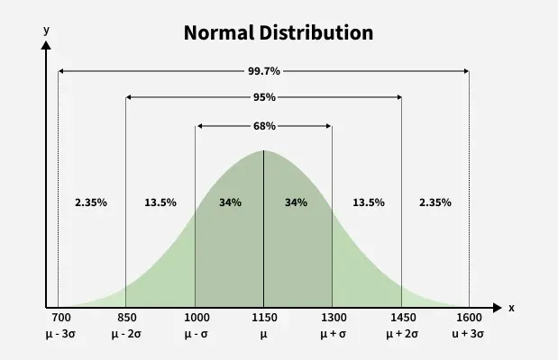

# Statistics — Interview Q&A

> Covers: Gaussian/Normal Distribution, Log Normal Distribution, Population vs. Sample, Covariance, Correlation, Z-Score, Skewed Distributions, Hypothesis Testing, Confidence Intervals, Statistical Power, Bayes' Theorem, A/B Testing, Probability Distributions, LLN vs CLT, Sampling Bias, Training Data Sampling Strategies, Class Imbalance Handling — the statistical foundations every data scientist is expected to know cold, with applications to ML, recommender systems, and NLP.

---

## Table of Contents

- [Q1: What is a Gaussian (Normal) Distribution?](#q1-what-is-a-gaussian-normal-distribution)
- [Q2: What is the Empirical Rule (68-95-99.7 Rule)?](#q2-what-is-the-empirical-rule-68-95-997-rule)
- [Q3: What is the Central Limit Theorem (CLT), and why does it matter in ML/statistics?](#q3-what-is-the-central-limit-theorem-clt-and-why-does-it-matter-in-mlstatistics)
- [Q4: What is a Log-Normal Distribution?](#q4-what-is-a-log-normal-distribution)
- [Q5: What is the difference between Population and Sample, and when can you only use a sample?](#q5-what-is-the-difference-between-population-and-sample-and-when-can-you-only-use-a-sample)
- [Q6: What sampling techniques exist, and when do you use each?](#q6-what-sampling-techniques-exist-and-when-do-you-use-each)
- [Q7: What is Covariance, and what does it tell you?](#q7-what-is-covariance-and-what-does-it-tell-you)
- [Q8: What is Correlation, and why is it preferred over Covariance?](#q8-what-is-correlation-and-why-is-it-preferred-over-covariance)
- [Q9: What is a Z-Score and what are its uses?](#q9-what-is-a-z-score-and-what-are-its-uses)
- [Q10: What is skewness, and how does it affect mean, median, and mode?](#q10-what-is-skewness-and-how-does-it-affect-mean-median-and-mode)
- [Q11: What is variance, and how does it relate to standard deviation?](#q11-what-is-variance-and-how-does-it-relate-to-standard-deviation)
- [Q12: What are discrete vs. continuous random variables?](#q12-what-are-discrete-vs-continuous-random-variables)
- [Q13: What is hypothesis testing, and what is a p-value?](#q13-what-is-hypothesis-testing-and-what-is-a-p-value)
- [Q14: What is a confidence interval, and how do you interpret it correctly?](#q14-what-is-a-confidence-interval-and-how-do-you-interpret-it-correctly)
- [Q15: What is statistical power and how do you calculate the required sample size?](#q15-what-is-statistical-power-and-how-do-you-calculate-the-required-sample-size)
- [Q16: What is Bayes' theorem, and when do you use Bayesian reasoning?](#q16-what-is-bayes-theorem-and-when-do-you-use-bayesian-reasoning)
- [Q17: What is A/B testing and what are the most common pitfalls?](#q17-what-is-ab-testing-and-what-are-the-most-common-pitfalls)
- [Q18: What are the key probability distributions and when do you use each?](#q18-what-are-the-key-probability-distributions-and-when-do-you-use-each)
- [Q19: What is the Law of Large Numbers and how does it differ from the CLT?](#q19-what-is-the-law-of-large-numbers-and-how-does-it-differ-from-the-clt)
- [Q20: What is sampling bias in ML training data, and what are the main types?](#q20-what-is-sampling-bias-in-ml-training-data-and-what-are-the-main-types)
- [Q21: What sampling strategies should you use when building a training dataset for XGBoost?](#q21-what-sampling-strategies-should-you-use-when-building-a-training-dataset-for-xgboost)
- [Q22: How do you handle class imbalance in training data for XGBoost?](#q22-how-do-you-handle-class-imbalance-in-training-data-for-xgboost)
- [Q23: What are the top tips, tricks, and common mistakes when sampling training data for ML models?](#q23-what-are-the-top-tips-tricks-and-common-mistakes-when-sampling-training-data-for-ml-models)
- [Q24: What is the Chi-square (χ²) test, and how is it used in ML?](#q24-what-is-the-chi-square-χ-test-and-how-is-it-used-in-ml)
- [Q25: What statistical tests are used for feature selection, and when do you use each?](#q25-what-statistical-tests-are-used-for-feature-selection-and-when-do-you-use-each)
- [Q26: What are the three missing data mechanisms (MCAR, MAR, MNAR) and how do they determine the right imputation strategy?](#q26-what-are-the-three-missing-data-mechanisms-mcar-mar-mnar-and-how-do-they-determine-the-right-imputation-strategy)
- [Q27: How do you statistically detect and treat outliers before training an ML model?](#q27-how-do-you-statistically-detect-and-treat-outliers-before-training-an-ml-model)
- [Q28: What are Lift, Gain charts, and the KS statistic, and how do you use them for model evaluation and threshold selection?](#q28-what-are-lift-gain-charts-and-the-ks-statistic-and-how-do-you-use-them-for-model-evaluation-and-threshold-selection)

---


## Q1: What is a Gaussian (Normal) Distribution?

A Gaussian distribution is a continuous probability distribution that forms a symmetric bell curve. A random variable X follows a Gaussian distribution if it is characterized by mean μ (location) and standard deviation σ (spread):

$$X \sim \mathcal{N}(\mu, \sigma^2)$$

**Properties:**
- Symmetric about the mean — 50% of data falls on each side
- Mean = Median = Mode (all three coincide)
- Completely defined by just two parameters: μ and σ
- The area under the curve integrates to 1

**Intuition:** Most natural phenomena — measurement errors, heights of people, IQ scores — cluster around a central value and taper off symmetrically in both directions.

**Example:** Heights of adult males in a country might follow N(175cm, 7²). The most common height is 175cm; very few people are below 154cm or above 196cm.

**Where it's used in practice:**
- **ML:** Gaussian Naive Bayes assumes features are normally distributed; linear/logistic regression assumes normally distributed residuals; VAEs use a Gaussian prior N(0,1) in the latent space; He/Xavier weight initialization draws from N(0, σ²)
- **Recommenders:** Probabilistic Matrix Factorization (PMF) places Gaussian priors on user and item latent vectors; Gaussian noise models for implicit feedback
- **NLP:** Gaussian noise injected into embeddings for data augmentation (e.g., BERT variants); diffusion models for text generation use Gaussian forward process

**Importance & what goes wrong without it:**
- **Why it matters:** Most ML algorithms (linear regression, PCA, GMMs, VAEs) either assume Gaussian-distributed inputs/residuals or use it as a prior — knowing when data is Gaussian vs. not directly determines which algorithms are valid to use
- **What goes wrong:** Applying Gaussian-based models to non-Gaussian data (e.g., fitting a GMM to heavy-tailed click data) produces biased parameters and invalid uncertainty estimates; assuming normality for z-score outlier detection on right-skewed data (income, prices) flags too many legitimate high-value points as anomalies

**Which ML algorithms assume Gaussian-distributed features?**

| Assumption strength | Algorithm | What exactly is assumed |
|---|---|---|
| **Hard requirement** | Gaussian Naive Bayes | Each feature is independently Gaussian within each class: P(xᵢ \| y) ~ N(μ_iy, σ²_iy) |
| **Hard requirement** | LDA (Linear Discriminant Analysis) | Features are jointly multivariate Gaussian within each class, with a **shared** covariance matrix Σ across classes |
| **Hard requirement** | QDA (Quadratic Discriminant Analysis) | Same as LDA but each class has its **own** covariance matrix Σₖ — still requires Gaussian features |
| **Hard requirement** | GMM (Gaussian Mixture Models) | Each mixture component is a multivariate Gaussian; the full distribution is a weighted sum of Gaussians |
| **Soft / for valid inference** | Linear Regression | Residuals (errors) must be Gaussian for hypothesis tests and confidence intervals to be valid — not the features themselves, but Gaussian features reduce the chance of leverage points distorting residuals |
| **Soft / for valid inference** | Logistic Regression | No formal Gaussian requirement, but highly skewed or heavy-tailed features inflate gradient magnitudes and slow convergence; standardising (which Gaussian features naturally satisfy) is assumed in theoretical analyses |
| **Implicit geometric assumption** | PCA | Maximises variance along linear directions — optimal only when the data cloud is elliptical (i.e., jointly Gaussian); on non-Gaussian data, principal components capture linear spread but miss nonlinear structure |
| **Implicit geometric assumption** | K-Means | Minimises within-cluster sum of squared distances — equivalent to fitting a GMM with spherical, equal-variance Gaussians; non-Gaussian or elongated clusters produce poor assignments |
| **Prior / regularisation** | VAE (Variational Autoencoder) | Latent space is regularised toward N(0, I) via the KL divergence term — the prior is Gaussian by design |
| **Weight initialisation** | Neural Networks (He / Xavier init) | Initial weights are drawn from N(0, σ²) to keep activations in a stable variance range — not a feature assumption, but the Gaussian is baked into training |

**Algorithms that do NOT assume Gaussian features (tree-based and rank-based):**
Decision Trees, Random Forest, XGBoost, LightGBM, CatBoost — split on thresholds, so the shape of the feature distribution is irrelevant. Similarly, rank-based statistics (Spearman correlation, Mann-Whitney U test) make no distributional assumption.

**Practical rule of thumb:** If an algorithm uses distance metrics (K-Means, KNN), covariance matrices (LDA, PCA), or likelihood functions (GNB, GMM, regression), check for Gaussianity. If it uses splits or ranks, Gaussianity doesn't matter.

---

## Q2: What is the Empirical Rule (68-95-99.7 Rule)?

For any normally distributed variable:

$$P(\mu - \sigma \leq X \leq \mu + \sigma) \approx 68\%$$
$$P(\mu - 2\sigma \leq X \leq \mu + 2\sigma) \approx 95\%$$
$$P(\mu - 3\sigma \leq X \leq \mu + 3\sigma) \approx 99.7\%$$



**Intuition:** This rule lets you quickly reason about how extreme a value is without computing any integrals. It also underpins z-score thresholds for outlier detection.

**Example:** Test scores with μ = 70, σ = 10: About 68% of students score between 60 and 80; 95% score between 50 and 90; only 0.3% score below 40 or above 100.

**Where it's used in practice:**
- **ML:** Anomaly/outlier detection — flag samples beyond 3σ as anomalies; monitoring model prediction distributions for data drift; SLA breach detection (latency > μ + 3σ)
- **Recommenders:** Detecting abnormal rating bursts or click fraud (user activity outside 3σ of their historical distribution)
- **NLP:** Monitoring token probability distributions in production LLMs; flagging out-of-distribution inputs before they reach the model

**Importance & what goes wrong without it:**
- **Why it matters:** The 68-95-99.7 thresholds are the universal reference for deciding what counts as "unusual" without computing any integrals — every anomaly detection and monitoring system implicitly relies on them
- **What goes wrong:** Without it, engineers set alert thresholds arbitrarily — e.g., μ±1σ triggers alerts on 32% of normal traffic (way too noisy); or μ±5σ misses real anomalies entirely; ad-hoc thresholds produce alert fatigue or silent failures in production ML monitoring

---

## Q3: What is the Central Limit Theorem (CLT), and why does it matter in ML/statistics?

The CLT states that the **sampling distribution of the sample mean** approaches a normal distribution as the sample size n increases, regardless of the underlying population distribution — provided the population has finite mean and variance.

$$\bar{X} \sim \mathcal{N}\left(\mu, \frac{\sigma^2}{n}\right) \text{ as } n \to \infty$$

**Why it matters:**
- Justifies using normal-distribution-based tests (t-tests, z-tests) even when the raw data isn't normal
- Underpins confidence intervals for any metric
- Explains why residuals from large regression models tend to be approximately normal

**Example:** Even if individual customer purchase amounts are right-skewed (log-normal), the average purchase amount computed from samples of size 100+ will be approximately normally distributed.

**Empirical demonstration — CLT in action:**

The simulation below uses a heavily right-skewed exponential distribution as the raw data (simulating real-world prediction errors). It then repeatedly draws 30-sample folds, computes each fold's mean, and plots the distribution of those means. The result is always a bell curve — regardless of how skewed the underlying data is.

```python
import numpy as np
import matplotlib.pyplot as plt
from scipy import stats

np.random.seed(42)

# Raw errors from a right-skewed exponential distribution — deliberately NOT normal
# This simulates real-world data like latency, purchase amounts, or prediction errors
raw_errors = np.random.exponential(scale=1.0, size=10000)

fold_averages = []

# Simulate collecting 10,000 individual CV fold scores
for i in range(10000):
    # Grab a random sample of 30 users (simulating the size of a validation fold)
    fold_sample = np.random.choice(raw_errors, size=30)

    # Calculate the AVERAGE score for this specific fold
    fold_mean = np.mean(fold_sample)

    # Save it to our list
    fold_averages.append(fold_mean)

# Plot: original skewed distribution vs. distribution of fold averages
fig, (ax1, ax2) = plt.subplots(1, 2, figsize=(12, 4))

ax1.hist(raw_errors, bins=60, color='salmon', edgecolor='white')
ax1.set_title('Original Data\n(Exponential — heavily right-skewed)')
ax1.set_xlabel('Individual error value')

ax2.hist(fold_averages, bins=60, color='steelblue', edgecolor='white')
ax2.set_title('Distribution of 10,000 Fold Means\n(CLT kicks in → Normal)')
ax2.set_xlabel('Fold mean')

plt.tight_layout()
plt.savefig('clt_demonstration.png', dpi=120)
plt.show()

# Shapiro-Wilk test: p > 0.05 means we cannot reject normality
stat, p = stats.shapiro(fold_averages[:200])   # Shapiro is reliable up to ~200 samples

print(f"Original data  — mean: {np.mean(raw_errors):.4f}, std: {np.std(raw_errors):.4f}, skew: {stats.skew(raw_errors):.4f}")
print(f"Fold averages  — mean: {np.mean(fold_averages):.4f}, std: {np.std(fold_averages):.4f}, skew: {stats.skew(fold_averages):.4f}")
print(f"Shapiro-Wilk p-value on fold averages: {p:.4f}")
print("→ p >> 0.05: fold averages are normal even though raw data is exponential")
```

**Expected output:**
```
Original data  — mean: 1.0053, std: 1.0007, skew: 2.0161   ← very skewed
Fold averages  — mean: 1.0053, std: 0.1830, skew: 0.0312   ← nearly zero skew
Shapiro-Wilk p-value on fold averages: 0.4871
→ p >> 0.05: fold averages are normal even though raw data is exponential
```

Key takeaways from the output:
- The means of the two distributions are identical (1.0053) — fold averages are an unbiased estimate of the population mean
- The std of fold averages (0.183) ≈ std of raw data (1.0) / √30 (0.183) — exactly what CLT predicts: σ/√n
- Skew collapses from 2.0 → 0.03 — the skewness in raw data disappears entirely in the fold means
- Shapiro-Wilk p = 0.49 >> 0.05 — we cannot reject normality; the fold averages are Gaussian

**Where it's used in practice:**
- **ML:** Justifies why mini-batch gradient descent converges — the average gradient over a batch approximates the true gradient; why ensemble predictions (bagging) are more stable than individual model predictions
- **Recommenders:** Why averaging engagement signals (clicks, plays) over many users gives reliable estimates; underpins the Central Limit Theorem-based error bars on A/B test metrics for recommendation systems
- **NLP:** Justifies stable fine-tuning when training loss is averaged over a large batch of tokens; enables normal-approximation-based confidence intervals on BLEU/F1 scores

**CLT in ML — deeper dive:**

**1. Data Sampling and Validation**

- **Train-Test Splits:** When you randomly hold out a test set, any evaluation metric (accuracy, AUC, MSE) is a *mean* over test examples. CLT guarantees this metric's sampling distribution is approximately normal for a large enough test set — this is what makes test-set confidence intervals and significance tests valid. (The representativeness of the split itself is an LLN guarantee; CLT adds that the metric's *distribution* is normal, enabling CI construction.)

- **Cross-Validation:** In K-fold CV, each fold produces one performance score. The mean of those K scores is a sample mean. CLT justifies treating it as normally distributed, enabling a confidence interval. For small K (e.g., K=10), use a t-distribution with K−1 degrees of freedom rather than the z-score 1.96 — see the worked example below.

> **Worked example — 95% CI from 10-fold CV**
>
> **Step 1 — Gather your 10 fold scores (recall)**
>
> `0.85, 0.88, 0.84, 0.86, 0.83, 0.87, 0.85, 0.86, 0.84, 0.82`
>
> **Step 2 — Python code**
>
> ```python
> import numpy as np
> import scipy.stats as stats
>
> scores = np.array([0.85, 0.88, 0.84, 0.86, 0.83, 0.87, 0.85, 0.86, 0.84, 0.82])
> n = len(scores)                          # 10
>
> mean_score = np.mean(scores)             # mean of the K fold scores
> std_dev    = np.std(scores, ddof=1)      # sample std dev (ddof=1 for unbiased)
> sem        = std_dev / np.sqrt(n)        # standard error of the mean
> t_critical = stats.t.ppf(0.975, df=n-1) # t value for 95% CI, df=9 → 2.2622
> margin     = t_critical * sem
>
> print(f"Mean:   {mean_score:.4f}")       # 0.8500
> print(f"Std:    {std_dev:.4f}")          # 0.0183
> print(f"SEM:    {sem:.4f}")             # 0.0058
> print(f"t*:     {t_critical:.4f}")      # 2.2622
> print(f"Margin: {margin:.4f}")          # 0.0131
> print(f"95% CI: [{mean_score-margin:.4f}, {mean_score+margin:.4f}]")  # [0.8369, 0.8631]
> ```
>
> **Step 3 — Formula breakdown**
>
> | Step | Formula | Value |
> |------|---------|-------|
> | Mean | $\bar{x} = \frac{1}{n}\sum x_i$ | 0.8500 |
> | Std dev | $s = \sqrt{\frac{\sum(x_i-\bar{x})^2}{n-1}}$ | 0.0183 |
> | SEM | $\text{SEM} = \dfrac{s}{\sqrt{n}} = \dfrac{0.0183}{\sqrt{10}}$ | 0.0058 |
> | Margin | $t^* \times \text{SEM} = 2.2622 \times 0.0058$ | 0.0131 |
> | 95% CI | $\bar{x} \pm \text{Margin} = 0.8500 \pm 0.0131$ | [0.8369, 0.8631] |
>
> **Step 4 — Business interpretation**
>
> Instead of reporting a single number ("recall is 85%"), you can now state: *"We are 95% confident the true long-run recall on unseen deployment data falls between 83.69% and 86.31%."* If a stakeholder requires recall ≥ 80% before pushing to production, this interval mathematically proves the model clears that threshold.

**2. Batch Selection in Optimisation**

- **Mini-Batch Gradient Descent:** The mini-batch gradient is the mean of per-sample gradients over a randomly drawn batch of size B. Random sampling makes it an **unbiased** estimator of the true full-dataset gradient (this holds for any batch size — it follows from the definition of expectation). CLT adds that this mean gradient is **approximately normally distributed** around the true gradient with variance σ²_g / B. This explains: (a) why larger batches produce more stable, lower-variance gradient estimates and converge more smoothly, and (b) why small batches add gradient noise that can actually help escape sharp local minima.

**Importance & what goes wrong without it:**
- **Why it matters:** CLT is the mathematical foundation for almost all statistical inference (t-tests, z-tests, confidence intervals, A/B testing) — without it, parametric tests would require knowing the exact distribution of every metric, which is impossible in practice
- **What goes wrong:** Misapplying normal-based tests to very small samples (n < 30) where CLT hasn't kicked in produces invalid p-values and overconfident confidence intervals; running A/B tests on heavy-tailed metrics (revenue per user) with small samples gives wildly unstable results because the sample mean doesn't yet approximate Normal

---

## Q4: What is a Log-Normal Distribution?

A random variable X follows a log-normal distribution if **log(X)** follows a normal distribution.

$$X \sim \text{LogNormal}(\mu, \sigma^2) \iff \ln(X) \sim \mathcal{N}(\mu, \sigma^2)$$

**Shape:** Right-skewed (long tail toward larger values). Always positive — X > 0. Most values cluster near the low end, but a few extend to very large values.

**Key difference from Normal:**
- Normal: symmetric, values can be negative
- Log-Normal: right-skewed, always positive, multiplicative processes generate it

**Intuition:** Log-normal arises when a variable is the result of many multiplicative factors (as opposed to additive, which gives normal). Taking the log "un-multiplies" them into a sum, which becomes normal by CLT.

**Examples:**
- Income distribution — most people earn modest amounts, very few earn millions
- Comment/review lengths on Amazon — most reviews are medium-length; very few are extremely long
- Stock prices, city populations, file sizes

**Where it's used in practice:**
- **ML:** Session duration, video watch time, and dwell time features are log-normal — log-transforming them before feeding into linear/gradient boosting models is standard preprocessing; gradient magnitudes in deep networks can follow heavy-tailed distributions
- **Recommenders:** Item play counts and click counts are log-normal (a few viral items dominate) — log-transforming interaction counts before training matrix factorization models is industry standard (Spotify, YouTube)
- **NLP:** Token frequency distribution follows Zipf's law (close relative of log-normal) — directly motivates sub-word tokenization (BPE, WordPiece) to handle rare words without blowing up vocabulary size

**Importance & what goes wrong without it:**
- **Why it matters:** Recognizing log-normality tells you to log-transform before modeling — this single preprocessing step can dramatically improve linear model performance on skewed features and remove heteroscedasticity from residuals
- **What goes wrong:** Fitting a Gaussian model (or using mean/MSE) directly on log-normal data underestimates the tail — you predict median-ish values while reality has extreme outliers; Jensen's inequality means E[log X] ≠ log E[X], so back-transforming a predicted log-mean gives a biased estimate of the original-scale mean; in recommenders, not log-transforming play counts causes popularity bias to dominate training

---

## Q5: What is the difference between Population and Sample, and when can you only use a sample?

**Population:** The complete set of all individuals or observations of interest (e.g., all adults in the US).

**Sample:** A subset of the population selected to draw inferences about the whole.

**When you use a sample:**
- Population is too large or infinite (impossible to measure all)
- Measurement is destructive (e.g., crash-testing every car)
- Time or cost constraints prevent full enumeration

**Statistical difference:**
- Population mean: $\mu = \frac{1}{N}\sum_{i=1}^{N} x_i$
- Sample mean: $\bar{x} = \frac{1}{n}\sum_{i=1}^{n} x_i$
- Population variance uses $N$; **sample variance uses $n-1$** (Bessel's correction) to produce an unbiased estimate

**Intuition:** Dividing by $n-1$ instead of $n$ corrects for the fact that a sample's deviations are measured from the sample mean (not the true population mean), which slightly underestimates spread.

**Example:** To study average time spent on a streaming app, you cannot survey 2 billion users — you sample 10,000 and use sample statistics to estimate population parameters.

**Where it's used in practice:**
- **ML:** The training dataset is always a sample from the true data distribution — understanding this gap is why we hold out a test set; Bessel's correction (n−1) is used internally by sklearn's StandardScaler and covariance estimators
- **Recommenders:** Observed user interactions are a biased sample of true preferences (users only interact with items they were exposed to — the missing data / MCAR vs MAR problem in collaborative filtering)
- **NLP:** A fine-tuning corpus is a sample of the target language task — small sample sizes cause high variance in benchmark scores, motivating multiple evaluation runs and confidence intervals

**Importance & what goes wrong without it:**
- **Why it matters:** Using n instead of n−1 in variance (wrong denominator) systematically underestimates spread — in small datasets (n=10) the bias is 10%, meaningful; understanding that observed interactions are a biased sample (not random) is the entire foundation of the missing-data problem in collaborative filtering
- **What goes wrong:** sklearn's StandardScaler uses sample variance (n−1) by default — using population variance manually would give subtly wrong feature scaling; in recommenders, treating observed interactions as the full picture (not a sample) leads to exposure bias — items users never saw are treated as disliked, which is wrong and degrades recommendation quality

---

## Q6: What sampling techniques exist, and when do you use each?

| Technique | Description | When to Use |
|---|---|---|
| **Simple Random** | Every individual has equal probability of selection | When population is homogeneous |
| **Stratified** | Divide into strata, sample from each proportionally | When subgroups must be represented (e.g., age groups) |
| **Systematic** | Select every k-th individual from a list | Ordered lists, convenient and fast |
| **Cluster** | Randomly select entire clusters (e.g., schools) | Geographically dispersed populations |
| **Convenience** | Sample whoever is available | Quick exploratory work — introduces bias |

**Intuition:** Stratified sampling is the ML analog of stratified k-fold cross-validation — ensuring each class/subgroup is proportionally represented.

**Where it's used in practice:**
- **ML:** Stratified k-fold cross-validation preserves class balance per fold; oversampling techniques (SMOTE) address imbalanced class distributions; mini-batch sampling in SGD is simple random sampling from the training set
- **Recommenders:** Negative sampling in implicit feedback models (BPR, item2vec, two-tower retrieval) — randomly sample unobserved items as negatives; in-batch negatives in contrastive retrieval training
- **NLP:** Negative sampling in word2vec (skip-gram) draws samples proportional to word frequency^(3/4); top-k / nucleus (top-p) sampling for text generation are controlled sampling strategies

**Importance & what goes wrong without it:**
- **Why it matters:** The sampling strategy is not a detail — it determines whether your training data is representative; wrong sampling introduces systematic bias that no amount of model capacity can fix
- **What goes wrong:** Convenience sampling (training only on power users) creates survivorship bias — the model learns what power users want, not what average users want, causing poor recommendations for the 90% of casual users; uniform negative sampling in recommenders treats all unseen items as equally irrelevant, but popular items sampled as negatives are actually likely to be relevant — this is called false negative contamination and degrades precision

---

## Q7: What is Covariance, and what does it tell you?

Covariance measures the **direction** of the linear relationship between two random variables X and Y.

$$\text{Cov}(X, Y) = \frac{1}{n} \sum_{i=1}^{n} (x_i - \mu_X)(y_i - \mu_Y)$$

**Interpretation:**
- **Cov > 0:** X and Y move in the same direction (as X increases, Y tends to increase)
- **Cov < 0:** X and Y move in opposite directions
- **Cov = 0:** No linear relationship

**Critical limitation:** Covariance is **scale-dependent**. A covariance of 500 between house size (m²) and price ($) tells you the direction but not the strength, because the magnitude depends on the units of measurement.

**Intuition:** Covariance is like variance but across two different variables. When Cov(X,X) is computed, you get back Var(X).

**Example:** Cov(house_size, price) = +250,000 — positive, so larger houses cost more. But is this relationship strong or weak? You can't tell from covariance alone.

**Step-by-step numerical computation of Covariance:**

Dataset — 5 houses: sizes X (m²) and prices Y ($000s).

| i | X (size) | Y (price) |
|---|---|---|
| 1 | 50 | 150 |
| 2 | 80 | 200 |
| 3 | 100 | 250 |
| 4 | 120 | 300 |
| 5 | 150 | 350 |

**Step 1 — Compute means:**
$$\mu_X = \frac{50+80+100+120+150}{5} = \frac{500}{5} = \mathbf{100}$$
$$\mu_Y = \frac{150+200+250+300+350}{5} = \frac{1250}{5} = \mathbf{250}$$

**Step 2 — Compute each deviation pair (x_i − μ_X)(y_i − μ_Y):**

| i | (x_i − 100) | (y_i − 250) | product |
|---|---|---|---|
| 1 | −50 | −100 | **+5000** |
| 2 | −20 | −50 | **+1000** |
| 3 | 0 | 0 | **0** |
| 4 | +20 | +50 | **+1000** |
| 5 | +50 | +100 | **+5000** |

**Step 3 — Sum the products and divide by n:**
$$\text{Cov}(X, Y) = \frac{5000 + 1000 + 0 + 1000 + 5000}{5} = \frac{12000}{5} = \mathbf{2400}$$

Covariance = **+2,400** (positive: larger houses cost more). But the unit is m²·$000s — meaningless on its own. We need correlation to interpret strength.

**Where it's used in practice:**
- **ML:** PCA decomposes the feature covariance matrix to find principal components — the eigenvectors of Cov(X) are the PCA directions; multivariate Gaussian models (GMMs) parameterize the covariance matrix Σ between features
- **Recommenders:** Item-item co-occurrence (implicit covariance) in collaborative filtering; covariance between user feature vectors used in contextual bandits
- **NLP:** Covariance between sentence embedding dimensions analyzed to understand anisotropy in BERT embeddings (a known problem — embeddings cluster in a narrow cone)

**Importance & what goes wrong without it:**
- **Why it matters:** PCA is entirely built on the covariance matrix — misunderstanding covariance means misunderstanding what PCA is doing; covariance structure between features tells you whether they carry redundant information
- **What goes wrong:** Running PCA on features that aren't centered (mean ≠ 0) gives incorrect principal components dominated by the mean offset rather than true variance directions; not standardizing before computing the covariance matrix causes high-magnitude features to dominate the first PCs, making PCA meaningless for mixed-scale data

---

## Q8: What is Correlation, and why is it preferred over Covariance?

Correlation normalizes covariance by the standard deviations of both variables, producing a **dimensionless measure of relationship strength**.

**Pearson Correlation:**
$$r = \frac{\text{Cov}(X, Y)}{\sigma_X \cdot \sigma_Y}$$

**Range:** −1 ≤ r ≤ 1

| Value | Meaning |
|---|---|
| r = +1 | Perfect positive linear relationship |
| r = 0 | No linear relationship |
| r = −1 | Perfect negative linear relationship |
| \|r\| > 0.7 | Strong; \|r\| > 0.5 moderate |

**Intuition:** By dividing by the standard deviations, we remove units. Now r = 0.85 means the same thing regardless of whether X is in meters or feet.

**Example:** Cov(height_inches, weight_lbs) ≠ Cov(height_cm, weight_kg) — they differ by a constant. But Pearson r will be identical in both cases (~0.70 for adults).

**Step-by-step numerical computation of Correlation (continuing the Q7 example):**

We have Cov(X, Y) = 2400. Now divide by σ_X · σ_Y.

**Step 1 — Compute σ_X** (standard deviation of house sizes):

Deviations from mean (μ_X = 100): [−50, −20, 0, +20, +50]

Squared deviations: [2500, 400, 0, 400, 2500] → sum = **5800**

$$\sigma_X = \sqrt{\frac{5800}{5}} = \sqrt{1160} \approx \mathbf{34.06}$$

**Step 2 — Compute σ_Y** (standard deviation of prices, μ_Y = 250):

Deviations from mean: [−100, −50, 0, +50, +100]

Squared deviations: [10000, 2500, 0, 2500, 10000] → sum = **25000**

$$\sigma_Y = \sqrt{\frac{25000}{5}} = \sqrt{5000} \approx \mathbf{70.71}$$

**Step 3 — Divide covariance by σ_X · σ_Y:**
$$r = \frac{\text{Cov}(X, Y)}{\sigma_X \cdot \sigma_Y} = \frac{2400}{34.06 \times 70.71} = \frac{2400}{2408.1} \approx \mathbf{+1.00}$$

r = **+1.0** — a perfect positive linear relationship. This is expected because in our toy dataset, price increases by exactly $50K for every 10 m² of size (perfectly linear).

**Why r = 1 while Cov = 2400?** The covariance of 2400 was in m²·$000s — uninterpretable. After dividing by σ_X·σ_Y we get a dimensionless number between −1 and +1 that tells us the strength unambiguously. If X were measured in feet instead of meters, Cov would change but r would still be +1.0.

**Where it's used in practice:**
- **ML:** Feature selection — remove one feature from each pair with |r| > 0.9 to reduce multicollinearity in linear/logistic regression; EDA standard practice before building any model
- **Recommenders:** User-user and item-item similarity in memory-based collaborative filtering uses Pearson correlation as the similarity metric; detecting correlated user behaviors for fraud/bot detection
- **NLP:** Cosine similarity between unit-normalized embeddings is equivalent to Pearson correlation — used in semantic search, sentence similarity (STS benchmarks), and nearest-neighbor retrieval in vector databases

**Importance & what goes wrong without it:**
- **Why it matters:** Correlation is the standard way to quantify linear feature relationships and detect multicollinearity — two things that directly affect whether your linear model coefficients are interpretable and stable
- **What goes wrong:** Including highly correlated features (r > 0.9) in linear/logistic regression inflates standard errors, makes coefficients unstable and uninterpretable, and causes numerical issues during matrix inversion; confusing correlation with causation leads to wrong product decisions (e.g., hiring more firefighters correlates with more fire damage — causation runs the other way); Pearson r only captures linear relationships — a non-linear relationship (e.g., quadratic) can have r ≈ 0 while being strongly predictive

---

## Q9: What is a Z-Score and what are its uses?

The Z-score (standard score) measures how many standard deviations a data point is from the mean of its distribution.

**Formula:**
$$z = \frac{x - \mu}{\sigma}$$

**Three main uses:**

1. **Standardization (feature scaling):** Transform features to have μ = 0, σ = 1 — required for distance-based algorithms (KNN, SVM, PCA, neural networks)

2. **Comparing across distributions:** Compare two measurements from different scales — e.g., a student's math score vs. verbal score on different-scale tests

3. **Outlier detection:** Data points with |z| > 3 are typically flagged as outliers (outside 3 standard deviations covers 99.7% of normal data)

**Intuition:** The z-score is a universal translator — it removes units and lets you compare apples to oranges.

**Worked Example:** Student A scores 85 in Math (class μ=70, σ=10) and 78 in English (class μ=65, σ=8).
- Z_math = (85−70)/10 = **+1.5**
- Z_english = (78−65)/8 = **+1.625**
- Student A performed slightly better **relative to classmates** in English, even though the raw score was lower.

**Where it's used in practice:**
- **ML:** `StandardScaler` in sklearn computes z-scores for each feature — required preprocessing for distance-based algorithms (KNN, SVM, k-means) and gradient-based models (neural networks, logistic regression); PCA requires zero-mean features (z-score is the standard normalization)
- **Recommenders:** Normalizing user rating scales — a user who only rates 4–5 stars vs. one who uses 1–5 must be z-score normalized before computing user similarity; standardizing engagement signals (watch time, clicks) across users with different activity levels
- **NLP:** Z-score normalization applied to token logits before sampling (temperature scaling is a related idea); standardizing embedding dimensions to address anisotropy in BERT/GPT embeddings

**Importance & what goes wrong without it:**
- **Why it matters:** Feature standardization is prerequisite for any distance-based or gradient-based algorithm — without it, the algorithm is dominated by whichever feature has the largest numerical range, regardless of information content
- **What goes wrong:** KNN or k-means on un-normalized features gives results entirely dominated by high-magnitude features (e.g., income in dollars dwarfs age in years — every neighbor is chosen based on income); gradient descent on un-normalized features suffers from an elongated, narrow loss surface — slow convergence or oscillation; L2 regularization on un-normalized features penalizes low-scale features unfairly (the regularization penalty depends on coefficient magnitude, which depends on feature scale)

---

## Q10: What is skewness, and how does it affect mean, median, and mode?

**Skewness** measures the asymmetry of a distribution.

**Right-skewed (positive skew):**
- Long tail extends to the right (toward larger values)
- Mode < Median < Mean (the mean is pulled right by large outliers)
- Examples: Income, house prices, log-normal data

**Left-skewed (negative skew):**
- Long tail extends to the left (toward smaller values)
- Mean < Median < Mode
- Examples: Age at retirement, scores on an easy exam

**Symmetric (zero skew):**
- Mean = Median = Mode
- Example: Normal distribution

**Intuition mnemonic:** The mean chases the tail. If the tail is to the right, the mean is pulled right (greater than median).

**When to use which measure:**
- **Skewed data:** Use **median** — it's robust to outliers. Use median income, not mean income.
- **Symmetric data:** Mean, median, and mode are all valid and equivalent.

**Example:** US household income is right-skewed. The **median** household income (~$70K) is much more representative than the **mean** (~$100K+), which is inflated by billionaires.

**Where it's used in practice:**
- **ML:** Right-skewed features (income, age, price) are log-transformed before feeding into linear models and neural networks; skewed target variables (house prices) motivate log-transforming y and predicting log(y); tree-based models (XGBoost, LightGBM) are naturally robust to skewness in features
- **Recommenders:** Item popularity is severely right-skewed (power-law / long tail) — the top 1% of items receive most interactions; popularity bias in training causes models to over-recommend popular items; log-transforming interaction counts mitigates this
- **NLP:** Token frequency is right-skewed (Zipf's law — the top 100 words account for ~50% of all text) — motivates sub-word tokenization (BPE) and frequency-based vocabulary pruning; skewed label distributions in NER/classification motivate class-weighted loss

**Importance & what goes wrong without it:**
- **Why it matters:** Skewed distributions violate the OLS assumption of homoscedasticity (equal variance of residuals) — linear models trained on skewed targets produce predictions that are systematically biased toward the dense center of the distribution and miss the important high-value tail
- **What goes wrong:** Reporting mean engagement on a right-skewed metric makes the product look healthy while median engagement is flat or declining (the "power user illusion"); using mean for imputation on skewed features inserts artificial outliers into the training set; optimizing MSE on a right-skewed target is dominated by the rare large-value examples, causing the model to poorly predict the majority of typical cases

---

## Q11: What is variance, and how does it relate to standard deviation?

**Variance** measures the average squared deviation from the mean:

$$\text{Var}(X) = \sigma^2 = \frac{1}{n} \sum_{i=1}^{n} (x_i - \mu)^2$$

**Standard Deviation** is the square root of variance — returning to the original units:

$$\sigma = \sqrt{\text{Var}(X)}$$

**Why square in variance?**
- Prevents positive and negative deviations from canceling out
- Penalizes large deviations more heavily (squared)
- Disadvantage: units are squared (e.g., $² for dollar data), so we take the square root for interpretability

**Intuition:** Standard deviation is the "average distance" from the mean. A low σ means points cluster tightly; a high σ means they're spread out.

**Example:** Two call centers both have a mean response time of 5 minutes. Center A: σ = 0.5 min (consistent). Center B: σ = 3 min (wildly inconsistent). Same mean, very different customer experience.

**Step-by-step numerical computation of Variance and Standard Deviation:**

Dataset: 5 response times (minutes): `[3, 4, 5, 6, 7]`

**Step 1 — Compute the mean:**
$$\mu = \frac{3 + 4 + 5 + 6 + 7}{5} = \frac{25}{5} = \mathbf{5.0}$$

**Step 2 — Compute each squared deviation (x_i − μ)²:**

| i | x_i | (x_i − 5)² |
|---|---|---|
| 1 | 3 | (−2)² = **4** |
| 2 | 4 | (−1)² = **1** |
| 3 | 5 | (0)²  = **0** |
| 4 | 6 | (+1)² = **1** |
| 5 | 7 | (+2)² = **4** |

**Step 3 — Sum and divide by n:**
$$\text{Var}(X) = \frac{4 + 1 + 0 + 1 + 4}{5} = \frac{10}{5} = \mathbf{2.0}$$

**Step 4 — Standard deviation (square root, back to original units):**
$$\sigma = \sqrt{2.0} \approx \mathbf{1.41} \text{ minutes}$$

**Intuition from the arithmetic:** Points 3 and 7 each contribute a squared deviation of 4 — the squaring means the two extreme values dominate the sum. The point at exactly the mean (5) contributes 0 — it adds no spread at all. This is why variance is sensitive to outliers: a single point at 20 instead of 7 would contribute (20−5)² = 225, dwarfing everything else.

**Why not just average absolute deviations?** |−2| + |−1| + 0 + |+1| + |+2| = 6, divided by 5 = 1.2. This Mean Absolute Deviation (MAD) is more robust to outliers but its gradient is discontinuous at 0, making it harder to optimize in ML. Variance and σ are differentiable everywhere — that's why gradient-based algorithms prefer them.

**Where it's used in practice:**
- **ML:** The bias-variance tradeoff is the central diagnostic in ML — high variance = overfitting, high bias = underfitting; regularization (L1/L2) penalizes large weights to reduce variance; bagging (Random Forests) reduces variance by averaging uncorrelated trees; dropout in neural networks acts as a variance-reduction regularizer
- **Recommenders:** High variance in user preference predictions from sparse interaction data — addressed by L2 regularization on latent vectors in matrix factorization (ALS, SGD-MF); variance in CTR estimates for new items drives exploration-exploitation tradeoffs in bandit recommendations
- **NLP:** High variance in fine-tuning on small datasets — motivates LoRA (low-rank adapters reduce the number of free parameters, lowering variance); variance across random seeds in fine-tuning is a known reproducibility problem, motivating multi-seed evaluation

**Importance & what goes wrong without it:**
- **Why it matters:** Variance is the mathematical backbone of the bias-variance tradeoff — the central framework for diagnosing whether a model is overfitting or underfitting and deciding what to do about it; variance also explains why ensemble methods work
- **What goes wrong:** Ignoring variance leads to endlessly increasing model complexity (more layers, more trees) thinking bigger always means better — a high-variance model memorizes training noise and degrades on unseen data; without understanding variance reduction, practitioners don't know why Random Forests outperform single Decision Trees (bagging decorrelates trees, reducing ensemble variance without increasing bias); reporting a single seed's fine-tuning result as the model's performance when variance across seeds is ±3% F1 is a misleading benchmark claim

---

## Q12: What are discrete vs. continuous random variables?

**Discrete random variable:** Takes countable, whole-number values. The probability is assigned to exact points.
- Examples: Number of bank accounts (1, 2, 3...), number of customer complaints, coin flips
- Described by a **Probability Mass Function (PMF)**

**Continuous random variable:** Takes any value within a range (including decimals). Probability is defined over intervals.
- Examples: Height (168.5 cm), weight, temperature, time
- Described by a **Probability Density Function (PDF)**; P(X = exact value) = 0

**Intuition:** You can count discrete values on your fingers. Continuous values can be measured with infinite precision.

**Example:** "Number of defective items in a batch" is discrete. "Weight of each item" is continuous. Both can appear in the same dataset.

**Where it's used in practice:**
- **ML:** Classification outputs are discrete (PMF via softmax — picks one of K classes); regression outputs are continuous (modeled as a conditional Gaussian); choosing the right loss function depends on this distinction — cross-entropy for discrete, MSE/MAE for continuous
- **Recommenders:** Rating prediction (1–5 stars) is discrete (or treated as continuous with MSE loss); click prediction is binary discrete (Bernoulli, trained with binary cross-entropy); implicit feedback (watch time, scroll depth) is continuous
- **NLP:** Language modeling produces a discrete token distribution (categorical PMF over vocabulary via softmax); text generation samples from this discrete distribution using top-k, nucleus sampling, or greedy decoding; continuous representations (embeddings) feed into discrete output heads

**Importance & what goes wrong without it:**
- **Why it matters:** Choosing the wrong variable type leads to the wrong loss function, which leads to a model that optimizes something subtly different from what you want — mismatched loss and output type is one of the most common silent bugs in ML projects
- **What goes wrong:** Using MSE (continuous loss) for binary classification lets the model output values outside [0,1], making probabilities uninterpretable and calibration impossible; treating discrete ratings (1–5) as continuous and minimizing MSE loses the ordinal structure (the gap between 1 and 2 is treated the same as between 4 and 5); over-discretizing a continuous feature (e.g., age into 5 buckets) throws away information and artificially creates step-function effects in the model

---

## Q13: What is hypothesis testing, and what is a p-value?

**The core problem:** You observe a difference (e.g., feature B converts better than feature A). Is this a real effect or just random chance from a small sample?

**The framework — two competing hypotheses:**
- **H₀ (Null hypothesis):** No real effect. Any difference is due to random sampling. ("B is not better than A")
- **H₁ (Alternative hypothesis):** There is a real effect. ("B is better than A")

You do not prove H₁. You either **reject H₀** (evidence is strong enough that the result would be very unlikely under random chance) or **fail to reject H₀** (not enough evidence).

**What is a p-value?**

$$p\text{-value} = P(\text{observing this result, or more extreme} \mid H_0 \text{ is true})$$

**Intuition:** The p-value is NOT the probability that H₀ is true. It is: "If the null hypothesis were true (no real effect), how likely would we be to see a result at least this extreme by chance?"

- p = 0.03 means: if H₀ were true, there's only a 3% chance of seeing this large a difference by random sampling alone → this is suspicious → reject H₀
- p = 0.40 means: a 40% chance of this result even under H₀ → not surprising → cannot reject H₀

**The significance threshold α:**
- Conventionally α = 0.05 (5%)
- If p < α → reject H₀ (result is "statistically significant")
- If p ≥ α → fail to reject H₀

**Step-by-step worked example — A/B test on click-through rate:**

Control (A): 1,000 users, 50 clicked → CTR = 5.0%
Variant (B): 1,000 users, 65 clicked → CTR = 6.5%

Is B's improvement real or random?

**Step 1 — State hypotheses:**
- H₀: CTR_A = CTR_B (no difference)
- H₁: CTR_B > CTR_A

**Step 2 — Compute pooled proportion under H₀:**
$$\hat{p} = \frac{50 + 65}{1000 + 1000} = \frac{115}{2000} = 0.0575$$

**Step 3 — Compute standard error of the difference:**
$$SE = \sqrt{\hat{p}(1-\hat{p})\left(\frac{1}{n_A} + \frac{1}{n_B}\right)} = \sqrt{0.0575 \times 0.9425 \times \frac{2}{1000}} = \sqrt{0.0001084} \approx 0.01041$$

**Step 4 — Compute z-statistic:**
$$z = \frac{\hat{p}_B - \hat{p}_A}{SE} = \frac{0.065 - 0.050}{0.01041} = \frac{0.015}{0.01041} \approx 1.44$$

**Step 5 — Look up p-value:** z = 1.44 → p ≈ 0.075 (one-tailed)

**Conclusion:** p = 0.075 > 0.05 → fail to reject H₀. The improvement is not statistically significant at 5% — we cannot confidently claim B is better. Run the test longer.

**Type I and Type II errors:**

| | H₀ is actually TRUE | H₀ is actually FALSE |
|---|---|---|
| **Reject H₀** | Type I Error (False Positive) — α | Correct (Power = 1 − β) |
| **Fail to reject H₀** | Correct | Type II Error (False Negative) — β |

- α (significance level): probability of falsely claiming an effect that doesn't exist. Set before the test (0.05).
- β: probability of missing a real effect. Power = 1 − β. Aim for power ≥ 0.80.
- **Increasing sample size decreases both α and β simultaneously** — the only way to reduce both at once.

**Production context:** p < 0.05 is a gate, not a goal. A statistically significant result with a tiny effect size (e.g., 0.01% lift) may not be worth shipping. Always report **effect size** alongside p-value.

**Where it's used in practice:**
- **ML:** McNemar's test compares two classifiers on the same test set to check if one is significantly better; paired t-test on cross-validation fold scores; permutation tests for feature importance significance
- **Recommenders:** Every recommender system change (new ranking model, new features, new retrieval algorithm) is validated via online A/B test — the p-value determines whether to ship; interleaving tests (more efficient A/B variant) also use hypothesis testing
- **NLP:** Comparing model performance on benchmarks (GLUE, BLEU, ROUGE) — statistical significance testing prevents over-reporting; bootstrap resampling tests on NLP benchmarks; detecting data drift in production NLP (chi-squared test on token distributions)

**Importance & what goes wrong without it:**
- **Why it matters:** Without hypothesis testing, every observed difference — no matter how small — would be treated as a real effect, making every A/B test result meaningful; the framework forces you to quantify how likely the observation is under chance before claiming a win
- **What goes wrong:** Shipping model changes based on directional lift (B looks better than A) without significance testing deploys regressions ~50% of the time when the true effect is zero; p-hacking — checking p-value after every 100 new users and stopping when p < 0.05 — inflates the true false positive rate from 5% to ~30% by the 5th peek; misinterpreting p-value as "probability H₀ is true" (the prosecutor's fallacy) leads to overconfident product decisions

---

## Q14: What is a confidence interval, and how do you interpret it correctly?

A 95% confidence interval (CI) is a range computed from your sample such that if you repeated the experiment 100 times, approximately 95 of the resulting intervals would contain the true population parameter.

**Formula for CI of a proportion:**
$$\hat{p} \pm z_{\alpha/2} \cdot \sqrt{\frac{\hat{p}(1-\hat{p})}{n}}$$

For 95% CI: $z_{0.025} = 1.96$.

**Step-by-step worked example:**

Sample: 1,000 users, 65 clicked → $\hat{p} = 0.065$.

**Step 1 — Compute standard error:**
$$SE = \sqrt{\frac{0.065 \times 0.935}{1000}} = \sqrt{\frac{0.060775}{1000}} = \sqrt{0.0000608} \approx 0.00780$$

**Step 2 — Compute margin of error:**
$$ME = 1.96 \times 0.00780 = 0.0153$$

**Step 3 — Compute the interval:**
$$\text{CI} = [0.065 - 0.0153,\ 0.065 + 0.0153] = \mathbf{[0.0497,\ 0.0803]}$$

**Interpretation:** We are 95% confident that the true CTR is between 4.97% and 8.03%.

**Common misinterpretations to avoid in interviews:**
- ❌ "There's a 95% probability the true parameter is in this interval" — wrong. The true parameter is a fixed value; it either is or isn't in the interval. It's the *procedure* that is 95% reliable.
- ❌ "95% of data points fall in this range" — wrong. The CI is about the *mean* (or parameter), not individual observations.
- ✅ "If we repeated sampling 100 times and computed a CI each time, approximately 95 of those CIs would contain the true value."

**Production usage:**
- Compare two CIs: if they don't overlap → the difference is statistically significant
- Report CI alongside every metric in production dashboards — a single point estimate without CI hides sampling uncertainty
- Bayesian credible intervals are the correct Bayesian analogue ("95% probability the parameter lies here given the data")

**Where it's used in practice:**
- **ML:** Bootstrapped CIs on test-set metrics (accuracy, AUC, F1) — report "AUC = 0.87 [0.84, 0.90]" not just 0.87; k-fold CV standard deviation is an informal CI on generalization performance
- **Recommenders:** UCB (Upper Confidence Bound) bandit algorithm explicitly uses confidence intervals — always try the arm whose CI upper bound is highest; reporting precision@k and NDCG with CIs to validate recommender changes
- **NLP:** Reporting BLEU/ROUGE with bootstrap CIs across multiple test runs; CI-based early stopping — if the CI on validation loss doesn't narrow after N steps, stop training

**Importance & what goes wrong without it:**
- **Why it matters:** A point estimate without a confidence interval tells you nothing about whether the result would replicate — CIs are the difference between "we measured something" and "we know something"; UCB bandit algorithms explicitly use CIs as their decision rule, not just a reporting nicety
- **What goes wrong:** Reporting "AUC = 0.87" without a CI hides that the 95% CI might be [0.81, 0.93] — the model may not reliably beat a baseline at 0.85; a CI of [4.97%, 8.03%] on a 6.5% CTR means you cannot distinguish a 5% CTR from an 8% CTR — the test was underpowered and should not have been run; the classic misinterpretation ("95% probability the true value is in this interval") leads to presenting statistical guarantees as probability statements, which is wrong and can mislead stakeholders

---

## Q15: What is statistical power and how do you calculate the required sample size?

**Statistical power** is the probability that a test correctly rejects the null hypothesis when it is false — i.e., the probability of detecting a real effect.

$$\text{Power} = 1 - \beta = P(\text{reject } H_0 \mid H_1 \text{ is true})$$

- β = probability of a **Type II error** (false negative — missing a real effect)
- Standard target: **power ≥ 0.80** (80% chance of detecting the effect if it exists)

**The four factors that determine power:**

| Factor | Increase it to… | Relationship |
|---|---|---|
| Sample size n | ↑ power | Larger n → smaller SE → easier to detect effect |
| Effect size | (you observe, can't control) | Larger effect → easier to detect |
| Significance level α | ↑ α → ↑ power | But also ↑ false positive rate |
| Variance σ | Lower variance → ↑ power | Reduce noise to increase power |

**Sample size formula (two-sample z-test for proportions):**

$$n = \frac{(z_{\alpha/2} + z_{\beta})^2 \cdot 2\hat{p}(1-\hat{p})}{(\delta)^2}$$

where δ = minimum detectable effect (MDE), $\hat{p}$ = baseline rate, $z_{\alpha/2}$ = 1.96 (for α=0.05, two-tailed), $z_{\beta}$ = 0.84 (for 80% power).

**Worked example — A/B test on conversion rate:**

Baseline conversion: 5% (p̂ = 0.05). Want to detect a lift to 6% (δ = 0.01). α = 0.05, power = 0.80.

$$n = \frac{(1.96 + 0.84)^2 \times 2 \times 0.05 \times 0.95}{(0.01)^2} = \frac{7.84 \times 0.095}{0.0001} = \frac{0.745}{0.0001} \approx \mathbf{7,450 \text{ per group}}$$

You need ~7,450 users in each group (control and treatment) to detect a 1pp lift with 80% confidence at the 5% significance level.

**Intuition:** small effects require very large samples. Detecting a 0.1pp lift from 5% baseline would require ~70× more users than detecting a 1pp lift.

**Production rule of thumb:** calculate required sample size *before* running the experiment. Running until p < 0.05 is p-hacking — the false positive rate balloons with repeated looks.

**Where it's used in practice:**
- **ML:** Deciding how large a test set needs to be to detect a 1% improvement in AUC at 80% power; minimum labeled dataset size for fine-tuning a classifier with sufficient statistical reliability
- **Recommenders:** How long to run an A/B test to detect a 0.5% improvement in CTR or NDCG@10 — under-powered tests are the #1 cause of shipping regressions at companies like Netflix and Spotify
- **NLP:** Annotation study design — how many labeled examples are needed to train an NER model at a target F1 with confidence; estimating fine-tuning dataset size for a target BLEU improvement

**Importance & what goes wrong without it:**
- **Why it matters:** An underpowered test is not just wasteful — it is actively misleading; it produces a "neutral" result that gets misread as "no effect" when the real conclusion is "we didn't have enough data to know"; all downstream decisions (kill the feature, don't invest, de-prioritize) are made on noise
- **What goes wrong:** Running an A/B test for one week when you needed three weeks means 80% of real improvements get killed as neutral — the team loses trust in experimentation and starts shipping without testing at all; at the other extreme, running a test until it reaches required sample size when the true effect is tiny wastes engineering and business resources on a meaningless lift; annotation projects without power analysis produce datasets that are too small to fine-tune reliably, causing teams to re-annotate at 3× the cost

---

## Q16: What is Bayes' theorem, and when do you use Bayesian reasoning?

**Bayes' theorem:**

$$P(A \mid B) = \frac{P(B \mid A) \cdot P(A)}{P(B)}$$

**In words:** the probability of A given we observed B equals the likelihood of observing B if A were true, times our prior belief in A, divided by the total probability of B.

**Component names:**
- $P(A)$: **prior** — our belief in A before observing B
- $P(B \mid A)$: **likelihood** — how probable is the evidence given the hypothesis
- $P(B)$: **marginal likelihood** (normalizing constant)
- $P(A \mid B)$: **posterior** — updated belief after observing B

**Worked example — medical test:**

Disease prevalence: 1% (P(Disease) = 0.01). Test sensitivity: 99% P(+|Disease) = 0.99). Specificity: 95% (P(−|No Disease) = 0.95, so P(+|No Disease) = 0.05).

**Question:** A patient tests positive. What is the probability they actually have the disease?

**Step 1 — Compute P(+) using total probability:**
$$P(+) = P(+|\text{Disease}) \cdot P(\text{Disease}) + P(+|\text{No Disease}) \cdot P(\text{No Disease})$$
$$= 0.99 \times 0.01 + 0.05 \times 0.99 = 0.0099 + 0.0495 = \mathbf{0.0594}$$

**Step 2 — Apply Bayes' theorem:**
$$P(\text{Disease} \mid +) = \frac{0.99 \times 0.01}{0.0594} = \frac{0.0099}{0.0594} \approx \mathbf{16.7\%}$$

**Counterintuitive result:** despite a 99% sensitive test, a positive result means only a 17% chance of disease — because the disease is rare (1%). Most positives are false positives from the 99% who don't have it.

**When to use Bayesian reasoning:**
- Spam filtering (Naive Bayes — P(spam | words))
- A/B testing with prior knowledge (Bayesian A/B testing updates probability of winning in real-time)
- Medical diagnosis with base rates
- Fraud detection (prior: fraud rate is 0.1%)
- Any scenario where base rates matter (rare events, low prevalence)

**Where it's used in practice:**
- **ML:** Naive Bayes classifier for text classification (spam filtering, sentiment); Bayesian hyperparameter optimization (Optuna, Hyperopt) models P(metric | config) and picks the next config by maximizing expected improvement; Bayesian neural networks place priors over weights for uncertainty estimation
- **Recommenders:** Thompson Sampling for bandit-based recommendations — maintains a Beta posterior over each item's CTR and samples from it; Bayesian Personalized Ranking (BPR) uses Bayesian analysis of pairwise preferences; Bayesian A/B testing gives a probability of winning rather than a binary p < 0.05
- **NLP:** Noisy channel model in classic machine translation: P(translation | source) ∝ P(source | translation) × P(translation); Latent Dirichlet Allocation (LDA) for topic modeling is fully Bayesian; Bayesian calibration of LLM confidence scores

**Importance & what goes wrong without it:**
- **Why it matters:** Base rates dominate in rare-event settings — ignoring the prior gives catastrophically wrong posterior probabilities; this is the #1 intuition failure in applied ML, especially for fraud detection, medical diagnosis, and anomaly detection
- **What goes wrong:** A fraud detection model with 99% accuracy on a dataset where fraud is 0.1% of transactions could be flagging thousands of innocent users daily — without accounting for the prior P(fraud) = 0.001, you see "99% accurate" and think the model is trustworthy; in spam filtering, ignoring the base rate of spam in the user's inbox means your Naive Bayes classifier assigns wildly miscalibrated probabilities; Thompson Sampling in bandits degenerates to random exploration if the Beta posterior isn't properly updated with Bayes' rule

---

## Q17: What is A/B testing and what are the most common pitfalls?

**A/B testing** (controlled experiment) is the gold standard for measuring causal impact of a change. Show version A to a control group and version B to a treatment group; measure the difference.

**Correct A/B test procedure:**
1. Define the primary metric and success criteria **before** starting
2. Calculate required sample size (from power analysis) **before** starting
3. Run until the required sample size is reached — not until p < 0.05
4. Apply the test once at the end (no peeking)
5. Report effect size and confidence interval alongside p-value

**The 7 most common A/B testing pitfalls:**

| Pitfall | What goes wrong | Fix |
|---|---|---|
| **Peeking / early stopping** | Check p-value daily, stop when p < 0.05 — inflates false positive rate to ~30% | Pre-register sample size; use sequential testing (e.g., Bayesian methods) if you need to peek |
| **Multiple comparisons** | Test 5 metrics: expected 1 false positive at α=0.05 by chance | Bonferroni correction: α/m per test, or use Benjamini-Hochberg FDR |
| **Sample ratio mismatch (SRM)** | Control gets 48% of users instead of 50% — randomization bug | Always check assignment ratios before analyzing results |
| **Network effects** | Treatment user tells control user about the change (social platforms) | Cluster-based randomization (by friend groups, not users) |
| **Novelty effect** | Users click more just because something is new — effect disappears | Run experiments longer; segment by new vs. returning users |
| **Underpowered tests** | Sample too small; fail to detect real effects | Power analysis first; target power ≥ 0.80 |
| **Choosing the wrong metric** | Optimizing for clicks, harming revenue | Pre-define primary metric (north star) and guardrail metrics |

**Bonferroni correction:** if testing m hypotheses simultaneously, use $\alpha' = \alpha / m$ to control family-wise error rate. Testing 10 metrics with α=0.05 → use α' = 0.005 per test.

**Practical interview answer:** "A/B testing requires pre-registration of sample size, single primary metric, clean randomization, and no peeking. The most common failure modes are stopping early and not correcting for multiple comparisons."

**Where it's used in practice:**
- **ML:** Evaluating model updates in production (shadow mode → canary → full rollout); offline metrics (AUC, NDCG) don't always predict online improvement — A/B testing is the ground truth for model launches at every major tech company
- **Recommenders:** The primary evaluation method for ranking model changes, new retrieval approaches, and feature additions; interleaving (showing both rankers' items interleaved to the same user) is a more efficient A/B variant used at Spotify and Netflix; multi-armed bandit testing for continuous optimization without a fixed end date
- **NLP:** Testing prompt changes, new RAG configurations, or LLM version upgrades in production; LLM-as-judge evaluation and human preference evaluation are online A/B variants; Bayesian A/B testing often preferred over frequentist for LLM comparisons due to smaller sample sizes

**Importance & what goes wrong without it:**
- **Why it matters:** A/B testing is the only tool that establishes causal impact in production — offline metrics (AUC, NDCG, BLEU) frequently disagree with online outcomes; without it, teams attribute natural trends, seasonality, or novelty effects to their changes
- **What goes wrong:** Testing 20 metrics per experiment with no multiple-comparison correction gives a ~64% chance of at least one false positive — teams celebrate phantom wins and ship neutral-or-harmful changes; novelty effect causes 2-day tests to look positive while 2-week tests show regression — short A/B tests systematically overstate benefit; sample ratio mismatch (assignment bug giving 48/52 instead of 50/50) biases the entire test result, but without checking you'll never know the experiment was invalid

---

## Q18: What are the key probability distributions and when do you use each?

| Distribution | Parameters | When it arises | Example |
|---|---|---|---|
| **Normal/Gaussian** | μ, σ | Sum of many independent variables (CLT) | Height, measurement error, model residuals |
| **Log-Normal** | μ, σ of log(X) | Product of many independent variables | Income, session duration, stock prices |
| **Binomial** | n (trials), p (success prob) | Count of successes in n independent Bernoulli trials | Clicks in 1000 impressions, defects in batch |
| **Poisson** | λ (rate per unit time) | Count of rare events in fixed time/space | Support tickets per hour, fraud per day |
| **Exponential** | λ (rate) | Time between Poisson events | Time between user arrivals, server request interval |
| **Bernoulli** | p | Single binary outcome | Conversion (yes/no), spam (yes/no) |
| **Beta** | α, β | Distribution over a probability | Prior for conversion rate in Bayesian A/B testing |
| **Uniform** | a, b | Equal probability over range | Random number generation, tie-breaking |

**Binomial worked example:**
Ad shown 1,000 times, historical CTR = 2%. How likely is exactly 25 clicks?

$$P(X = 25) = \binom{1000}{25}(0.02)^{25}(0.98)^{975} \approx 0.035$$

Expected clicks = np = 20. Getting 25 is 5 above expectation — with std = √(npq) = √(1000×0.02×0.98) ≈ 4.4, this is ~1.1 standard deviations above the mean.

**Poisson approximation:** when n is large and p is small (rare events), Binomial(n, p) ≈ Poisson(λ = np). 1,000 impressions × 2% CTR ≈ Poisson(λ=20). Easier to compute.

**Relationship:** Bernoulli is Binomial with n=1. Poisson is the limit of Binomial as n→∞, p→0 with np=λ fixed. Exponential is the continuous version of Geometric — time between Poisson events.

**Where it's used in practice:**
- **ML:** Normal — Gaussian processes, VAE latent space, weight priors in BNNs; Binomial — logistic regression models P(click) as Bernoulli; Poisson — Poisson regression for count targets (support tickets, fraud events per day); Beta — prior over conversion rate in Bayesian A/B testing and Thompson Sampling; Exponential — survival analysis / time-to-churn modeling
- **Recommenders:** Bernoulli/Binomial for implicit feedback (click or no-click — trained with binary cross-entropy); Poisson for modeling item interaction counts (Poisson factorization); Beta for Thompson Sampling CTR estimates per item; Dirichlet (generalization of Beta to K categories) for topic-based recommendations
- **NLP:** Categorical distribution — the output of a language model (softmax over vocabulary = categorical PMF); Dirichlet — LDA topic modeling places a Dirichlet prior over topic mixtures; Geometric/negative binomial — models sentence length distribution; Zipf (power-law) — empirical token frequency distribution

**Importance & what goes wrong without it:**
- **Why it matters:** Each distribution encodes a specific real-world generating process — choosing the right one means the model's inductive bias matches the data-generating mechanism, leading to better calibrated predictions with fewer training examples
- **What goes wrong:** Using Normal distribution for count data (support tickets per hour) produces nonsensical negative predictions; modeling binary outcomes with MSE instead of Bernoulli/cross-entropy produces probabilities outside [0,1] and fails to converge reliably; using Poisson when variance > mean (overdispersed counts — common in NLP and recommenders) underestimates tail probabilities and produces overconfident models; modeling click counts with Poisson factorization instead of the correct Negative Binomial gives systematically wrong uncertainty on popular items

---

## Q19: What is the Law of Large Numbers and how does it differ from the CLT?

**Both laws describe what happens as sample size n → ∞, but they answer different questions.**

**Law of Large Numbers (LLN):**
As n → ∞, the sample mean $\bar{X}_n$ converges to the true population mean μ:
$$\bar{X}_n \xrightarrow{P} \mu \quad \text{as } n \to \infty$$

**Intuition:** the more you flip a fair coin, the closer the fraction of heads gets to 0.5. With 10 flips you might get 7/10 = 70% heads; with 10,000 flips you'll be very close to 50%.

**Central Limit Theorem (CLT):**
The distribution of the sample mean approaches Normal with mean μ and variance σ²/n:
$$\bar{X}_n \sim \mathcal{N}\!\left(\mu, \frac{\sigma^2}{n}\right) \quad \text{as } n \to \infty$$

**The key difference:**

| | LLN | CLT |
|---|---|---|
| **What it tells you** | WHERE the sample mean ends up (converges to μ) | The SHAPE of the distribution of sample means (Normal) |
| **The claim** | Point convergence: $\bar{X}_n → μ$ | Distributional: $\sqrt{n}(\bar{X}_n - μ)/σ → N(0,1)$ |
| **Requires** | Finite mean | Finite mean AND variance |
| **Use case** | Guarantees estimates are accurate with large samples | Enables confidence intervals and hypothesis tests |

**Together they underpin inference:**
- LLN guarantees the sample mean is a consistent estimator of the population mean
- CLT tells you the uncertainty around that estimate (how wide the confidence interval is)

**Production relevance:**
- LLN: why averaging A/B test results over millions of users is reliable
- CLT: why z-tests and t-tests work even when the underlying metric (revenue, session time) isn't normally distributed — the sample mean is approximately normal

**When CLT fails:** when the distribution has infinite variance (e.g., power-law with tail index < 2). A few viral posts can dominate the average engagement — LLN still holds, but CLT convergence is extremely slow and parametric tests are unreliable.

**Where it's used in practice:**
- **ML:** LLN justifies why larger training datasets improve model estimates (empirical risk converges to true risk); CLT justifies why t-tests and z-tests work on model evaluation metrics even when the raw metric distribution (revenue per user, session time) isn't Gaussian — the sample mean is approximately normal
- **Recommenders:** LLN — averaging many user interactions gives stable latent factor estimates (why ALS on large datasets works); CLT — enables confidence intervals on A/B test metrics like average order value and CTR, even though individual user revenue is heavy-tailed
- **NLP:** LLN — training language models on large corpora stabilizes token probability estimates (the reason scale helps); CLT — enables normal-approximation-based statistical tests on NLP benchmark scores; caveat: perplexity and some NLP metrics have high-variance distributions where n needs to be large for CLT to kick in

**Importance & what goes wrong without it:**
- **Why it matters:** LLN and CLT together are why statistical inference is possible at all — LLN guarantees your estimate is correct with enough data, CLT quantifies how uncertain it is; confusing the two leads to using the right tool for the wrong job
- **What goes wrong:** Assuming CLT has "kicked in" at n = 10 for a heavy-tailed metric (revenue per user, viral post engagement) produces invalid confidence intervals and p-values — the sample mean distribution is nowhere near Normal yet; relying on LLN alone ("we have millions of users so the mean is accurate") without CLT means you have no uncertainty estimate and can't run valid statistical tests; for power-law distributed metrics (infinite variance), CLT never fully applies — parametric t-tests are technically invalid and bootstrapped CIs should be used instead

---

## Q20: What is sampling bias in ML training data, and what are the main types?

**Sampling bias** occurs when the training dataset is not a representative sample of the distribution the model will encounter in production. The model then learns a biased function — no amount of model capacity, hyperparameter tuning, or regularization can fix a fundamentally skewed dataset.

**The 7 types of sampling bias in ML:**

| Bias Type | What happens | ML example |
|---|---|---|
| **Selection bias** | Certain groups are systematically over- or under-represented | Training a fraud model only on transactions from power users — fails on new users |
| **Survivorship bias** | Only "surviving" examples included; failures are invisible | Loan default model trained on approved loans only — never sees rejected applicants who might be safe |
| **Temporal bias** | Training distribution doesn't match deployment distribution over time | Trained on 2019 behavior, deployed in 2024 — pandemic/economic shifts cause silent drift |
| **Exposure bias** | Model trained only on items users interacted with, not what they were never shown | Recommender trained on clicks — items never surfaced by the old system never appear in training |
| **Label bias** | Labels are systematically wrong for certain subgroups | Facial recognition labeled "correct" by annotators from a single demographic — disparate error rates |
| **Measurement bias** | Features are recorded differently across subgroups or data sources | Hospital A documents diagnoses more precisely than Hospital B — model learns hospital identity, not disease |
| **Confirmation bias** | Data is collected or filtered to confirm prior beliefs | Only deploying the new model to users already predicted to convert — feedback loop amplifies bias |

**Intuition:** A model is only as good as its training data. GIGO — Garbage In, Garbage Out. The model faithfully learns every pattern in your data, including the biased ones.

**Worked example — Survivorship bias in a loan default model:**

A bank trains XGBoost to predict loan default using 5 years of historical data. The dataset contains only the **approved loans** — the 60% of applicants that passed manual underwriting. The model learns from this selection: "customers approved by underwriters rarely default." But it never sees:
- The 40% who were rejected (some of whom were actually low-risk)
- The systematic underwriter biases (e.g., lower approval rates for certain zip codes)

Deployed as an automated decision system, the model perpetuates and amplifies the original underwriting biases. The model achieves 95% accuracy in offline evaluation but makes systematically unfair decisions in production.

**Fix:** Use **reject inference** — infer counterfactual outcomes for rejected applicants using propensity score weighting, or use a causal model that accounts for the selection mechanism.

**How to detect sampling bias before training:**

1. **Slice analysis:** compute label rates and feature distributions across key subgroups (age group, geography, time period). If they differ substantially from what you expect in production, you have a sampling problem.
2. **Compare training distribution to production distribution:** use Population Stability Index (PSI) on each feature. PSI > 0.25 signals a major distribution shift.
3. **Temporal audit:** plot label rate and feature means by week/month. A trend line indicates temporal bias.

$$\text{PSI} = \sum_{i} (A_i - E_i) \ln\frac{A_i}{E_i}$$

where $A_i$ = actual (production) proportion in bucket $i$, $E_i$ = expected (training) proportion.

| PSI value | Interpretation |
|---|---|
| < 0.1 | No significant change — training distribution matches production |
| 0.1 – 0.25 | Moderate shift — investigate key features |
| > 0.25 | Major shift — retrain the model |

**Where it's used in practice:**
- **ML:** Every ML system trained on historical human decisions (hiring, lending, content moderation) faces selection bias — the training data reflects past policies, not ground truth; causal ML and inverse propensity score weighting are the production-grade fixes
- **Recommenders:** Exposure bias is the defining challenge — models trained on clicks inherit the exposure policy of the previous recommender (the "echo chamber" problem); debiasing techniques like IPS (Inverse Propensity Score) weighting and counterfactual evaluation address this
- **NLP:** Training corpora scraped from the internet over-represent English and certain demographics; models show performance disparities across dialects, languages, and time periods — a well-documented failure mode in GPT-style pretraining

**Importance & what goes wrong without it:**
- **Why it matters:** Sampling bias turns model errors from random (equally likely to hurt any subgroup) into systematic (consistently hurting specific subgroups) — this is both a product quality problem and a legal/ethical risk
- **What goes wrong:** A credit model trained only on approved loans perpetuates historical discrimination at machine speed and scale; a churn model trained on recent churners misses long-tenure customers who churn for different reasons; a content moderation model trained on a non-diverse annotation team shows disparate false positive rates across demographic groups — each is a production incident waiting to happen

---

## Q21: What sampling strategies should you use when building a training dataset for XGBoost?

Building the training dataset is often more impactful than choosing the model. The five decisions below determine whether your XGBoost model generalizes or silently overfits to artifacts.

### Strategy 1 — Temporal split (not random split) for any time-dependent data

**The most common and damaging mistake in industry.** If your data has a time dimension, always split by time:

```
Train:      Jan 2022 – Dec 2023
Validation: Jan 2024 – Jun 2024   (gap prevents leakage)
Test:       Jul 2024 – Dec 2024
```

Never do random train/test split on time-series data. A random split lets the model see "future" behavior in training while predicting "past" — this is data leakage disguised as generalization. Offline metrics look great; production performance is terrible.

**Why the gap matters:** features like "7-day rolling average" computed at label time can bleed information across the boundary. A 7-day gap ensures no rolling features from the validation set can touch training labels.

### Strategy 2 — Stratified sampling on multiple axes

Stratify your sample to preserve the natural rates of every important subgroup, not just the target label:

| Axis | Why it matters |
|---|---|
| **Target label** | Preserves class balance across folds |
| **Time period** | Each fold covers all seasons/months equally |
| **Key categorical features** | Ensures geographic region, user segment, product category are all represented |
| **Data source** | If data comes from multiple pipelines, all sources appear in train and test |

In sklearn: `StratifiedKFold` stratifies on target; for multi-axis stratification, use `iterative-stratification` library.

### Strategy 3 — Point-in-time correct feature construction (prevent temporal leakage)

Every feature must be computed using **only information available at the moment of prediction**, not information available after the event you're predicting.

**Example — predicting customer churn:**

| Feature | Is it point-in-time correct? |
|---|---|
| `sessions_last_30d` computed as of prediction date | ✅ Correct |
| `days_to_cancellation` (days until the user actually cancelled) | ❌ Leakage — this only exists after the event |
| `last_support_ticket_date` as of prediction date | ✅ Correct |
| `total_refunds_ever` (including future refunds) | ❌ Leakage — includes post-prediction refunds |

**Rule of thumb:** if you can only know the feature value after the event you're trying to predict, it's leakage. Features with near-perfect correlation with the target (|r| > 0.95) should be treated as suspected leakage until proven otherwise.

### Strategy 4 — Importance-weighted sampling for distribution mismatch

When training and production distributions differ (e.g., you trained on 2020-2022 data but must handle 2024 queries), use **sample weights** proportional to the density ratio:

$$w_i = \frac{p_{\text{prod}}(x_i)}{p_{\text{train}}(x_i)}$$

In XGBoost: pass `sample_weight` to `fit()`. This makes the model emphasize examples that look like production. In practice, estimate density ratios using a classifier trained to distinguish train from production samples — its predicted probabilities give you the weights.

### Strategy 5 — Reservoir sampling for streaming / large-scale data

When training data is too large to fit in memory or arrives as a stream, use **reservoir sampling** to maintain a representative sample of size $k$ from $n$ items seen so far:

- Each new item $i$ is included with probability $k/i$
- When included, it randomly replaces one existing item in the reservoir
- Guarantees each item has equal probability of being in the final sample

This is how production ML systems at large scale (e.g., training on click streams at Google/Meta) maintain training buffers without storing everything.

**Where it's used in practice:**
- **ML:** Temporal split is the industry standard at every company with time-dependent labels (fraud, churn, CTR) — random split is a well-known antipattern that inflates offline metrics by 5–15% relative to production; importance weighting is used in domain adaptation and transfer learning
- **Recommenders:** Point-in-time correct features are critical for retrieval and ranking models — a user's interaction history must be frozen at prediction time; future-leaked features cause the model to memorize outcomes rather than predict them
- **NLP:** Temporal splits for NLP tasks with temporal dependencies (tweet sentiment, news classification) — training on 2023 tweets and testing on 2024 requires temporal awareness; domain adaptation between training corpus and deployment domain uses importance weighting

**Importance & what goes wrong without it:**
- **Why it matters:** The sampling strategy determines whether offline metrics predict online performance — the single biggest gap between a working notebook and a working production model is how the training data was constructed
- **What goes wrong:** Random split on time-series data inflates offline AUC by 5–20% compared to production — the team ships a model that looks great offline but immediately degrades in production; non-point-in-time features cause the model to "cheat" during training, learning patterns that don't exist at inference time; models trained on unweighted historical data underperform on recent traffic patterns as user behavior evolves

---

## Q22: How do you handle class imbalance in training data for XGBoost?

Class imbalance occurs when one class is significantly rarer than the other — common in fraud detection (0.1% fraud rate), churn prediction (5% churn), and medical diagnosis (1% disease prevalence).

**Why imbalance hurts XGBoost specifically:** XGBoost optimizes logloss (cross-entropy) by default. With 99% negatives, predicting "negative" for every example achieves 99% accuracy and ~0 logloss — the model converges to a trivial solution that ignores the minority class.

### Approach 1 — Algorithm-level: `scale_pos_weight` (recommended first step)

XGBoost's `scale_pos_weight` directly reweights the minority class in the loss function:

$$\text{scale\_pos\_weight} = \frac{\text{count(negative examples)}}{\text{count(positive examples)}}$$

For a 99:1 imbalance: `scale_pos_weight = 99`.

```python
import xgboost as xgb

model = xgb.XGBClassifier(
    scale_pos_weight=99,   # ratio of negatives to positives
    eval_metric='aucpr',   # use PR-AUC, not accuracy
    use_label_encoder=False
)
```

**Why this is preferred over resampling:** it keeps the original data distribution intact (no synthetic data), is computationally cheap, and is directly tied to XGBoost's gradient computation.

### Approach 2 — Oversampling: SMOTE

**SMOTE (Synthetic Minority Oversampling TEchnique)** creates synthetic minority-class examples by interpolating between real minority samples in feature space:

1. For each minority sample $x_i$, find its $k$ nearest minority neighbors
2. Randomly pick one neighbor $x_j$
3. Generate a synthetic sample: $x_{\text{new}} = x_i + \lambda (x_j - x_i)$, where $\lambda \sim \text{Uniform}(0, 1)$

```python
from imblearn.over_sampling import SMOTE
from sklearn.model_selection import train_test_split

X_train, X_test, y_train, y_test = train_test_split(X, y, stratify=y)

# CRITICAL: apply SMOTE only to training set, NEVER to test set
smote = SMOTE(sampling_strategy=0.1, random_state=42)  # resample to 10:1 ratio, not 1:1
X_train_resampled, y_train_resampled = smote.fit_resample(X_train, y_train)
```

**SMOTE variants:**

| Variant | What it does | When to use |
|---|---|---|
| **SMOTE** | Interpolates between all minority samples | Default starting point |
| **ADASYN** | Generates more samples in regions where classifier struggles | When minority class has complex decision boundary |
| **SMOTE + Tomek** | SMOTE then removes Tomek link pairs (borderline majority samples) | Cleaning overlapping class boundaries |
| **BorderlineSMOTE** | Only synthesizes near the decision boundary | When most minority samples are easy but a few are ambiguous |

### Approach 3 — Undersampling: RandomUnderSampler and Tomek Links

**RandomUnderSampler:** randomly remove majority-class examples to balance the ratio.

```python
from imblearn.under_sampling import RandomUnderSampler

rus = RandomUnderSampler(sampling_strategy=0.1, random_state=42)
X_resampled, y_resampled = rus.fit_resample(X_train, y_train)
```

**When to prefer undersampling over oversampling:**
- Very large dataset (millions of rows) — undersampling is faster
- Majority-class examples are genuinely redundant (many near-duplicates)
- Avoid risk of SMOTE generating misleading synthetic points in sparse regions

**Tomek Links:** remove majority-class samples that are closest neighbors to minority samples — cleans the decision boundary without aggressive undersampling.

### Approach 4 — Threshold optimization

XGBoost outputs probabilities. The default classification threshold is 0.5, but this is rarely optimal for imbalanced data. After training, find the threshold that maximizes your business metric on the validation set:

```python
from sklearn.metrics import precision_recall_curve, f1_score
import numpy as np

y_proba = model.predict_proba(X_val)[:, 1]
precisions, recalls, thresholds = precision_recall_curve(y_val, y_proba)

# Find threshold maximizing F1
f1_scores = 2 * (precisions * recalls) / (precisions + recalls + 1e-8)
best_threshold = thresholds[np.argmax(f1_scores[:-1])]
y_pred = (y_proba >= best_threshold).astype(int)
```

**When to use each approach:**

| Situation | Recommended approach |
|---|---|
| Moderate imbalance (10:1 – 50:1), tabular data | `scale_pos_weight` first, then threshold tuning |
| Severe imbalance (> 100:1) | `scale_pos_weight` + SMOTE or undersampling |
| Very large dataset (> 10M rows) | Undersampling + `scale_pos_weight` |
| Complex minority class boundary | SMOTE-ADASYN |
| Business metric is precision-recall tradeoff | Threshold optimization is always needed |

**Evaluation metrics for imbalanced datasets:**

| Metric | Use case |
|---|---|
| **PR-AUC (Average Precision)** | Best overall metric — summarizes precision-recall tradeoff across all thresholds |
| **F1-score** | When you care equally about precision and recall |
| **F-beta** | When false negatives are more costly (β > 1) or false positives are (β < 1) |
| **AUC-ROC** | Useful but can be misleadingly high for severe imbalance |
| **Accuracy** | ❌ Never use for imbalanced data — 99% fraud model achieves 99% accuracy |

**Where it's used in practice:**
- **ML:** Fraud detection (0.1% positive rate — `scale_pos_weight=999`), churn prediction (5% rate), rare disease detection, anomaly detection; XGBoost `scale_pos_weight` and SMOTE are the two most common industry approaches
- **Recommenders:** Click-through rate prediction is severely imbalanced (1–3% CTR) — all major industry CTR models (YouTube, TikTok, Meta) use log loss with positive sample reweighting; negative downsampling (keeping 100% of positives, sampling 1% of negatives) then correcting predicted probabilities is the standard approach
- **NLP:** NER and relation extraction have severe entity/non-entity imbalance (< 5% of tokens are entities); class-weighted cross-entropy loss is standard; focal loss (a dynamic reweighting that focuses on hard examples) is used in object detection and NLP classification

**Importance & what goes wrong without it:**
- **Why it matters:** An unaddressed class imbalance causes XGBoost to optimize for the majority class and produce a model that looks great on accuracy metrics but is useless for the actual task (catching fraud, predicting churn, identifying disease)
- **What goes wrong:** A fraud model trained without `scale_pos_weight` flags zero fraudulent transactions — it achieves 99.9% accuracy by predicting "not fraud" for everything; SMOTE applied before train/test split leaks synthetic minority samples into the test set, inflating precision/recall by 5–15% and producing metrics that are impossible to replicate in production; evaluating with accuracy on a 99:1 dataset gives stakeholders false confidence that the model is working

---

## Q23: What are the top tips, tricks, and common mistakes when sampling training data for ML models?

### Tips and tricks

**Tip 1 — Always temporal-split time-dependent data, with a gap**
Any dataset where behavior or labels change over time (clicks, fraud, churn) must use a temporal split. Add a gap equal to your longest rolling-window feature to prevent leakage across the boundary.

**Tip 2 — Stratify on multiple axes, not just the target label**
`StratifiedKFold` stratifies only on the label. You should also stratify on time period, geography, and user segment. Use the `iterative-stratification` library for multi-label stratification, or manually construct folds using groupby + proportional sampling.

**Tip 3 — Apply SMOTE/resampling inside the CV loop, not outside**
```python
# ✅ Correct: resample inside the fold
for train_idx, val_idx in cv.split(X, y):
    X_fold, y_fold = smote.fit_resample(X[train_idx], y[train_idx])
    model.fit(X_fold, y_fold)
    evaluate(model, X[val_idx], y[val_idx])

# ❌ Wrong: resample before splitting — synthetic test data
X_resampled, y_resampled = smote.fit_resample(X, y)
X_train, X_test = train_test_split(X_resampled, y_resampled)
```

**Tip 4 — Check PSI between training and production before every model deployment**
Compute PSI on each feature between the training set and a recent production window. PSI > 0.25 on any key feature means the model is being asked to extrapolate outside its training distribution.

**Tip 5 — Use sample weights instead of resampling when model interpretability matters**
Resampling changes the physical dataset, making SHAP values and feature importances harder to interpret (synthetic rows distort feature relationships). XGBoost's `sample_weight` achieves the same reweighting effect without altering the dataset.

**Tip 6 — Match your label window to your prediction window exactly**
If you're predicting "will churn in the next 30 days," every label in the training set must be computed over exactly a 30-day horizon from the feature extraction point. Inconsistent label windows inject noise that looks like model instability.

**Tip 7 — Audit for post-event features before every dataset build**
Run a quick audit: for each feature, check its correlation with the target. Any feature with |r| > 0.9 is a red flag for leakage. Also check the feature's timestamp against the label's timestamp — if the feature can only be known after the label event, it's leakage.

**Tip 8 — Never resample the test set — it must always reflect the real-world distribution**
The test set is your simulation of production. Its class distribution, feature distribution, and temporal coverage must all match what the model will see when deployed. Resampling the test set to be "balanced" gives you fake metrics.

---

### Common mistakes

| Mistake | What goes wrong | Fix |
|---|---|---|
| **Random split on time-series** | Model sees "future" data in training (temporal leakage) — offline AUC inflated by 5–20% vs. production | Always use temporal train/val/test split |
| **SMOTE before train/test split** | Synthetic minority samples end up in the test set — test metrics are optimistic and unreproducible | Apply SMOTE inside each CV fold, only on training data |
| **Post-event features in training** | Model learns to "predict" outcomes it can only know after the fact — perfect offline, useless online | Point-in-time correct feature construction; audit all features with |r| > 0.9 to target |
| **Evaluating with accuracy on imbalanced data** | 99% accurate fraud model catches zero frauds — stakeholders believe the model works | Use PR-AUC, F1, or business-specific cost-weighted metrics |
| **Only stratifying on target label** | Folds end up with temporal or geographic imbalance — model trains on summer behavior, tests on winter | Stratify on target, time period, and key categoricals |
| **Ignoring the feedback loop** | Model recommendations change user behavior, changing the distribution of future training data | Monitor data distribution continuously; retrain regularly; use exploration strategies |
| **Using scale_pos_weight = 1 (default) on severe imbalance** | XGBoost converges to the trivial majority-class predictor — loss decreases but minority recall is ~0 | Set `scale_pos_weight = count(neg) / count(pos)` |
| **Including all historical data equally** | Old data from 3 years ago may reflect behavior that no longer exists — model capacity wasted on irrelevant patterns | Use recency weighting (exponential decay) or a rolling training window |
| **Sampling without replacement when dataset is small** | Evaluation folds have insufficient minority-class examples to estimate metrics reliably | Use leave-one-out CV or k-fold with k chosen so each fold has ≥ 30 minority examples |
| **Leaking future aggregate features** | `avg_spend_last_30d` computed at dataset creation time includes post-prediction-date transactions | Compute all aggregations using only data available at each row's prediction timestamp |

**Summary decision tree for training data sampling:**

```
Is data time-dependent?
├── YES → Temporal split with gap. Stratify on time period.
└── NO  → Stratified k-fold on target + key categoricals.

Is there class imbalance?
├── < 10:1 → Use scale_pos_weight. Tune threshold on val set.
├── 10:1–100:1 → scale_pos_weight + SMOTE inside CV folds.
└── > 100:1 → scale_pos_weight + undersampling. Evaluate with PR-AUC.

Is training distribution = production distribution?
├── YES → Standard sampling.
└── NO  → Importance-weighted sampling. Monitor PSI on all key features.
```

**Where it's used in practice:**
- **ML:** The gap between a great offline model and a great production model is almost always a data sampling issue — temporal leakage and post-event features are the two most frequent root causes of the "offline–online gap" at every major ML team; XGBoost in production at companies like Airbnb, Lyft, and Stripe relies heavily on temporal splits and point-in-time feature stores
- **Recommenders:** Negative downsampling (sampling 1–5% of negatives, keeping 100% of positives) is standard for CTR models — but requires correcting predicted probabilities back to calibrated values using the sampling rate; feedback loops are a production reality at every recommender system (Netflix, Spotify, TikTok) and require continual retraining
- **NLP:** Training data curation for fine-tuning LLMs follows similar principles — temporal splits for tasks with temporal drift (news, social media), deduplication to prevent test contamination, domain stratification to ensure the model sees diverse text styles

**Importance & what goes wrong without it:**
- **Why it matters:** The sampling decisions made during dataset construction set a hard ceiling on production performance — a model cannot generalize beyond the quality of the data it learned from; the best XGBoost configuration in the world cannot overcome a training set with temporal leakage
- **What goes wrong:** A fraud model that looks production-ready in offline evaluation (AUC 0.95) but uses a random split on time-series data will drop to 0.72 AUC in production the day it launches — the most expensive and demoralizing outcome in applied ML; SMOTE applied to the full dataset before splitting gives evaluation metrics that look publishable but cannot be reproduced when the model hits real traffic

---

## Q24: What is the Chi-square (χ²) test, and how is it used in ML?

The chi-square test is a non-parametric test that works with **count data (frequencies)**. It has two main uses in ML:

1. **Test of independence** — are two categorical variables associated or independent?
2. **Goodness-of-fit test** — does an observed frequency distribution match an expected one?

### Use 1 — Test of independence (most common in ML)

$$\chi^2 = \sum_{i,j} \frac{(O_{ij} - E_{ij})^2}{E_{ij}}$$

where $O_{ij}$ = observed count in cell (i,j), $E_{ij}$ = expected count under independence:

$$E_{ij} = \frac{(\text{row total}_i) \times (\text{column total}_j)}{n}$$

**Degrees of freedom:** $(r - 1)(c - 1)$ where r = rows, c = columns.

**Decision rule:** If $\chi^2 > \chi^2_{\alpha, df}$ (critical value), reject H₀ (independence). Equivalently, if p-value < α, the variables are associated.

**Worked example — is gender associated with product category?**

Survey of 200 purchases: rows = gender (M/F), columns = category (Electronics/Clothing).

| | Electronics | Clothing | Row total |
|---|---|---|---|
| Male | 70 | 30 | 100 |
| Female | 40 | 60 | 100 |
| Col total | 110 | 90 | 200 |

**Step 1 — Expected counts under independence:**

$$E_{11} = \frac{100 \times 110}{200} = 55, \quad E_{12} = \frac{100 \times 90}{200} = 45$$
$$E_{21} = \frac{100 \times 110}{200} = 55, \quad E_{22} = \frac{100 \times 90}{200} = 45$$

**Step 2 — Compute χ²:**

$$\chi^2 = \frac{(70-55)^2}{55} + \frac{(30-45)^2}{45} + \frac{(40-55)^2}{55} + \frac{(60-45)^2}{45}$$
$$= \frac{225}{55} + \frac{225}{45} + \frac{225}{55} + \frac{225}{45} = 4.09 + 5.00 + 4.09 + 5.00 = \mathbf{18.18}$$

**Step 3 — Decision:** df = (2-1)(2-1) = 1. Critical value at α=0.05: 3.84. Since 18.18 > 3.84, **reject H₀ — gender and category are associated**.

### Use 2 — Goodness-of-fit test

Tests whether observed frequencies match a theoretical distribution (e.g., is a die fair?).

$$\chi^2 = \sum_{i} \frac{(O_i - E_i)^2}{E_i}$$

df = (number of bins − 1 − number of estimated parameters).

### Assumptions (violations invalidate the test)

- Observations are independent (no repeated measures in the same cell)
- Expected frequency in every cell ≥ 5 — if violated, merge categories or use Fisher's exact test
- Data is in raw counts, not percentages or proportions

### Feature selection with chi-square (sklearn)

In sklearn, `chi2` tests whether each categorical feature is independent of the target label. Features with larger χ² (lower p-value) are more informative:

```python
from sklearn.feature_selection import SelectKBest, chi2

# X must be non-negative (frequencies / counts / one-hot encoded)
selector = SelectKBest(chi2, k=10)
X_selected = selector.fit_transform(X, y)
p_values = selector.pvalues_   # lower = more informative
```

**Limitation:** chi-square only captures linear associations between categorical variables; for continuous features, use ANOVA F-test or mutual information (Q25).

**Where it's used in practice:**
- **ML:** Feature selection for categorical features before tree models and logistic regression; testing whether a categorical feature carries information about the binary target; chi-square test for data drift detection (comparing category distributions between training and production)
- **Recommenders:** Testing whether user segment is associated with item category preference; detecting distribution shift in item category exposures between time periods
- **NLP:** Testing whether specific n-grams (word features) are associated with sentiment class — the original Naive Bayes text classifier used chi-square for feature selection; testing whether language model outputs follow an expected distribution

**Importance & what goes wrong without it:**
- **Why it matters:** Chi-square is the statistical foundation for testing categorical independence — without it, you can't rigorously determine whether a categorical feature carries information about the target, you're just guessing based on count tables
- **What goes wrong:** Including every categorical feature without testing independence adds noise features that hurt model generalization (especially for logistic regression and linear SVMs); applying chi-square to features with expected cell counts < 5 gives invalid p-values — common mistake when categories are rare; using chi-square on continuous features is wrong (it only works on counts/frequencies) — use ANOVA or mutual information instead

---

## Q25: What statistical tests are used in ML, and when/how do you apply each?

Statistical tests in ML serve three purposes: **feature selection** (does this variable carry signal?), **model comparison** (is Model A genuinely better than Model B?), and **data drift detection** (has production data shifted from training data?).

### Parametric vs Non-parametric — quick selection cheat sheet

| Property | Parametric Tests | Non-Parametric Tests |
|---|---|---|
| Data distribution | Must be Normal | Any distribution (skewed, uniform, multimodal) |
| Data type | Continuous | Continuous, Ordinal, or Nominal |
| Central metric | Mean | Median |
| Outlier sensitivity | Highly sensitive — one outlier skews the mean and invalidates the test | Robust — operates on ranks, not raw values |
| Statistical power | Higher — needs less data to detect an effect | Lower — needs more data to reach the same confidence |
| When to use | Large samples, confirmed normality (Shapiro-Wilk p > 0.05) | Small samples, skewed data, or when normality cannot be confirmed |

**Decision rule:** Run Shapiro-Wilk first. If p > 0.05 → parametric test is valid. If p ≤ 0.05 → use the non-parametric equivalent.

### Master reference table

| Test | Type | Primary ML Use | Requires Normal? |
|---|---|---|---|
| Student's t-test | Parametric | Model comparison (2 models, CV scores) | Yes |
| ANOVA | Parametric | Feature selection — continuous feature vs 3+ class target | Yes |
| Pearson Correlation | Parametric | EDA / multicollinearity detection | Yes (linear relationship) |
| Shapiro-Wilk | Parametric | Normality check before applying parametric tests | — (is the normality test itself) |
| Chi-Square (χ²) | Non-parametric | Feature selection — categorical feature vs categorical target | No |
| Wilcoxon Signed-Rank | Non-parametric | Model comparison when CV scores are skewed | No |
| Mann-Whitney U | Non-parametric | A/B testing, two-group comparison on skewed data | No |
| Kruskal-Wallis | Non-parametric | Feature selection — skewed continuous feature vs 3+ class target | No |
| Kolmogorov-Smirnov | Non-parametric | Data drift detection — compare two distributions | No |
| Mutual Information | Non-parametric | Feature selection — any type, catches non-linear relationships | No |
| VIF | Diagnostic | Multicollinearity detection for linear models | No |

**Parametric → Non-parametric swap guide (when data is skewed):**

| If data is skewed, swap… | …for its non-parametric equivalent |
|---|---|
| Paired t-test | Wilcoxon Signed-Rank Test |
| Independent t-test | Mann-Whitney U Test |
| ANOVA | Kruskal-Wallis Test |
| Pearson Correlation | Spearman Rank Correlation |

---

### 1. Shapiro-Wilk — normality check (run this first)

Always check normality before applying any parametric test. If p > 0.05, data is consistent with normal; if p ≤ 0.05, switch to the non-parametric alternative.

```python
from scipy import stats

stat, p = stats.shapiro(scores)
print(f"p={p:.4f} → {'normal' if p > 0.05 else 'NOT normal — use non-parametric test'}")
```

---

### 2. Student's t-test — model comparison

**When:** You have CV scores for two models and want to know if the difference in means is statistically significant, not random luck.
**Assumptions:** Scores are normally distributed (check with Shapiro-Wilk); use *paired* t-test because the same folds are shared.

```python
from scipy import stats

model_a = [0.85, 0.88, 0.84, 0.86, 0.83]   # CV fold scores
model_b = [0.82, 0.85, 0.81, 0.83, 0.80]

t_stat, p = stats.ttest_rel(model_a, model_b)  # paired: same folds
print(f"t={t_stat:.3f}, p={p:.4f}")
# p < 0.05 → Model A is significantly better
```

**ML example:** 10-fold CV on XGBoost vs. LightGBM on the same churn dataset. Paired t-test on the 10 fold scores tells you whether XGBoost's +1.5% AUC is real or noise.

---

### 3. ANOVA — continuous feature vs 3+ class target

**When:** Feature selection — does a numerical feature (`income`) vary significantly across 3+ target classes (`Low/Medium/High risk`)?
**Assumptions:** Normality within each group, roughly equal variances (homoscedasticity).

$$F = \frac{\text{Between-group variance}}{\text{Within-group variance}} = \frac{SS_B / (k-1)}{SS_W / (n-k)}$$

```python
from scipy import stats
from sklearn.feature_selection import f_classif

# sklearn bulk version — rank all continuous features against a categorical target
F_scores, p_values = f_classif(X_train, y_train)
# keep features where p_values < 0.05

# scipy for a single feature
low_risk   = df[df['risk'] == 'Low']['income']
med_risk   = df[df['risk'] == 'Med']['income']
high_risk  = df[df['risk'] == 'High']['income']
F, p = stats.f_oneway(low_risk, med_risk, high_risk)
```

---

### 4. Chi-Square (χ²) — categorical feature vs categorical target

**When:** Feature selection — does a categorical feature (`user_country`) have a statistically significant association with the target (`churned/retained`)?
**Assumptions:** No distributional assumption; expected cell counts ≥ 5 per cell.

```python
from scipy.stats import chi2_contingency
from sklearn.feature_selection import chi2, SelectKBest

# scipy for a single feature
contingency_table = pd.crosstab(df['user_country'], df['churned'])
chi2_stat, p, dof, expected = chi2_contingency(contingency_table)

# sklearn bulk version — rank all categorical features
selector = SelectKBest(chi2, k=10)
X_selected = selector.fit_transform(X_train_encoded, y_train)
```

---

### 5. Pearson Correlation + VIF — multicollinearity detection

**When:** Before training linear regression or logistic regression — correlated input features inflate coefficient variance and make them uninterpretable.

```python
import pandas as pd
from statsmodels.stats.outliers_influence import variance_inflation_factor

# Pearson correlation matrix — flag pairs with |r| > 0.85
corr = X.corr().abs()
high_corr = corr[(corr > 0.85) & (corr < 1.0)].stack()

# VIF — flag features with VIF > 10
vif = pd.DataFrame({'feature': X.columns,
                    'VIF': [variance_inflation_factor(X.values, i) for i in range(X.shape[1])]})
# Drop features with VIF > 10, one at a time, recalculate each time
```

| VIF | Action |
|---|---|
| < 5 | Safe |
| 5–10 | Investigate |
| > 10 | Drop or combine |

**Tree models (XGBoost, RF) are immune to multicollinearity** — skip VIF entirely.

---

### 6. Mutual Information — non-linear feature selection

**When:** The feature-target relationship is non-linear (quadratic, threshold, U-shaped). ANOVA and chi-square only detect linear/monotonic associations; MI catches any dependency.

$$I(X;Y) = \sum_{x,y} p(x,y) \log \frac{p(x,y)}{p(x)p(y)}$$

```python
from sklearn.feature_selection import mutual_info_classif, mutual_info_regression

# Classification target
mi_scores = mutual_info_classif(X_train, y_train, random_state=42)

# Regression target
mi_scores = mutual_info_regression(X_train, y_train, random_state=42)

# Rank features — MI = 0 means independent (useless), higher is better
feature_importance = pd.Series(mi_scores, index=X.columns).sort_values(ascending=False)
```

**Limitation:** MI scores are not on an interpretable scale — use for ranking, not absolute thresholds.

---

### 7. Wilcoxon Signed-Rank — model comparison on skewed scores

**When:** Same use case as paired t-test, but CV scores are skewed or non-normal (Shapiro-Wilk fails). This is the safer default when K is small (K < 30).

```python
from scipy.stats import wilcoxon

model_a = [0.85, 0.88, 0.84, 0.86, 0.83, 0.87, 0.85, 0.86, 0.84, 0.82]
model_b = [0.82, 0.85, 0.81, 0.83, 0.80, 0.84, 0.82, 0.83, 0.81, 0.79]

stat, p = wilcoxon(model_a, model_b)
print(f"p={p:.4f} → {'significant difference' if p < 0.05 else 'no significant difference'}")
```

---

### 8. Mann-Whitney U — A/B testing on skewed data

**When:** Comparing two independent groups (A/B test control vs variant) where data is skewed — e.g., revenue per user, session length. Use instead of independent t-test.

```python
from scipy.stats import mannwhitneyu

control  = df[df['group'] == 'control']['revenue_per_user']
variant  = df[df['group'] == 'variant']['revenue_per_user']

stat, p = mannwhitneyu(control, variant, alternative='two-sided')
print(f"p={p:.4f}")
```

---

### 9. Kolmogorov-Smirnov — data drift detection

**When:** Comparing the distribution of a feature in production vs training data. A significant K-S test means the distribution has shifted — trigger model retraining or alerting.

```python
from scipy.stats import ks_2samp

train_feature = df_train['age']
prod_feature  = df_prod['age']

stat, p = ks_2samp(train_feature, prod_feature)
print(f"KS stat={stat:.4f}, p={p:.4f}")
# p < 0.05 → distributions differ → data drift detected → consider retraining
```

**ML example:** Your model was trained on users with `session_length` mean=5 min. Six months later, K-S test on live traffic shows p=0.001 → the feature distribution has shifted → retrain or investigate.

---

### Feature selection decision guide

| Feature type | Target type | Test to use |
|---|---|---|
| Continuous (normal) | Categorical (3+ classes) | ANOVA `f_classif` |
| Continuous (skewed) | Categorical (3+ classes) | Kruskal-Wallis |
| Categorical | Categorical | Chi-Square `chi2` |
| Any | Any (non-linear ok) | Mutual Information |
| Continuous | Continuous | Pearson / `f_regression` |
| Any | Binary | Information Value (IV) / WoE |
| Continuous | Any (linear model only) | VIF for multicollinearity |

---

## Q26: What are the three missing data mechanisms (MCAR, MAR, MNAR) and how do they determine the right imputation strategy?

Understanding **why** data is missing is more important than knowing which imputation technique to use. The mechanism determines whether any imputation can be unbiased, and which method to choose.

### The three mechanisms

**MCAR — Missing Completely At Random**

Missingness has nothing to do with any variable — it's pure noise (sensor failure, random data entry system crash). The missing data is a random subset of the full dataset.

**Test:** Little's MCAR test. A non-significant result supports MCAR.

**Safe imputation:** any method works (mean, median, mode, MICE).

**Example:** A blood pressure sensor randomly loses connection for 2% of readings.

---

**MAR — Missing At Random**

Missingness depends on **other observed variables**, but not on the missing value itself.

**Example:** Older users are less likely to report income — but within any age group, whether income is missing has nothing to do with the income amount itself. Missingness is explained by age (observed).

**Safe imputation:** model-based (conditional) imputation using other features. MICE (Multiple Imputation by Chained Equations) is the gold standard — it imputes each missing feature using a regression model conditioned on all other features.

**Marker variable trick:** add a binary `income_missing` indicator feature to training — the model learns that missingness itself is informative.

---

**MNAR — Missing Not At Random**

Missingness depends on the **missing value itself** — the hardest case.

**Example:** High earners skip the income question — whether income is missing depends directly on how high the income is.

**No unbiased imputation exists** without external information. Approaches:
- Domain-knowledge imputation ("if income missing, assume high income")
- Sensitivity analysis — impute optimistically and pessimistically, report both

---

### Imputation strategy summary

| Mechanism | Is imputation unbiased? | Recommended approach |
|---|---|---|
| MCAR | ✅ Yes (any method) | Mean/median imputation or drop rows |
| MAR | ✅ Yes (if conditioned on observed data) | MICE, KNN imputation, model-based + missingness indicator |
| MNAR | ❌ No (without modeling the mechanism) | Domain-knowledge imputation + sensitivity analysis + flag the feature |

### Practical imputation methods for ML

| Method | Best for | Notes |
|---|---|---|
| **Mean imputation** | MCAR continuous features | Reduces variance; distorts correlation structure |
| **Median imputation** | MCAR skewed continuous features | More robust than mean |
| **Mode imputation** | MCAR categorical features | Safe default |
| **MICE** | MAR, multiple features | Gold standard; sklearn: `IterativeImputer` |
| **KNN imputation** | MAR, low-to-medium dimensionality | Computationally expensive; sklearn: `KNNImputer` |
| **Indicator + mean** | MAR/MNAR | Add `feature_missing` binary flag; preserve information |
| **XGBoost native** | Any | XGBoost handles NaN natively — it learns the best direction for missing values during training |

**XGBoost and missing data:** XGBoost's tree-building algorithm learns a default direction (left or right branch) for missing values at each split — effectively learning an optimal imputation rule from the data. This means you can often pass NaN directly to XGBoost without imputing.

**Where it's used in practice:**
- **ML:** MAR is the most common mechanism in production tabular data (missingness in income, education, or device type correlates with observable user attributes); MICE is the production standard at companies doing credit risk and healthcare ML; XGBoost's native NaN handling makes it the go-to model when imputation is uncertain
- **Recommenders:** MNAR is endemic — users rate only items they chose to engage with (their rating is missing for all other items, and the missingness depends on their true preference for those items); this is the fundamental missing data problem in collaborative filtering
- **NLP:** Masked language modeling (BERT's MLM objective) is a form of imputation — predicting masked tokens using surrounding context; this is essentially MICE applied to token sequences

**Importance & what goes wrong without it:**
- **Why it matters:** Applying mean imputation to MNAR data introduces systematic bias — the imputed values are wrong in a directional way (e.g., imputing mean income for high-earners who skipped the question understates their income); the mechanism determines everything
- **What goes wrong:** Mean-imputing a MNAR feature (e.g., test score missing because the student failed) inserts the average score where the true score is actually very low — the model is trained on a dataset that is systematically more optimistic than reality; not adding a missingness indicator for a MAR feature throws away the information that "this field is missing" — which is often a strong predictor by itself (e.g., `phone_number_missing = 1` is a strong fraud signal)

---

## Q27: How do you statistically detect and treat outliers before training an ML model?

Outliers — data points far from the bulk of the distribution — can distort linear models, slow convergence in neural networks, and bias statistical summaries. Tree-based models (XGBoost, LightGBM) are mostly insensitive, but preprocessing for other models requires explicit treatment.

### Detection method 1 — IQR rule (non-parametric, preferred)

$$Q_1 = 25\text{th percentile}, \quad Q_3 = 75\text{th percentile}, \quad \text{IQR} = Q_3 - Q_1$$

$$\text{Lower fence} = Q_1 - 1.5 \times \text{IQR}$$
$$\text{Upper fence} = Q_3 + 1.5 \times \text{IQR}$$

Points outside [lower fence, upper fence] are flagged as outliers.

**Why 1.5?** For a normal distribution, the fences fall at ≈ ±2.7σ, capturing 99.3% of data. Tukey chose 1.5 as a conservative threshold that catches true outliers without being oversensitive.

**Advantage over z-score:** IQR uses the median and quartiles — statistics that are themselves robust to outliers. The z-score method uses the mean and std, which are pulled by the outliers you're trying to detect (masking effect).

**Worked example:**

Values: [2, 3, 4, 5, 5, 6, 7, 8, 50]

Q1 = 3.5, Q3 = 7.5, IQR = 4.0

Lower fence = 3.5 − 6.0 = −2.5, Upper fence = 7.5 + 6.0 = **13.5**

Value 50 is flagged as an outlier.

---

### Detection method 2 — Z-score method (parametric, assumes normality)

$$z = \frac{x - \mu}{\sigma}$$

Flag |z| > 3 as outliers. Standard threshold covers 99.7% of a normal distribution.

**Limitation:** Mean and std are computed including the outliers — extreme values inflate both, pulling the thresholds outward and causing **masking** (severe outliers make themselves look less extreme). Prefer the IQR method on skewed data for this reason.

---

### Treatment: Winsorization / Clipping

Rather than removing outliers (which loses data and can bias distributions), **clip** them to the fence values:

```python
import numpy as np

Q1 = np.percentile(x, 25)
Q3 = np.percentile(x, 75)
IQR = Q3 - Q1
lower = Q1 - 1.5 * IQR
upper = Q3 + 1.5 * IQR

x_clipped = np.clip(x, lower, upper)  # replace outliers with fence values
```

**Alternatively, use percentile-based clipping** (more common in production):

```python
# Clip to 1st and 99th percentiles
lower = np.percentile(x, 1)
upper = np.percentile(x, 99)
x_clipped = np.clip(x, lower, upper)
```

**Scipy winsorize** (clips a fraction of both tails):

```python
from scipy.stats.mstats import winsorize
x_winsorized = winsorize(x, limits=[0.01, 0.01])  # clip bottom/top 1%
```

### When to treat outliers vs. keep them

| Situation | Action |
|---|---|
| Outlier is a **data entry error** (age = 999) | Remove or impute |
| Outlier is **real but extreme** (salary = $5M) | Winsorize / clip to 99th percentile |
| Model is **XGBoost / Random Forest** | Usually leave as-is — tree splits handle extremes naturally |
| Model is **linear regression, logistic regression, neural network** | Always clip/winsorize — these are sensitive to extreme values |
| Outlier is the **business signal** (fraud = rare extreme transaction) | Never clip! The outlier IS the signal |

**Where it's used in practice:**
- **ML:** Winsorizing continuous features at 1st/99th percentile is standard preprocessing for linear models and neural networks; XGBoost in production often skips winsorization but pipelines add it as defensive preprocessing; loan amount, transaction amount, user spend are routinely winsorized
- **Recommenders:** Watch time and session length distributions have extreme outliers (bots, power users with 18-hour sessions) — clipping prevents these from dominating gradient updates in neural ranking models; Spotify and YouTube clip engagement signals before feeding into embedding models
- **NLP:** Document lengths and token counts are winsorized before feeding into classical ML models; in LLM training, gradient clipping is the deep learning analogue (clips the gradient norm, not the data)

**Importance & what goes wrong without it:**
- **Why it matters:** A single extreme outlier in a linear regression dataset can tilt the entire regression line — the model becomes a fit to the outlier rather than the trend; outlier detection is also a first-pass data quality check that catches data pipeline bugs
- **What goes wrong:** One transaction of $50M in a loan dataset with typical amounts of $10K–$100K causes OLS to produce a coefficient on loan_amount that is essentially fit to that single point; z-score outlier detection without robust statistics misses extreme outliers in skewed distributions (the masking effect); clipping fraud signals as "outliers" before training a fraud model removes exactly the examples the model needs to learn from

---

## Q28: What are Lift, Gain charts, and the KS statistic, and how do you use them for model evaluation and threshold selection?

Lift, Gain, and KS are the standard model evaluation tools in credit risk, insurance, direct marketing, and any domain where you must **prioritize a population** (who to call, who to approve, who to flag). They go beyond AUC by telling you how the model performs at specific operating points.

### Setup

Sort the entire scored population from highest predicted probability to lowest. Divide into deciles (10 equal groups of 10% each).

**Baseline rate (overall positive rate):** $r = \frac{\text{Total positives}}{n}$

---

### Gain chart (cumulative gain)

**Gain at decile d** = % of all positives captured by the top d% of the ranked population.

$$\text{Gain}(d\%) = \frac{\text{Positives in top } d\% \text{ of scores}}{\text{Total positives}} \times 100\%$$

**Worked example:** 10,000 customers, 1,000 churners (10% churn rate). XGBoost model scores all customers; top 10% contains 350 churners.

| Decile | Cumulative Population | Cumulative Churners | Cumulative Gain |
|---|---|---|---|
| 1 (top 10%) | 1,000 | 350 | 35% |
| 2 (top 20%) | 2,000 | 580 | 58% |
| 3 (top 30%) | 3,000 | 730 | 73% |
| 5 (top 50%) | 5,000 | 870 | 87% |
| 10 (100%) | 10,000 | 1,000 | 100% |

**Interpretation:** By contacting only the top 30% of customers (3,000 people), you reach 73% of all churners — vs. 30% with random selection.

---

### Lift chart (cumulative lift)

$$\text{Lift}(d\%) = \frac{\text{Gain}(d\%)}{\text{Random gain}(d\%)} = \frac{\text{Gain}(d\%)}{d\%}$$

At decile 1: Lift = 35% / 10% = **3.5×** — the model is 3.5× better than random at finding churners in the top 10%.

| Decile | Gain | Lift |
|---|---|---|
| 1 (10%) | 35% | **3.5×** |
| 2 (20%) | 58% | **2.9×** |
| 3 (30%) | 73% | **2.4×** |
| 5 (50%) | 87% | **1.7×** |
| 10 (100%) | 100% | **1.0×** |

**Lift always decreases** as you go deeper — the model's advantage over random shrinks as you include lower-scoring observations.

**Lift = 1.0** is the baseline (random selection). A good model has lift > 1 in the top deciles.

---

### Threshold selection using the lift curve

**Business scenario:** You have a marketing budget to contact X% of the population. Optimize X by reading the lift curve.

**Rule:** Find the decile where the lift curve starts to flatten significantly (the "elbow"). Contacting beyond the elbow adds volume but sharply reduces the return-on-investment per contact.

In the example above:
- Top 10%: 3.5× lift — every contact is 3.5× as likely as random to convert
- Top 30%: 2.4× lift — still 2.4× better than random
- Top 50%: 1.7× lift — diminishing returns

**Business threshold:** contact top 20–30% — the elbow is at 30%, where lift drops below 2.5× and the marginal lift from adding the 4th decile is small.

---

### KS statistic (Kolmogorov-Smirnov)

KS measures the maximum separation between the cumulative distribution of positives and negatives across all possible score thresholds:

$$KS = \max_t \left| F_+(t) - F_-(t) \right|$$

where $F_+(t)$ = cumulative % of positives with score ≤ t, $F_-(t)$ = cumulative % of negatives with score ≤ t.

**KS reading from the decile table:**

| Decile | Cum. % Positives | Cum. % Negatives | Difference |
|---|---|---|---|
| 1 | 35% | 7.2% | 27.8% |
| 2 | 58% | 14.4% | **43.6% ← KS** |
| 3 | 73% | 24.4% | 48.6% |
| 4 | 82% | 37.8% | 44.2% |
| 5 | 87% | 52.2% | 34.8% |

**KS = 48.6%** at decile 3 — the score threshold at the top 30% maximally separates churners from non-churners.

**KS benchmarks:**

| KS | Model quality |
|---|---|
| < 20% | Poor |
| 20 – 40% | Acceptable |
| 40 – 60% | Good |
| 60 – 75% | Very good |
| > 75% | Excellent (verify for leakage) |

**KS threshold:** the score cutoff at the KS point is the threshold that maximally separates the two classes — the natural operating point for a binary decision system.

---

### Gini coefficient

Related to AUC and KS:

$$\text{Gini} = 2 \times \text{AUC} - 1$$

Gini = 0 → random model. Gini = 1 → perfect. Gini is the standard reporting metric in credit risk (used alongside KS in scorecard validation).

**Where it's used in practice:**
- **ML:** Lift/Gain/KS are the primary evaluation tools in credit risk, insurance underwriting, churn prediction, and direct marketing — industries where you must decide how far down the scored list to act; KS is a regulatory requirement for credit scorecard validation (Basel II/III) at banks
- **Recommenders:** Lift at top-k is the conceptual basis for NDCG and Precision@K — did the model rank relevant items higher than random?; cumulative gain is equivalent to recall@k
- **NLP:** Lift charts used when deploying LLM-based triage systems (e.g., top 20% of customer support tickets scored as "high priority" — how much of the actual high-priority volume is captured?)

**Importance & what goes wrong without it:**
- **Why it matters:** AUC summarizes model performance over all thresholds equally — but in production you always operate at a specific threshold determined by business constraints (budget, capacity); lift and KS tell you how the model performs at the threshold you will actually use
- **What goes wrong:** Two models with identical AUC (0.82) can have very different lift curves — Model A has lift 4.0 at top 10% while Model B has lift 2.5; if you contact only the top 10%, Model A is 60% better in practice but the AUC comparison made them look equal; using KS threshold naively without business context (e.g., choosing the KS threshold maximizes statistical separation but may produce precision too low for the business use case)

