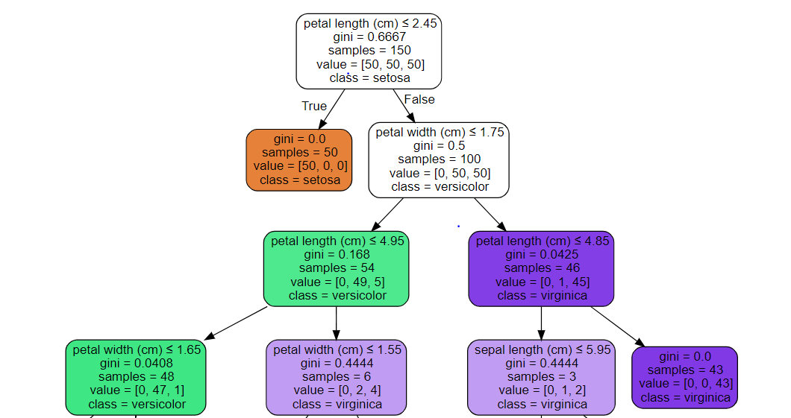
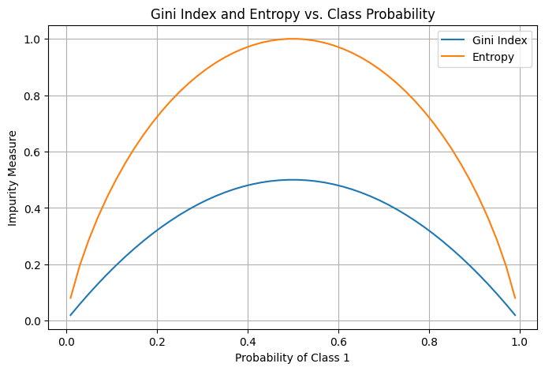
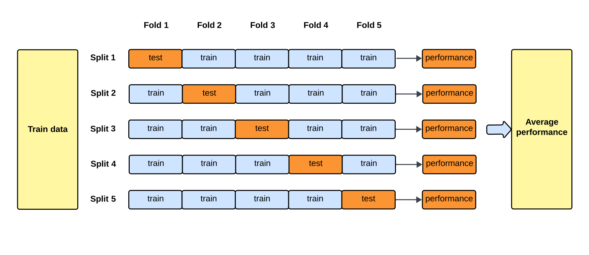
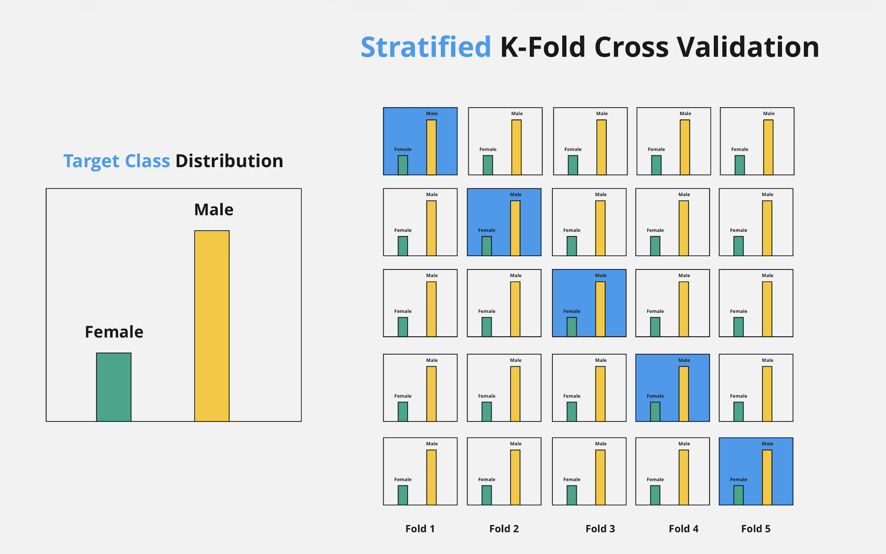

# ML Algorithms, Feature Engineering & Model Evaluation — Interview Q&A

> Covers: ML algorithms (Naive Bayes through XGBoost), feature engineering, feature importance, and model evaluation metrics — the full classical ML stack tested in DS/MLE interviews.

---

## Table of Contents

**Supervised Algorithms** — Naive Bayes · Linear & Logistic Regression · SVM · Comparisons · Regularization
- [Q1: What is Naive Bayes and what is its core assumption?](#q1-what-is-naive-bayes-and-what-is-its-core-assumption)
- [Q2: What are the types of Naive Bayes and when do you use each?](#q2-what-are-the-types-of-naive-bayes-and-when-do-you-use-each)
- [Q3: What are the advantages and disadvantages of Naive Bayes?](#q3-what-are-the-advantages-and-disadvantages-of-naive-bayes)
- [Q4: Does Naive Bayes require feature scaling?](#q4-does-naive-bayes-require-feature-scaling)
- [Q5: What are the four basic assumptions of Linear Regression?](#q5-what-are-the-four-basic-assumptions-of-linear-regression)
- [Q6: What is the cost function for Linear Regression and how does Gradient Descent minimize it?](#q6-what-is-the-cost-function-for-linear-regression-and-how-does-gradient-descent-minimize-it)
- [Q7: What is R² and Adjusted R², and when does Adjusted R² matter?](#q7-what-is-r²-and-adjusted-r²-and-when-does-adjusted-r²-matter)
- [Q8: What is multicollinearity and why does it hurt Linear Regression?](#q8-what-is-multicollinearity-and-why-does-it-hurt-linear-regression)
- [Q9: What is Logistic Regression and how does it produce a probability?](#q9-what-is-logistic-regression-and-how-does-it-produce-a-probability)
- [Q10: What is the loss function for Logistic Regression?](#q10-what-is-the-loss-function-for-logistic-regression)
- [Q11: How does Logistic Regression handle multiclass classification?](#q11-how-does-logistic-regression-handle-multiclass-classification)
- [Q12: What is the core idea behind Support Vector Machines (SVM)?](#q12-what-is-the-core-idea-behind-support-vector-machines-svm)
- [Q13: What is the kernel trick in SVM, and why is it powerful?](#q13-what-is-the-kernel-trick-in-svm-and-why-is-it-powerful)
- [Q14: What is the C parameter in SVM, and what is the hard vs. soft margin trade-off?](#q14-what-is-the-c-parameter-in-svm-and-what-is-the-hard-vs-soft-margin-trade-off)
- [Q15: Does SVM require feature scaling?](#q15-does-svm-require-feature-scaling)
- [Q16: Naive Bayes vs. Logistic Regression — when would you choose each?](#q16-naive-bayes-vs-logistic-regression-when-would-you-choose-each)
- [Q17: Linear Regression vs. Logistic Regression — what's the fundamental difference?](#q17-linear-regression-vs-logistic-regression-whats-the-fundamental-difference)
- [Q18: What is the Bias-Variance Tradeoff?](#q18-what-is-the-bias-variance-tradeoff)
- [Q19: What is L1 vs L2 Regularisation — Ridge vs Lasso?](#q19-what-is-l1-vs-l2-regularisation-ridge-vs-lasso)
- [Q20: What is a Voting Classifier (Hard vs. Soft voting)?](#q20-what-is-a-voting-classifier-hard-vs-soft-voting)

**Unsupervised Algorithms** — Distance Metrics · Dimensionality · K-Means · DBSCAN
- [Q21: What is the Curse of Dimensionality?](#q21-what-is-the-curse-of-dimensionality)
- [Q22: What is Cosine Similarity, and when is it better than Euclidean distance?](#q22-what-is-cosine-similarity-and-when-is-it-better-than-euclidean-distance)
- [Q63: How does K-Means clustering work, and how do you choose K?](#q63-how-does-k-means-clustering-work-and-how-do-you-choose-k)
- [Q64: What is DBSCAN and how does it differ from K-Means?](#q64-what-is-dbscan-and-how-does-it-differ-from-k-means)

**Dimensionality Reduction** — PCA · UMAP · t-SNE
- [Q65: What is PCA (Principal Component Analysis) and how does it work?](#q65-what-is-pca-principal-component-analysis-and-how-does-it-work)
- [Q66: What is UMAP and how does it differ from PCA and t-SNE?](#q66-what-is-umap-and-how-does-it-differ-from-pca-and-t-sne)

**Tree-Based Algorithms** — Decision Trees · Random Forest · XGBoost / Gradient Boosting · Ensemble Methods
- [Q23: What are Gini Impurity and Entropy in Decision Trees, and what's the difference?](#q23-what-are-gini-impurity-and-entropy-in-decision-trees-and-whats-the-difference)
- [Q24: Why do Decision Trees overfit, and how do you control it?](#q24-why-do-decision-trees-overfit-and-how-do-you-control-it)
- [Q25: Does a Decision Tree require feature scaling, and is it sensitive to outliers?](#q25-does-a-decision-tree-require-feature-scaling-and-is-it-sensitive-to-outliers)
- [Q26: How does Random Forest work, and what is bootstrap aggregation (bagging)?](#q26-how-does-random-forest-work-and-what-is-bootstrap-aggregation-bagging)
- [Q27: What is Out-of-Bag (OOB) error in Random Forest?](#q27-what-is-out-of-bag-oob-error-in-random-forest)
- [Q28: How is feature importance calculated in Random Forest, XGBoost, and LightGBM — and which should you trust?](#q28-how-is-feature-importance-calculated-in-random-forest-xgboost-and-lightgbm--and-which-should-you-trust)
- [Q29: How does Gradient Boosting work, and why is XGBoost the production default?](#q29-how-does-gradient-boosting-work-and-why-is-xgboost-the-production-default)
- [Q29b: Random Forest vs XGBoost vs LightGBM — how do their trees differ, and what is level-wise vs leaf-wise growth?](#q29b-random-forest-vs-xgboost-vs-lightgbm--how-do-their-trees-differ-and-what-is-level-wise-vs-leaf-wise-growth)
- [Q67: What are all the key XGBoost and LightGBM hyperparameters, and what happens when you increase or decrease each?](#q67-what-are-all-the-key-xgboost-and-lightgbm-hyperparameters-and-what-happens-when-you-increase-or-decrease-each)
- [Q68: What are the main ensemble strategies — Bagging, Boosting, and Stacking?](#q68-what-are-the-main-ensemble-strategies--bagging-boosting-and-stacking)

**Feature Preprocessing** — Imputation · Outlier Removal · Scaling · Imbalanced Data
- [Q30: What is feature scaling, and when is it required vs. not required?](#q30-what-is-feature-scaling-and-when-is-it-required-vs-not-required)
- [Q31: Which scaler should you use — StandardScaler, MinMaxScaler, or RobustScaler?](#q31-which-scaler-should-you-use-standardscaler-minmaxscaler-or-robustscaler)
- [Q32: What techniques exist for handling missing data?](#q32-what-techniques-exist-for-handling-missing-data)
- [Q33: How do you handle imbalanced datasets?](#q33-how-do-you-handle-imbalanced-datasets)
- [Q34: How do you create negative samples when you only have positive labels?](#q34-how-do-you-create-negative-samples-when-you-only-have-positive-labels)
- [Q35: How do class weights work in LightGBM for imbalanced binary classification?](#q35-how-do-class-weights-work-in-lightgbm-for-imbalanced-binary-classification)
- [Q36: What is the correct preprocessing order (imputation → clipping → scaling) and why does order matter?](#q36-what-is-the-correct-preprocessing-order-imputation-clipping-scaling-and-why-does-order-matter)

**Feature Engineering** — Encoding · Dimensionality
- [Q37: How do you handle high-cardinality categorical features?](#q37-how-do-you-handle-high-cardinality-categorical-features)

**Feature Selection** — Filter Methods · Correlation · End-to-End Workflow
- [Q38: What is Feature Selection and what are the three families of methods?](#q38-what-is-feature-selection-and-what-are-the-three-families-of-methods)
- [Q39: What are simple filter-based feature elimination methods and what thresholds do you use?](#q39-what-are-simple-filter-based-feature-elimination-methods-and-what-thresholds-do-you-use)
- [Q40: When do you use Spearman vs Pearson correlation for feature selection?](#q40-when-do-you-use-spearman-vs-pearson-correlation-for-feature-selection)
- [Q41: What is the end-to-end feature selection workflow for a production ML project?](#q41-what-is-the-end-to-end-feature-selection-workflow-for-a-production-ml-project)

**Model Evaluation** — Metrics · Thresholds · Calibration · Lift/KS
- [Q42: What is Cross-Validation, and why is it better than a single train/test split?](#q42-what-is-cross-validation-and-why-is-it-better-than-a-single-traintest-split)
- [Q43: What is a Confusion Matrix? Walk me through a worked example.](#q43-what-is-a-confusion-matrix-walk-me-through-a-worked-example)
- [Q44: What are Precision and Recall, and when does each matter more?](#q44-what-are-precision-and-recall-and-when-does-each-matter-more)
- [Q45: What is the F1 Score and when do you use it over accuracy?](#q45-what-is-the-f1-score-and-when-do-you-use-it-over-accuracy)
- [Q46: What are True Positive Rate and False Positive Rate, and how do they relate to the ROC curve?](#q46-what-are-true-positive-rate-and-false-positive-rate-and-how-do-they-relate-to-the-roc-curve)
- [Q47: What is AUC (Area Under the ROC Curve), and how do you interpret it?](#q47-what-is-auc-area-under-the-roc-curve-and-how-do-you-interpret-it)
- [Q48: How do you choose the right classification threshold?](#q48-how-do-you-choose-the-right-classification-threshold)
- [Q49: Why is accuracy a misleading metric for imbalanced datasets?](#q49-why-is-accuracy-a-misleading-metric-for-imbalanced-datasets)
- [Q50: What is the false positive vs. false negative trade-off?](#q50-what-is-the-false-positive-vs-false-negative-trade-off)
- [Q51: What is Specificity, and how does it differ from Precision?](#q51-what-is-specificity-and-how-does-it-differ-from-precision)
- [Q52: When would you use AUC-PR instead of AUC-ROC?](#q52-when-would-you-use-auc-pr-instead-of-auc-roc)
- [Q53: What is the difference between micro, macro, and weighted averaging for multiclass metrics?](#q53-what-is-the-difference-between-micro-macro-and-weighted-averaging-for-multiclass-metrics)
- [Q54: What is model calibration, and why does it matter in production?](#q54-what-is-model-calibration-and-why-does-it-matter-in-production)
- [Q55: How do you use Lift/Gain charts and KS statistic to evaluate a model and choose an operating threshold in production?](#q55-how-do-you-use-liftgain-charts-and-ks-statistic-to-evaluate-a-model-and-choose-an-operating-threshold-in-production)

**Business Insights from Model** — Feature Importance · SHAP · Variable Profiling · Feature-Score Correlation
- [Q56: What are the methods for computing feature importance, and how do they differ?](#q56-what-are-the-methods-for-computing-feature-importance-and-how-do-they-differ)
- [Q57: What is SHAP and how do you use it for post-model insight analysis?](#q57-what-is-shap-and-how-do-you-use-it-for-post-model-insight-analysis)
- [Q58: How do you build a probability bin report for model evaluation?](#q58-how-do-you-build-a-probability-bin-report-for-model-evaluation)
- [Q59: What is a feature-score correlation report and how do you use it for post-model insight?](#q59-what-is-a-feature-score-correlation-report-and-how-do-you-use-it-for-post-model-insight)

**Model Monitoring** — Drift Detection · PSI · Retraining Triggers
- [Q60: What is model drift, concept drift, and data drift — and how do you detect each in production?](#q60-what-is-model-drift-concept-drift-and-data-drift-and-how-do-you-detect-each-in-production)

**Tips & Tricks — End-to-End Model Building** — Data Leakage · Common Mistakes · Production Checklist
- [Q61: What is data leakage and what are the main types?](#q61-what-is-data-leakage-and-what-are-the-main-types)
- [Q62: How do you detect and prevent data leakage in an ML pipeline?](#q62-how-do-you-detect-and-prevent-data-leakage-in-an-ml-pipeline)

**Hyperparameter Tuning** — Optuna · HyperOpt · Bayesian Optimization
- [Q69: How does Optuna work for hyperparameter optimization?](#q69-how-does-optuna-work-for-hyperparameter-optimization)
- [Q70: What is HyperOpt and how does Bayesian optimization compare to grid and random search?](#q70-what-is-hyperopt-and-how-does-bayesian-optimization-compare-to-grid-and-random-search)

---

---

# Supervised Algorithms

---

## Q1: What is Naive Bayes and what is its core assumption?

Naive Bayes is a probabilistic classifier based on Bayes' Theorem. It computes the posterior probability of a class given the input features. The "naive" part is the **conditional independence assumption**: it assumes all features are independent of each other given the class label.

**Formula (Bayes' Theorem):**
$$P(C \mid X) = \frac{P(X \mid C) \cdot P(C)}{P(X)}$$

**Intuition:** If features were truly independent, computing the joint likelihood is just a product of individual likelihoods — which is computationally trivial even with 10,000 features.

**Example:** In spam detection, Naive Bayes treats "free" and "win" as independent features even though they often co-occur. Despite this unrealistic assumption, it still works well in practice.

**Step-by-step numerical walkthrough — spam detection:**

Given:
- P(spam) = 0.4, P(not spam) = 0.6
- P("free" | spam) = 0.8, P("free" | not spam) = 0.2
- New email contains the word "free" — what is P(spam | "free")?

**Step 1 — Compute the numerator** (prior × likelihood for spam):
$$P(\text{"free"} \mid \text{spam}) \cdot P(\text{spam}) = 0.8 \times 0.4 = 0.32$$

**Step 2 — Compute the numerator for not-spam:**
$$P(\text{"free"} \mid \text{not spam}) \cdot P(\text{not spam}) = 0.2 \times 0.6 = 0.12$$

**Step 3 — Compute the evidence** P("free") using the law of total probability:
$$P(\text{"free"}) = 0.32 + 0.12 = 0.44$$

**Step 4 — Apply Bayes' Theorem:**
$$P(\text{spam} \mid \text{"free"}) = \frac{0.32}{0.44} \approx \mathbf{0.727}$$

**Conclusion:** The prior probability of spam was 40%. After seeing "free", the posterior jumps to 72.7%. The word "free" is 4× more likely in spam than legitimate email, so it strongly shifts the probability. In a real classifier you multiply P(word | class) across all words in the email (that's the "naive" independence part) and pick the class with the highest posterior.

---


## Q2: What are the types of Naive Bayes and when do you use each?

| Type | Assumption | Use Case |
|---|---|---|
| **Gaussian NB** | Features are normally distributed | Continuous features (e.g., height, weight) |
| **Multinomial NB** | Features are counts (integers ≥ 0) | Text classification with TF-IDF or BoW counts |
| **Bernoulli NB** | Features are binary (0 or 1) | Binary word presence features in NLP |

**Intuition:** The type determines how `P(X | C)` is computed — choose based on the distribution of your feature values.

**Example:** For sentiment analysis on Amazon reviews using bag-of-words, Multinomial NB is the standard choice.

---


## Q3: What are the advantages and disadvantages of Naive Bayes?

**Advantages:**
- Works very well with a large number of features (e.g., 5,000–15,000 word features from TF-IDF)
- Scales well to large training datasets
- Converges fast — training is just computing conditional probabilities
- Handles sparse matrices well (binary/count features)
- No feature scaling required

**Disadvantages:**
- Correlated features hurt performance — if two features carry the same signal, their probabilities get double-counted
- The independence assumption is almost never truly satisfied in real data
- Poor probability calibration (the actual probability values are unreliable, even if the classification is correct)

**Example:** If "breaking" and "news" are highly correlated in a news classifier, Naive Bayes will overweight this signal and produce overconfident probabilities.

---


## Q4: Does Naive Bayes require feature scaling?

No. Because Naive Bayes operates purely on probabilities, the magnitude of feature values does not affect the computation. Feature scaling (standardization/normalization) is only needed for algorithms that rely on distance metrics (KNN, SVM, linear regression).

**Intuition:** Probability calculations are about counts and frequencies, not distances between points.

---


## Q5: What are the four basic assumptions of Linear Regression?

1. **Linearity** — The relationship between the independent features and the mean of the dependent variable is linear.
2. **Homoscedasticity** — The variance of the residuals (errors) is constant across all values of the independent variables (no funnel shape in residual plots).
3. **Independence** — Observations (residuals) are independent of each other — no autocorrelation.
4. **Normality** — For any fixed value of X, the dependent variable Y is normally distributed. Equivalently, the residuals should be normally distributed.

**Intuition:** These four assumptions ensure that OLS (Ordinary Least Squares) estimates are BLUE — Best Linear Unbiased Estimators (Gauss-Markov theorem).

**Example interview follow-up:** "What do you do if the normality assumption is violated?" — Apply log, Box-Cox, or power transformations to the feature before fitting.

---


## Q6: What is the cost function for Linear Regression and how does Gradient Descent minimize it?

**Cost Function (Mean Squared Error):**
$$J(\theta) = \frac{1}{2m} \sum_{i=1}^{m} \left( \hat{y}^{(i)} - y^{(i)} \right)^2$$

**Gradient Descent update rule:**
$$\theta_j := \theta_j - \alpha \frac{\partial J}{\partial \theta_j}$$

where $\alpha$ is the learning rate.

**Intuition:** We want to find the slope and intercept that minimize prediction error. Gradient descent iteratively adjusts parameters in the direction that reduces the cost. Feature scaling is critical here — if features have very different magnitudes, the gradient surface is elongated and convergence is slow.

**Example:** Without scaling, a feature in thousands (house size) vs. a feature in single digits (bedrooms) creates an asymmetric gradient surface. After standardization, gradient descent reaches the global minimum much faster.

**Step-by-step gradient descent update with concrete numbers:**

Setup: single feature, two training samples — `y_true = [3, 5]`, `y_pred = [2, 4]` (so errors = `[1, 1]`). Current parameter `θ = 1.0`, learning rate `α = 0.1`, `m = 2`.

**Step 1 — Compute MSE (cost):**
$$J(\theta) = \frac{1}{2m} \sum (y_{pred}^{(i)} - y_{true}^{(i)})^2 = \frac{1}{4}\left[(2-3)^2 + (4-5)^2\right] = \frac{1}{4}[1 + 1] = 0.5$$

**Step 2 — Compute the gradient** (partial derivative of J w.r.t. θ for a single-feature model where ŷ = θ·x, with x = [2, 4]):
$$\frac{\partial J}{\partial \theta} = \frac{1}{m} \sum_{i=1}^{m} (\hat{y}^{(i)} - y^{(i)}) \cdot x^{(i)} = \frac{1}{2}\left[(2-3)\cdot 2 + (4-5)\cdot 4\right] = \frac{1}{2}[(-2) + (-4)] = -3.0$$

**Step 3 — Update θ:**
$$\theta := \theta - \alpha \cdot \frac{\partial J}{\partial \theta} = 1.0 - 0.1 \times (-3.0) = 1.0 + 0.3 = \mathbf{1.3}$$

**Interpretation:** θ moved from 1.0 → 1.3 in one step. The gradient was negative (predictions were too low vs. truth), so θ increased. On the next iteration, predictions improve and the gradient shrinks, moving θ in smaller steps until convergence.

---


## Q7: What is R² and Adjusted R², and when does Adjusted R² matter?

**R² (Coefficient of Determination):**
$$R^2 = 1 - \frac{SS_{res}}{SS_{tot}} = 1 - \frac{\sum(y_i - \hat{y}_i)^2}{\sum(y_i - \bar{y})^2}$$

| Term | Full name | What it measures |
|---|---|---|
| $SS_{res}$ | **Residual** Sum of Squares | How much the model still gets wrong — sum of squared gaps between each actual value $y_i$ and the model's prediction $\hat{y}_i$ |
| $SS_{tot}$ | **Total** Sum of Squares | Total variance in the data — sum of squared gaps between each actual value $y_i$ and the overall mean $\bar{y}$ |
| $y_i$ | actual value | the ground truth for observation $i$ |
| $\hat{y}_i$ | predicted value | what the model outputs for observation $i$ |
| $\bar{y}$ | mean of actuals | baseline: predict the mean for every point |

**Intuition:** $SS_{tot}$ is the error of a "dumb" model that always predicts the mean. $SS_{res}$ is the error that remains after your model fits. R² = 1 means the model perfectly explains all variance ($SS_{res}=0$); R² = 0 means the model is no better than predicting the mean.

R² measures the proportion of variance in the dependent variable explained by the model. Range: 0 to 1 (higher is better).

**Problem with R²:** Adding any new feature — even a random one — will never decrease R². So R² always goes up as you add more predictors.

**Adjusted R²:**
$$R^2_{adj} = 1 - \left(1 - R^2\right) \cdot \frac{n-1}{n-k-1}$$

where $n$ = number of samples, $k$ = number of features. Adjusted R² penalizes for adding irrelevant features.

**Intuition:** Adjusted R² goes up only if the new feature actually improves the model more than chance would.

**Example:** A model with 50 random noise features can have R² = 0.9 but Adjusted R² = 0.3, revealing the true situation.

**Step-by-step numerical computation of R² and Adjusted R²:**

Dataset: `y_true = [3, 5, 4, 6, 5]` → mean ȳ = (3+5+4+6+5)/5 = **4.6**

Suppose a model predicts `ŷ = [3.5, 4.5, 4.0, 5.5, 5.5]`.

**Step 1 — Compute SS_res** (residual sum of squares — how much the model still gets wrong):

| i | y_true | ŷ | (y − ŷ)² |
|---|---|---|---|
| 1 | 3 | 3.5 | (−0.5)² = 0.25 |
| 2 | 5 | 4.5 | (0.5)² = 0.25 |
| 3 | 4 | 4.0 | (0.0)² = 0.00 |
| 4 | 6 | 5.5 | (0.5)² = 0.25 |
| 5 | 5 | 5.5 | (−0.5)² = 0.25 |

**SS_res = 0.25 + 0.25 + 0.00 + 0.25 + 0.25 = 1.00**

**Step 2 — Compute SS_tot** (total sum of squares — variance around the mean):

| i | y_true | (y − ȳ)² |
|---|---|---|
| 1 | 3 | (3 − 4.6)² = 2.56 |
| 2 | 5 | (5 − 4.6)² = 0.16 |
| 3 | 4 | (4 − 4.6)² = 0.36 |
| 4 | 6 | (6 − 4.6)² = 1.96 |
| 5 | 5 | (5 − 4.6)² = 0.16 |

**SS_tot = 2.56 + 0.16 + 0.36 + 1.96 + 0.16 = 5.20**

**Step 3 — Compute R²:**
$$R^2 = 1 - \frac{SS_{res}}{SS_{tot}} = 1 - \frac{1.00}{5.20} \approx \mathbf{0.808}$$

The model explains about 81% of the variance.

**Step 4 — Compute Adjusted R²** (n=5, k=1 feature):
$$R^2_{adj} = 1 - (1 - 0.808) \cdot \frac{5-1}{5-1-1} = 1 - 0.192 \cdot \frac{4}{3} = 1 - 0.256 = \mathbf{0.744}$$

**Step 5 — Why Adjusted R² penalizes extra features:** Now add a second feature that is pure random noise. Suppose R² rises slightly to 0.812 (random noise always adds a little). With k=2:
$$R^2_{adj} = 1 - (1 - 0.812) \cdot \frac{4}{2} = 1 - 0.188 \times 2 = 1 - 0.376 = \mathbf{0.624}$$

Adjusted R² dropped from 0.744 → 0.624 even though R² went up. This is the penalty for adding a feature that doesn't earn its keep.

---


## Q8: What is multicollinearity and why does it hurt Linear Regression?

Multicollinearity occurs when two or more independent features are highly correlated with each other (e.g., > 0.90 correlation). It does not affect the model's predictions, but it inflates the standard errors of the coefficients, making them unstable and unreliable.

**Detection:**

**Correlation matrix** — fast pairwise check; flag |r| > 0.9. Misses hidden multicollinearity where no single pair looks bad but one feature is a linear combination of several others (e.g., Z = X + Y).

**VIF (Variance Inflation Factor)** — for each feature $j$, regress it on all other features and measure $R^2$:
$$\text{VIF}_j = \frac{1}{1 - R_j^2}$$
If other features predict $j$ perfectly, $R^2 \to 1$ and $\text{VIF} \to \infty$. Catches multi-variable relationships that pairwise correlation misses.

| VIF | Interpretation |
|-----|---------------|
| 1 | No correlation |
| 1–5 | Acceptable |
| > 5–10 | Severe — drop or merge |

```python
from statsmodels.stats.outliers_influence import variance_inflation_factor
vif = pd.DataFrame()
vif["feature"] = X.columns
vif["VIF"] = [variance_inflation_factor(X.values, i) for i in range(X.shape[1])]
# Drop highest-VIF feature one at a time and recalculate
```

**Choosing:** Use correlation matrix for quick EDA on large datasets. Use VIF when building interpretable models — rigorous but expensive (one regression per feature).

**Note:** Tree-based models (XGBoost, Random Forest) are unaffected — VIF only matters when coefficient interpretability is required.

**Solutions:**
- Drop one of the correlated features (iterative VIF loop)
- Use Ridge Regression (L2) which shrinks correlated coefficients toward zero
- Use PCA to replace correlated features with orthogonal components

**Example:** In a housing price model, "living area" and "number of rooms" are likely 90%+ correlated. Keeping both makes the individual coefficients hard to interpret and unstable across different dataset samples.

---


## Q9: What is Logistic Regression and how does it produce a probability?

Logistic Regression is a linear classifier that models the **log-odds** (logit) of the outcome as a linear function of the features. The sigmoid function maps this to a probability between 0 and 1.

**Sigmoid Function:**
$$\sigma(z) = \frac{1}{1 + e^{-z}}, \quad z = \theta^T x$$

**Log-odds (logit):**
$$\log \frac{P(y=1)}{P(y=0)} = \theta^T x$$

**Intuition:** The model draws a linear decision boundary in feature space. Points on one side get P(y=1) > 0.5, the other side < 0.5.

**Step-by-step numerical walkthrough — loan default prediction:**

Suppose weights learned: $\theta = [1.2,\ 0.4,\ -0.3]$ (bias, income\_score, debt\_ratio).

Sample: income\_score = 2.0, debt\_ratio = 3.0.

**Step 1 — Compute z (linear combination):**
$$z = 1.2 + 0.4 \times 2.0 + (-0.3) \times 3.0 = 1.2 + 0.8 - 0.9 = 1.1$$

**Step 2 — Apply sigmoid:**
$$\sigma(1.1) = \frac{1}{1 + e^{-1.1}} = \frac{1}{1 + 0.333} = \frac{1}{1.333} \approx \mathbf{0.75}$$

**Interpretation:** This customer has a 75% predicted probability of default. Since 0.75 > 0.5, the model classifies them as "will default."

**What if z = 0?** $\sigma(0) = 0.5$ — the model is completely uncertain. The decision boundary is exactly where $\theta^T x = 0$.

**What does log-odds mean in practice?**
$$\log \frac{0.75}{0.25} = \log(3) \approx 1.1 = z$$
The linear model directly predicts the log-odds. Each unit increase in income\_score increases the log-odds of default by 0.4, which multiplies the odds by $e^{0.4} \approx 1.49$.

---


## Q10: What is the loss function for Logistic Regression?

**Binary Cross-Entropy (Log Loss):**
$$J(\theta) = -\frac{1}{m} \sum_{i=1}^{m} \left[ y^{(i)} \log \hat{p}^{(i)} + (1 - y^{(i)}) \log(1 - \hat{p}^{(i)}) \right]$$

**Intuition:** We heavily penalize confident wrong predictions. If the model says P(y=1) = 0.99 but the true label is 0, the log term −log(0.01) ≈ 4.6 is a massive penalty.

MSE is not used for classification because the resulting loss surface is non-convex for sigmoid outputs, making gradient descent unreliable.

**Step-by-step numerical walkthrough — 3 samples:**

| i | $y$ | $\hat{p}$ | Term used | Penalty |
|---|---|---|---|---|
| 1 (fraud, correct) | 1 | 0.90 | $-\log(0.90)$ | **0.105** — small, model is right |
| 2 (fraud, missed) | 1 | 0.05 | $-\log(0.05)$ | **3.00** — huge, model confidently wrong |
| 3 (legit, correct) | 0 | 0.10 | $-\log(1-0.10) = -\log(0.90)$ | **0.105** — small, model is right |

$$J = -\frac{1}{3}[(-0.105) + (-3.00) + (-0.105)] \text{ (negatives already in formula)} = \frac{0.105 + 3.00 + 0.105}{3} \approx \mathbf{1.07}$$

**Key insight:** Sample 2 (confident miss) contributes 3.00 out of 3.21 total — it dominates the gradient completely and forces the model to fix that error first. This is why log loss is powerful: it makes the model pay maximum attention to its worst mistakes.

---


## Q11: How does Logistic Regression handle multiclass classification?

**One-vs-Rest (OvR):** Train K binary classifiers, one per class. At inference, the class with the highest predicted probability wins. This is the default in scikit-learn.

**Softmax (Multinomial Logistic Regression):** A single model with K output nodes. The softmax function ensures all class probabilities sum to 1:
$$P(y=k \mid x) = \frac{e^{\theta_k^T x}}{\sum_{j=1}^{K} e^{\theta_j^T x}}$$

**Intuition:** OvR is simpler and works well in practice. Softmax is more principled when classes are mutually exclusive.

**Example:** For 3-class flower classification (iris dataset), OvR trains 3 binary classifiers: setosa vs. rest, versicolor vs. rest, virginica vs. rest.

---


## Q12: What is the core idea behind Support Vector Machines (SVM)?

SVM finds the **maximum-margin hyperplane** — the decision boundary that maximizes the distance (margin) between the two classes. The data points closest to the boundary are called **support vectors**, and only these points define the hyperplane.

**Hyperplane equation:** $w^T x + b = 0$

**Margin:** $\frac{2}{\|w\|}$ (we maximize this by minimizing $\|w\|^2$)

**Intuition:** A wider margin means better generalization. By focusing only on support vectors, SVM is memory-efficient and robust to non-support-vector outliers.

**Example:** In a dataset with 10,000 points in 2D, the hyperplane might be defined by only 3–5 support vectors along the class boundaries.

---


## Q13: What is the kernel trick in SVM, and why is it powerful?

The kernel trick allows SVM to find a non-linear decision boundary by implicitly mapping data to a higher-dimensional space without explicitly computing the transformation. The kernel function computes the dot product in that higher space directly.

**Common kernels:**

| Kernel | Formula | Use Case |
|---|---|---|
| **Linear** | $K(x, z) = x^T z$ | Linearly separable data, high-dim text |
| **RBF (Gaussian)** | $K(x,z) = e^{-\gamma \|x-z\|^2}$ | General non-linear problems |
| **Polynomial** | $K(x,z) = (x^T z + c)^d$ | Image and NLP tasks |

**Intuition:** Data that isn't separable in 2D may become linearly separable in 100D. The kernel trick does this efficiently without ever materializing the high-dimensional features.

**Example:** Two concentric circles (inner = class 0, outer = class 1) are not linearly separable in 2D, but an RBF kernel maps them to 3D where a plane separates them.

---


## Q14: What is the C parameter in SVM, and what is the hard vs. soft margin trade-off?

**Hard margin SVM:** Requires all points to be correctly classified with no violations. Only works when data is perfectly linearly separable. Sensitive to outliers.

**Soft margin SVM:** Introduces slack variables to allow some misclassifications, controlled by the **C parameter**:

- **Large C:** Small margin, fewer training errors → high variance (overfitting risk)
- **Small C:** Large margin, more training errors tolerated → high bias (underfitting risk)

**Intuition:** C controls the bias-variance trade-off. Think of it as "how much do you penalize margin violations?"

**Example:** In a medical dataset with a few mislabeled examples, a large C would try to classify those outliers correctly, resulting in a narrow, contorted margin. A smaller C ignores those outliers for a cleaner, wider margin.

---


## Q15: Does SVM require feature scaling?

Yes. SVM creates a hyperplane based on distances between points and the margin. If one feature has values in [0, 1] and another in [0, 1000], the larger-scale feature will dominate the distance calculation, skewing the margin unfairly.

**Solution:** Always apply standardization (z-score scaling) or min-max scaling before fitting an SVM.

**Example:** SVM on housing data with "bedrooms" (1–5) and "price" (100,000–2,000,000) without scaling will effectively ignore the "bedrooms" feature.

---

---


## Q16: Naive Bayes vs. Logistic Regression — when would you choose each?

| | Naive Bayes | Logistic Regression |
|---|---|---|
| **Training data** | Works well with small data | Needs more data |
| **Features** | Handles 10,000+ features easily | Struggles with very high dims without regularization |
| **Correlated features** | Hurt performance | Handles correlation better |
| **Speed** | Very fast | Fast, but slower than NB |
| **Probability quality** | Poorly calibrated | Well-calibrated probabilities |
| **Interpretability** | Low | High (coefficients have meaning) |

**Rule of thumb:** Use Naive Bayes for text classification as a fast baseline. Use Logistic Regression when you need interpretable, calibrated probabilities.

---


## Q17: Linear Regression vs. Logistic Regression — what's the fundamental difference?

| | Linear Regression | Logistic Regression |
|---|---|---|
| **Output** | Continuous value (−∞, +∞) | Probability [0, 1] |
| **Loss function** | MSE | Log loss (binary cross-entropy) |
| **Activation** | Identity (linear) | Sigmoid |
| **Decision boundary** | N/A (predicts value) | Linear boundary in feature space |
| **Assumes normality** | Yes, of residuals | No distribution assumption on features |

**Intuition:** Logistic regression is linear regression with a sigmoid squashing function applied to the output. It reframes a regression output as a probability.

**Example:** Linear regression predicting house price (output could be -$50K, nonsensical). Logistic regression predicting probability of sale (always in [0,1]).

---


## Q18: What is the Bias-Variance Tradeoff?

Every model's prediction error on unseen data decomposes into three terms:

$$\text{Total Error} = \text{Bias}^2 + \text{Variance} + \text{Irreducible Noise}$$

**Bias** — error from wrong assumptions. A high-bias model is too simple to capture the true pattern. It underfits: bad on both train and test.

**Variance** — error from sensitivity to training data fluctuations. A high-variance model memorises training data. It overfits: great on train, bad on test.

**Irreducible noise** — randomness in the data itself (label noise, missing features). No model can fix this.

**Intuition — the bull's-eye analogy:**

Think of darts thrown at a bull's-eye target:
- **Low bias, low variance** (ideal): darts cluster tightly at the centre
- **High bias, low variance**: darts cluster tightly — but in the wrong corner (wrong assumption, consistent)
- **Low bias, high variance**: darts are centred around the bull's-eye on average — but are scattered everywhere (right direction, inconsistent)
- **High bias, high variance**: worst case — scattered AND off-centre

**Concrete example — predicting house prices:**

| Model | Train RMSE | Test RMSE | Diagnosis |
|---|---|---|---|
| Linear regression (1 feature) | 120k | 125k | High bias — model too simple, underfits |
| Polynomial degree 10 | 5k | 180k | High variance — memorised training data |
| Polynomial degree 3 + Ridge | 45k | 50k | Sweet spot |

**How complexity affects the tradeoff:**

$$\text{Bias} \downarrow \text{ as complexity} \uparrow, \quad \text{Variance} \uparrow \text{ as complexity} \uparrow$$

The optimal model sits at the bottom of the U-shaped test error curve — complex enough to capture the real pattern, simple enough not to memorise noise.

**Production levers:**
- High bias → add features, increase model complexity, reduce regularisation
- High variance → get more data, add regularisation (L1/L2), use ensemble methods (Random Forest, bagging), reduce model complexity

---


## Q19: What is L1 vs L2 Regularisation — Ridge vs Lasso?

Both add a penalty term to the loss function to discourage large weights and reduce overfitting. The difference is the shape of the penalty.

**Ridge (L2 regularisation):**
$$J(\theta) = \text{MSE} + \lambda \sum_{j=1}^{k} \theta_j^2$$

**Lasso (L1 regularisation):**
$$J(\theta) = \text{MSE} + \lambda \sum_{j=1}^{k} |\theta_j|$$

**Intuition — why L1 produces zeros and L2 does not:**

Imagine the loss surface as an ellipse in weight space, centred at the OLS solution. The regularisation term adds a constraint region — L2 is a sphere (smooth everywhere), L1 is a diamond (corners on the axes).

The constrained solution is where the ellipse first touches the constraint boundary. A sphere has no corners — the touching point is typically on the surface, with all weights non-zero. A diamond has corners exactly on the coordinate axes. The ellipse almost always touches a corner first — where one weight is exactly 0. **This is why L1 produces sparse models automatically.**

**Step-by-step numerical example — what λ does:**

Suppose OLS gives θ = [5.0, 0.1] (one important feature, one near-zero feature).

With Ridge (λ = 1):
- Penalise 5.0² + 0.1² = 25.01 — the large weight 5.0 dominates the penalty
- Gradient descent shrinks 5.0 → ~4.7 (still non-zero), 0.1 → ~0.09 (still non-zero)
- **Ridge shrinks all weights but zeros out none**

With Lasso (λ = 1):
- Penalise |5.0| + |0.1| = 5.1
- The gradient of |θ| is ±1 everywhere (constant) — for a small weight like 0.1, the constant L1 gradient overpowers the data gradient and drives it exactly to 0
- **Lasso sets the small weight exactly to 0 → automatic feature selection**

| | Ridge (L2) | Lasso (L1) |
|---|---|---|
| Penalty | $\lambda \sum \theta_j^2$ | $\lambda \sum \|\theta_j\|$ |
| Effect on weights | Shrinks all toward zero | Shrinks some to exactly zero |
| Feature selection | No | Yes |
| Best for | Multicollinearity (shrinks correlated pairs together) | High-dim data with many irrelevant features |
| Solution when features correlated | Shares weight between correlated features | Picks one, zeros the rest |
| Scikit-learn | `Ridge(alpha=λ)` | `Lasso(alpha=λ)` |

**Production rule:** Start with Ridge when you believe all features are useful but correlated. Use Lasso when you suspect many features are irrelevant and want automatic selection. Use ElasticNet (combines both) as a default when unsure.

**How to choose λ:** Always cross-validate. Plot train/val error vs. log(λ). Pick the λ at the val-error elbow. In scikit-learn: `RidgeCV` and `LassoCV` do this automatically.

---


## Q20: What is a Voting Classifier (Hard vs. Soft voting)?

Voting classifiers combine multiple models and aggregate their predictions — a simple ensemble method.

**Hard Voting:** Each model outputs a class label. Final prediction = majority vote.

**Soft Voting:** Each model outputs a probability per class. Final prediction = the class with the highest **average probability** across models.

$$\hat{y}_{soft} = \arg\max_k \frac{1}{M} \sum_{m=1}^{M} P_m(y=k \mid x)$$

**Soft vs. Hard:**
- Soft voting is generally better when models are well-calibrated (probabilities are trustworthy)
- Soft voting uses more information — probability magnitudes, not just class labels
- Hard voting is simpler and works when individual model probabilities are unreliable

**Intuition:** In hard voting, a very confident model counts the same as an uncertain one. In soft voting, a model that says 99% has more influence than one that says 51%.

**Example:** 4 decision trees predicting fraud — hard: [1, 1, 0, 1] → majority = 1. Soft: probabilities [0.9, 0.8, 0.2, 0.7] → mean = 0.65 → fraud. Same result but more nuanced signal used.

# Unsupervised Algorithms

---

## Q21: What is the Curse of Dimensionality?

The curse of dimensionality: adding more features improves model performance up to a point, then performance degrades as the feature space grows exponentially sparse.

**Why it happens:**
1. As dimensions increase, the volume of the feature space grows exponentially — data becomes extremely sparse
2. With sparse data, distance metrics become meaningless (all points are roughly equidistant)
3. Training data requirements grow exponentially with dimensions to maintain the same data density

**Intuition:** Finding a friend in a 2D city block is easy. In a million-dimensional space — impossible. More dimensions paradoxically make the problem harder.

**Solutions:**
- **Feature selection** — keep only the most informative features
- **PCA** — project to fewer orthogonal dimensions that capture most variance
- **Regularization** (L1/L2) — penalizes complexity, reducing effective dimensions

**Example:** A TF-IDF matrix for 10,000 words creates 10,000 features. For KNN, all documents become roughly equidistant. PCA might reduce this to 50–100 dimensions while preserving 90%+ of variance.

---


## Q22: What is Cosine Similarity, and when is it better than Euclidean distance?

**Cosine Similarity** measures the angle between two vectors, not the distance between their endpoints:

$$\cos(\theta) = \frac{A \cdot B}{\|A\| \cdot \|B\|} = \frac{\sum_{i=1}^{n} A_i B_i}{\sqrt{\sum A_i^2} \cdot \sqrt{\sum B_i^2}}$$

Range: −1 to +1. cos θ = 1 means identical direction; 0 means orthogonal; −1 means opposite.

**When Cosine Similarity is better:**

| Scenario | Why Cosine Wins |
|---|---|
| **NLP / Text similarity** | A short and a long document about "cats" are semantically similar — Euclidean would call them far apart due to length |
| **High-dimensional sparse vectors** | TF-IDF: most values are 0; magnitude differences dominate Euclidean, cosine normalizes them away |
| **Recommendation systems** | User preference vectors — orientation (topic), not scale (activity level), is what matters |

**Numerical walkthrough — TF-IDF vectors:**

Doc A = [3, 1, 0, 2], Doc B = [6, 2, 0, 4] (Doc B is 2× Doc A in magnitude, same direction).

- Dot product: 3×6 + 1×2 + 0 + 2×4 = 18 + 2 + 8 = **28**
- ‖A‖ = √(9+1+0+4) = √14 ≈ 3.742, ‖B‖ = √(36+4+0+16) = √56 ≈ 7.483
- cos θ = 28 / (3.742 × 7.483) = **1.0** — identical content despite different length ✓

Euclidean distance = √((3−6)² + (1−2)² + 0 + (2−4)²) = √14 ≈ 3.74 — incorrectly suggests they're different.

**Production note:** Embedding models output L2-normalized vectors, making cosine similarity equivalent to the dot product — which is why FAISS and Qdrant support inner-product search as a fast cosine approximation.

---


## Q63: How does K-Means clustering work, and how do you choose K?

K-Means partitions n observations into K clusters by minimizing the **within-cluster sum of squares (WCSS)**:

$$\text{WCSS} = \sum_{k=1}^{K} \sum_{x_i \in C_k} \|x_i - \mu_k\|^2$$

**Algorithm (Lloyd's algorithm):**
1. Initialize K centroids (random or K-Means++)
2. **Assignment:** each point goes to the nearest centroid: $c_i = \arg\min_k \|x_i - \mu_k\|^2$
3. **Update:** recompute each centroid as the mean of its assigned points: $\mu_k = \frac{1}{|C_k|} \sum_{x_i \in C_k} x_i$
4. Repeat steps 2–3 until centroids stop moving

**Step-by-step example — 4 points, K=2:**

Points: A=(1,1), B=(1,2), C=(4,4), D=(5,3). Initialize centroids: μ₁=(1,1), μ₂=(4,4).

Round 1 — Assignment: A→Cluster 1, B→Cluster 1, C→Cluster 2, D→Cluster 2

Round 1 — Update: μ₁=mean(A,B)=(1, 1.5), μ₂=mean(C,D)=(4.5, 3.5)

Round 2 — Assignment: same → **converged**.

**Choosing K — Elbow Method:**

```python
from sklearn.cluster import KMeans
import numpy as np

wcss = []
for k in range(1, 11):
    km = KMeans(n_clusters=k, random_state=42, n_init=10)
    km.fit(X)
    wcss.append(km.inertia_)  # inertia_ = WCSS
# Plot wcss vs k — look for the "elbow" where gain flattens
```

**Choosing K — Silhouette Score (more objective):**

Measures how similar each point is to its own cluster vs. the nearest other cluster. Range: −1 to +1 (higher = better separation).

$$s_i = \frac{b_i - a_i}{\max(a_i, b_i)}$$

where a_i = mean distance to points in same cluster, b_i = mean distance to points in nearest other cluster.

```python
from sklearn.metrics import silhouette_score

scores = []
for k in range(2, 11):
    km = KMeans(n_clusters=k, random_state=42, n_init=10)
    labels = km.fit_predict(X)
    scores.append(silhouette_score(X, labels))

best_k = range(2, 11)[np.argmax(scores)]
print(f"Best K by silhouette: {best_k}")
```

**K-Means limitations and when to use DBSCAN instead:**

| Scenario | K-Means | DBSCAN |
|---|---|---|
| Spherical, similar-size clusters | ✅ Best | Overkill |
| Arbitrary shapes (rings, blobs) | ❌ Fails | ✅ |
| Unknown number of clusters | ❌ K required | ✅ Auto-found |
| Outlier detection | ❌ Assigns every point | ✅ Labels as noise |
| Varying cluster density | ❌ Poor | ⚠ Use HDBSCAN |

> 🎯 **Interview prep:** "How do you choose K?" — Use both the elbow method (plot WCSS vs K, look for the inflection) and silhouette score (picks the K with best cluster cohesion and separation). "When does K-Means fail?" — Non-spherical clusters (use DBSCAN), very different cluster sizes, presence of outliers (one point can pull a centroid far from the cluster center).

---


## Q64: What is DBSCAN and how does it differ from K-Means?

**DBSCAN (Density-Based Spatial Clustering of Applications with Noise)** groups tightly-packed points together, marking points in low-density regions as outliers. It requires no upfront K specification.

**Two hyperparameters:**
- `eps` (ε): radius of the neighborhood around a point
- `min_samples`: minimum points within eps to form a dense region

**Three point types:**
- **Core point:** ≥ `min_samples` neighbors within eps
- **Border point:** within eps of a core point but fewer than `min_samples` neighbors itself
- **Noise point:** not reachable from any core point — assigned label **−1**

**Algorithm:**
1. For each point, count neighbors within eps
2. If count ≥ min_samples → core point; recursively expand cluster to all density-reachable points
3. Non-core points within eps of a core point → border points (added to cluster)
4. All remaining points → noise

**Worked example:** eps=1.5, min_samples=2

Points: A=(1,1), B=(1,2), C=(1.5,1.5), D=(8,8), E=(8.5,8.5)

- A: neighbors={B,C} → count=2 ≥ 2 → **core point** → Cluster 1
- B: neighbors={A,C} → core → Cluster 1
- C: neighbors={A,B} → core → Cluster 1
- D: neighbors={E} → count=1 < 2 → not core; is D within eps of any core point? No → **noise**
- E: same → **noise**

Increase eps to 2.0: D and E become each other's neighbor (dist=0.7 < 2.0), both become core → **Cluster 2**.

**Choosing eps — k-distance plot:**

```python
from sklearn.neighbors import NearestNeighbors
import numpy as np

k = 5  # set to min_samples
nbrs = NearestNeighbors(n_neighbors=k).fit(X)
distances, _ = nbrs.kneighbors(X)
kth_distances = np.sort(distances[:, k-1])
# Plot kth_distances — the elbow is the optimal eps
```

**DBSCAN in code:**

```python
from sklearn.cluster import DBSCAN

db = DBSCAN(eps=0.8, min_samples=5)
labels = db.fit_predict(X)

n_clusters = len(set(labels)) - (1 if -1 in labels else 0)
n_noise = list(labels).count(-1)
print(f"Clusters: {n_clusters}, Noise points: {n_noise}")

# eps too small: almost everything is noise
db_small = DBSCAN(eps=0.1, min_samples=5).fit_predict(X)
# eps too large: everything merges into one cluster
db_large = DBSCAN(eps=100, min_samples=5).fit_predict(X)
```

**DBSCAN vs K-Means full comparison:**

| Criterion | K-Means | DBSCAN |
|---|---|---|
| K required | Yes | No |
| Cluster shape | Spherical only | Any arbitrary shape |
| Outlier handling | Assigns to nearest cluster | Labels as noise (−1) |
| Speed | O(nKT) — fast | O(n log n) with kd-tree |
| Varying density | Poor | Struggles (use HDBSCAN) |
| Best use case | Well-separated, similar-size clusters | Arbitrary shapes, outlier detection needed |

> 🎯 **Interview prep:** "Why use DBSCAN over K-Means?" — DBSCAN doesn't need K, handles any cluster shape (rings, elongated blobs), and explicitly identifies outliers. K-Means assumes spherical clusters and always assigns every point. "What's the failure mode of DBSCAN?" — Clusters of very different densities: a single eps can't simultaneously capture a dense cluster and a sparse one. Use HDBSCAN (Hierarchical DBSCAN) for varying density.

---

# Dimensionality Reduction

---

## Q65: What is PCA (Principal Component Analysis) and how does it work?

PCA reduces dimensionality by finding orthogonal directions of **maximum variance** in the data — called **principal components**. The first PC explains the most variance, each subsequent PC explains the most remaining variance perpendicular to all prior ones.

**Algorithm:**

1. **Center the data:** $X_{c} = X - \bar{X}$
2. **Covariance matrix:** $\Sigma = \frac{1}{n-1} X_c^T X_c$
3. **Eigendecomposition:** $\Sigma v_j = \lambda_j v_j$ — eigenvectors $v_j$ are the principal components, eigenvalues $\lambda_j$ are the variance explained
4. **Sort by eigenvalue descending** — PC1 has the largest λ
5. **Project:** $Z = X_c \cdot V_k$ where $V_k$ = top k eigenvectors

**Explained variance ratio:**

$$\text{EVR}_j = \frac{\lambda_j}{\sum_{i=1}^{p} \lambda_i}$$

**Worked numerical example — 2D data:**

Points: (1,2), (3,4), (5,6). Mean = (3,4). Centered: (−2,−2), (0,0), (2,2).

Covariance: $\Sigma = \begin{bmatrix} 4 & 4 \\ 4 & 4 \end{bmatrix}$. Eigenvalues: λ₁=8, λ₂=0.

EVR₁ = 8/8 = **1.0** — the first PC explains 100% of variance (the data is perfectly collinear along y=x).

**Production code:**

```python
from sklearn.decomposition import PCA
import numpy as np

pca = PCA().fit(X)

# Cumulative explained variance — choose n_components for 95%
cumulative_evr = np.cumsum(pca.explained_variance_ratio_)
n_components = int(np.argmax(cumulative_evr >= 0.95)) + 1
print(f"Components for 95% variance: {n_components}")
print(f"EVR per component: {pca.explained_variance_ratio_[:10]}")

# Transform
pca_final = PCA(n_components=n_components)
X_reduced = pca_final.fit_transform(X)

# Reconstruction error — how much information was lost
X_reconstructed = pca_final.inverse_transform(X_reduced)
recon_mse = np.mean((X - X_reconstructed)**2)
print(f"Reconstruction MSE: {recon_mse:.4f}")
```

**Does PCA require feature scaling?** Yes — PCA is variance-based. A feature in thousands (price) will dominate the first PC over a feature in single digits (count), regardless of predictive value. Always apply `StandardScaler` before PCA.

**When to use PCA vs. not:**

| Use PCA when... | Skip PCA when... |
|---|---|
| Features are highly correlated (multicollinearity) | Using tree-based models (XGBoost, LightGBM) — no distance computation |
| Before distance-based models (KNN, K-Means, SVM) | When individual feature interpretability is required |
| To speed up training on very high-dimensional data | Data has non-linear structure — use UMAP instead |
| Visualization (2D/3D projection) | Small datasets where dropping features hurts more than helps |

> 🎯 **Interview prep:** "What are principal components?" — Eigenvectors of the covariance matrix — orthogonal directions that successively capture the most remaining variance. "PCA vs. feature selection?" — PCA creates new features (linear combinations of all originals); no original feature is preserved. Feature selection keeps original features — interpretable, but doesn't remove collinearity within selected features.

---


## Q66: What is UMAP and how does it differ from PCA and t-SNE?

**UMAP (Uniform Manifold Approximation and Projection)** is a non-linear dimensionality reduction algorithm that learns the underlying **manifold structure** of high-dimensional data. Unlike PCA (which finds linear directions of variance), UMAP models the topology of the data and optimizes a low-dimensional layout that preserves that topology.

**Core idea:** High-dimensional data often lies on a lower-dimensional curved surface (manifold). UMAP:
1. Builds a weighted k-nearest neighbor graph representing local connectivity
2. Finds a low-dimensional embedding that preserves this topology using fuzzy set theory and stochastic gradient descent

**Key hyperparameters:**

| Parameter | Default | Increase → | Decrease → |
|---|---|---|---|
| `n_neighbors` | 15 | More global structure preserved; clusters spread out | Very local structure; micro-clusters appear, global layout meaningless |
| `min_dist` | 0.1 | Points spread out (loose clusters) | Points packed tightly (dense clusters, good for downstream ML) |
| `n_components` | 2 | More dimensions retained (less compression) | Maximum compression |
| `metric` | 'euclidean' | Use 'cosine' for NLP/embedding spaces | — |

```python
import umap

# Visualization (2D)
reducer = umap.UMAP(n_neighbors=15, min_dist=0.1, n_components=2, random_state=42)
X_2d = reducer.fit_transform(X)

# Feature reduction for downstream ML (compact, clustered representation)
reducer_ml = umap.UMAP(n_neighbors=15, min_dist=0.0, n_components=50, random_state=42)
X_reduced = reducer_ml.fit_transform(X_train)
X_reduced_test = reducer_ml.transform(X_test)  # UMAP can transform unseen data
```

**UMAP vs. PCA vs. t-SNE — full comparison:**

| Criterion | PCA | t-SNE | UMAP |
|---|---|---|---|
| Type | Linear | Non-linear | Non-linear |
| Speed | Very fast | Very slow O(n²) | Fast O(n log n) |
| Global structure | ✅ Preserved | ❌ Distorted | ✅ Well-preserved |
| Local structure | ❌ Poor | ✅ Excellent | ✅ Excellent |
| Scalable to large data | ✅ | ❌ | ✅ |
| Transform new data | ✅ | ❌ (must re-fit) | ✅ |
| For ML features | ✅ | ❌ Visualization only | ✅ |
| Best for | Linear correlations, multicollinearity | Dense cluster visualization | Both visualization AND ML preprocessing |

**n_neighbors effect:**
- `n_neighbors=5` → hyper-local: disconnected micro-clusters, global positions meaningless
- `n_neighbors=15` → balanced: production default
- `n_neighbors=50` → global topology preserved, local detail smoothed

**Production use case:** Project 768-dim BERT embeddings → 50-dim via UMAP before training a downstream classifier. Retains semantic neighborhood structure while making the classification task tractable.

> 🎯 **Interview prep:** "Difference between UMAP and PCA?" — PCA is linear, finds orthogonal directions of maximum variance, interpretable (components are linear combos of features). UMAP is non-linear, learns manifold topology, is a black box. PCA for linear structure; UMAP for complex high-dimensional data like text embeddings or image features. "When not to use UMAP?" — When you need interpretability (use PCA), or when the dataset is very small (< 100 points — neighborhood structure becomes unstable).

---

# Tree-Based Algorithms

---

## Q23: What are Gini Impurity and Entropy in Decision Trees, and what's the difference?





Both measure the impurity of a node — how mixed the class labels are.

**Entropy (Information Gain):**
$$H(S) = -\sum_{k=1}^{K} p_k \log_2 p_k$$

**Gini Impurity:**
$$G = 1 - \sum_{k=1}^{K} p_k^2$$

**Information Gain** (used by ID3):
$$IG = H(parent) - \sum_{children} \frac{n_{child}}{n_{parent}} H(child)$$

**Key difference:** Gini is computationally cheaper (no log) and biased toward larger partitions. Entropy is more information-theoretically principled. In practice, they produce nearly identical trees. CART (scikit-learn) uses Gini by default.

**Intuition:** A pure node (all one class) has Gini = 0 and Entropy = 0. A perfectly mixed 50/50 binary node has Gini = 0.5 and Entropy = 1.0.

**Example:** Node with [70% class A, 30% class B]: Gini = 1 − (0.7² + 0.3²) = 0.42. Entropy = −(0.7 log₂ 0.7 + 0.3 log₂ 0.3) = 0.88.

**Full step-by-step computation for node [70% class A, 30% class B]:**

Given: p_A = 0.7, p_B = 0.3.

**Gini Impurity — step by step:**

$$G = 1 - \sum p_k^2 = 1 - (p_A^2 + p_B^2)$$

1. Square each probability: p_A² = 0.7² = **0.49**, p_B² = 0.3² = **0.09**
2. Sum them: 0.49 + 0.09 = **0.58**
3. Subtract from 1: 1 − 0.58 = **0.42**

**Gini = 0.42** (0 = pure, 0.5 = maximally mixed for 2 classes)

**Entropy — step by step:**

$$H = -\sum p_k \log_2 p_k = -(p_A \log_2 p_A + p_B \log_2 p_B)$$

1. Compute log₂(0.7): log₂(0.7) = ln(0.7)/ln(2) = −0.357/0.693 = **−0.515**
2. Compute log₂(0.3): log₂(0.3) = ln(0.3)/ln(2) = −1.204/0.693 = **−1.737**
3. Multiply each p by its log:
   - 0.7 × (−0.515) = **−0.361**
   - 0.3 × (−1.737) = **−0.521**
4. Sum: −0.361 + (−0.521) = **−0.882**
5. Negate: −(−0.882) = **0.882** ≈ **0.88**

**Entropy = 0.88** (0 = pure, 1.0 = maximally mixed for 2 classes)

**Why both are non-zero at 70/30?** Because the node still has some of class B in it — the tree will want to split further to separate them. A pure node (100/0) gives Gini = 1 − (1² + 0²) = 0 and Entropy = −(1·log₂1 + 0) = 0, meaning no further split is needed.

**Why Gini < Entropy for the same node?** The two measures have different scales. Gini caps at 0.5 (binary), Entropy at 1.0 (binary). They rank splits identically almost always — which is why trees built with either criterion produce nearly the same structure in practice.

**How does the tree use Gini to *select* a split? — Full numerical walkthrough**

A node contains 10 transactions: 4 Fraud, 6 Legitimate.

**Step 1 — Parent node impurity:**
$$\text{Gini}_{parent} = 1 - (0.4^2 + 0.6^2) = 1 - (0.16 + 0.36) = \mathbf{0.48}$$

**Step 2 — Propose a candidate split:** `Transaction Amount > $100`

| Child node | Rows | Fraud | Legit | Fraction of total |
|---|---|---|---|---|
| Left (Amount > $100) | 4 | 3 | 1 | 4/10 |
| Right (Amount ≤ $100) | 6 | 1 | 5 | 6/10 |

**Step 3 — Child node impurities:**

$$\text{Gini}_{left} = 1 - \left[\left(\tfrac{3}{4}\right)^2 + \left(\tfrac{1}{4}\right)^2\right] = 1 - (0.5625 + 0.0625) = \mathbf{0.375}$$

$$\text{Gini}_{right} = 1 - \left[\left(\tfrac{1}{6}\right)^2 + \left(\tfrac{5}{6}\right)^2\right] = 1 - (0.0278 + 0.6944) = \mathbf{0.2778}$$

**Step 4 — Weighted child impurity and impurity decrease:**

$$\text{Weighted} = \frac{4}{10} \times 0.375 + \frac{6}{10} \times 0.2778 = 0.150 + 0.1667 = \mathbf{0.3167}$$

$$\text{Impurity Decrease} = 0.48 - 0.3167 = \mathbf{0.1633}$$

The algorithm repeats this for *every* candidate feature and threshold. The split with the **highest impurity decrease** is permanently executed at this node. This is why splitting on a random noise feature rarely wins — it produces near-zero impurity decrease and gets outcompeted by informative features.

---


## Q24: Why do Decision Trees overfit, and how do you control it?

Decision Trees have **low bias and high variance** by default — they will grow to their full depth and perfectly memorize training data, including noise.

**Intuition:** A fully-grown tree creates one leaf per training sample in the extreme — zero training error but terrible generalization. Every stopping rule below limits this growth.

**Pre-pruning (stopping criteria during growth):**

| Hyperparameter | Default | What it limits | When to tune |
|---|---|---|---|
| `max_depth` | None | Maximum vertical levels the tree can grow | Cap at 3–10 for interpretability; None is fine inside a Random Forest (bagging handles variance) |
| `min_samples_split` | 2 | Min samples a node must have to *attempt* a split | Raise to 10–20 on noisy or small datasets; a node with only 2 rows should rarely split |
| `min_samples_leaf` | 1 | Min samples that must end up in each *resulting leaf* | Raise to 5–10; proposed splits are rolled back if either child falls below this threshold |
| `max_features` | None | Features considered at each split | Set to `'sqrt'` or `'log2'` to introduce randomness and decorrelate trees in an ensemble |
| `max_leaf_nodes` | None | Hard cap on total leaf count | Grows best-first up to this limit; good for a specific complexity budget |

**Post-pruning (after full growth):**
- **Cost-complexity pruning** (`ccp_alpha` in scikit-learn): after growing fully, removes subtrees whose impurity-reduction-per-leaf doesn't justify the complexity cost. Higher `ccp_alpha` = more aggressive pruning. Use `cost_complexity_pruning_path()` + CV to find the best `ccp_alpha`.

**Example:** With `min_samples_split=15`, a node with only 10 rows is immediately forced into a leaf — the split walkthrough in Q23 (10-row parent node) would be *blocked* by this rule. This is the direct connection between the hyperparameter and the split mechanics.

**Rule of thumb:** Inside a Random Forest, set `max_depth=None` (let trees grow deep — bagging handles overfitting). For a standalone Decision Tree, `max_depth=5–10` + `min_samples_leaf=5` is a robust starting point.

---


## Q25: Does a Decision Tree require feature scaling, and is it sensitive to outliers?

**Feature scaling:** Not required. Decision trees split features based on threshold comparisons (feature > value?), not distances. The scale of features doesn't affect which split is chosen.

**Outliers:** Decision trees are generally **robust to outliers** because a split threshold will either include or exclude the outlier in a specific leaf. The outlier doesn't distort the splitting criterion globally (unlike linear regression where one outlier shifts the entire hyperplane).

**Missing values:** Decision trees can handle missing values natively using surrogate splits — if the primary split feature is missing, a surrogate feature is used instead.

---


## Q26: How does Random Forest work, and what is bootstrap aggregation (bagging)?

A Random Forest is an ensemble algorithm that combines predictions from many decision trees to produce a more accurate, stable final prediction. It relies on **Bagging (Bootstrap Aggregating)**: while a single decision tree overfits easily and is sensitive to noise, a collection of *diverse* trees averages out each other's errors.

**Two core sources of diversity (what forces trees to differ):**

| Randomness type | Mechanism | Effect |
|---|---|---|
| **Row Randomness (Bootstrapping)** | Each tree trains on a random sample drawn *with replacement* from the full dataset. ~63% unique rows appear; the remaining ~37% are **Out-of-Bag (OOB)** — free for validation. | Trees see different data slices → different error patterns |
| **Feature Randomness (Feature Subspace)** | At each split, the tree evaluates only a random subset of features (`max_features = √p` for classification). Best split chosen from that restricted pool only. | Trees focus on different features → low correlation between trees |

**Key insight:** Averaging N *uncorrelated* models with individual variance σ² yields ensemble variance σ²/N. Without feature randomness all trees would pick the same dominant feature at the root — they'd be correlated — and averaging them wouldn't help.

**Step-by-step production example — fraud detection**

Features: `Transaction Amount`, `Device Country`, `Time of Day`. Target: Fraud vs Legitimate.

**Step 1 — Bootstrap sampling:**

| Tree | Rows sampled (with replacement) | OOB rows (free validation) |
|---|---|---|
| Tree 1 | 1, 2, 2, 5, 9 | 3, 4, 6, 7, 8, 10 |
| Tree 2 | 2, 3, 4, 7, 8 | 1, 5, 6, 9, 10 |
| Tree 3 | 1, 4, 5, 6, 6 | 2, 3, 7, 8, 9, 10 |

**Step 2 — Feature randomness at each split:**

- Tree 1: first split evaluates `Transaction Amount` + `Time of Day` only
- Tree 2: first split evaluates `Device Country` + `Time of Day` only
- Tree 3: first split evaluates `Transaction Amount` + `Device Country` only

All three trees grow completely different structures despite seeing the same problem.

**Step 3 — Majority vote at inference:**

New transaction: `$5,000 | Unknown Country | 3:00 AM`

| Tree | Prediction |
|---|---|
| Tree 1 | Fraud |
| Tree 2 | Legitimate |
| Tree 3 | Fraud |

$$\text{2 × Fraud, 1 × Legitimate} \rightarrow \textbf{Final: Fraud}$$

For **regression**, replace majority vote with the **average** of all tree outputs.

**Why seniors choose Random Forest over a single tree:**

| Advantage | Why it matters in production |
|---|---|
| **No pruning needed** | Let individual trees grow fully deep (low bias, high variance). Averaging cancels variance — no manual `max_depth` tuning required. |
| **Free OOB validation** | ~37% of rows are OOB per tree. Set `oob_score=True` → `.oob_score_` gives a built-in CV estimate at zero extra compute cost. |
| **Robust feature importances** | MDI averaged across 100+ trees is far more stable than a single tree's importances (see Q28). |
| **Robust to hyperparameters** | Adding more trees never hurts (only costs compute). A single tree is fragile to `max_depth`; RF is not. |

**Implementation — inspect individual tree votes:**

```python
import numpy as np
from sklearn.ensemble import RandomForestClassifier
from sklearn.datasets import make_classification

# 1,000 transactions, 10 features, binary target (0=Legit, 1=Fraud)
X, y = make_classification(n_samples=1000, n_features=10, n_informative=7, random_state=42)

rf = RandomForestClassifier(
    n_estimators=100,    # build 100 trees
    max_features='sqrt', # √10 ≈ 3 features per split — decorrelates trees
    oob_score=True,      # compute free OOB validation score during training
    n_jobs=-1,           # parallelize across all CPU cores
    random_state=42,
)
rf.fit(X, y)

new_tx = np.random.randn(1, 10)                                          # one unseen transaction
individual_votes = [tree.predict(new_tx)[0] for tree in rf.estimators_] # raw vote from every tree

print(f"OOB accuracy:              {rf.oob_score_:.4f}")                 # built-in val score — no holdout needed
print(f"Ensemble prediction:       {rf.predict(new_tx)[0]}")            # final majority vote
print(f"Fraud probability:         {rf.predict_proba(new_tx)[0][1]:.2f}") # fraction of trees voting Fraud
print(f"First 10 individual votes: {individual_votes[:10]}")             # raw diversity visible here
```

**Hyperparameter reference:**

| Parameter | Default | What it controls | Prod recommendation |
|---|---|---|---|
| `n_estimators` | 100 | Number of trees | 200–500; more = more stable, diminishing returns after ~300 |
| `max_features` | `'sqrt'` | Features evaluated per split | `'sqrt'` for classification, `1/3` for regression |
| `max_depth` | None | Max depth per tree | Leave None inside RF (bagging handles variance); cap at 10–20 if memory is a constraint |
| `min_samples_split` | 2 | Min samples to attempt a split | 10–20 on small/noisy datasets |
| `min_samples_leaf` | 1 | Min samples in a leaf | 5–10; prevents single-point leaves |
| `bootstrap` | True | Row-level bootstrapping | Always True; set False only to compare without bagging |
| `oob_score` | False | Free OOB validation | Always set True in production — it's free |

> 🎯 **Interview prep:** "Why does RF reduce variance but not bias?" — Each fully-grown tree has low bias but high variance. Averaging many uncorrelated trees preserves the low bias but cancels variance. "When would you pick XGBoost over RF?" — When you need the last 1–2% of accuracy on tabular data. RF is the right first baseline — robust, interpretable, and fast to train.

---


## Q27: What is Out-of-Bag (OOB) error in Random Forest?

Since each tree is trained on a bootstrap sample (~63% of the data), the remaining ~37% of samples not used for that tree are called **out-of-bag samples**. Each sample ends up out-of-bag for roughly 37% of trees.

The OOB error is computed by evaluating each sample's prediction using only the trees for which it was OOB — providing a built-in cross-validation estimate without a separate validation set.

**Intuition:** OOB error is essentially "free" validation — you get a reliable generalization estimate at no additional computational cost.

**Example:** In scikit-learn, set `oob_score=True` in `RandomForestClassifier`. The `oob_score_` attribute gives the OOB accuracy — typically within 1–2% of held-out validation accuracy.

---


## Q28: How is feature importance calculated in Random Forest, XGBoost, and LightGBM — and which should you trust?

All three algorithms measure how much a feature helps organise/split the data, but they define "helps" differently. Using the wrong metric gives misleading rankings.

---

### 1. Random Forest — MDI (Mean Decrease in Impurity)

Scikit-learn's `RandomForestClassifier` uses **MDI (Gini Importance)** by default.

**How it's computed step by step:**
1. Every time feature F splits a node, record the **Gini impurity drop** that split achieved (the impurity-decrease calculation from Q23).
2. Sum all impurity drops caused by F across all splits in all 100+ trees, weighted by the fraction of samples that passed through each node.
3. Divide by the total impurity drop from all features combined → normalised score in [0, 1].

```python
from sklearn.ensemble import RandomForestClassifier
import pandas as pd

rf = RandomForestClassifier(n_estimators=100, random_state=42)
rf.fit(X_train, y_train)

importance_df = pd.DataFrame({
    'feature':   X_train.columns,
    'mdi_score': rf.feature_importances_   # MDI by default
}).sort_values('mdi_score', ascending=False)
```

**The senior warning — MDI's cardinal bias:**

MDI severely over-inflates continuous or high-cardinality features (Zip Code, User ID, transaction timestamp). Because these features have thousands of unique split thresholds, trees split on them repeatedly *by chance* on noise data, accumulating large impurity drops artificially.

**The fix — Permutation Importance:**
Shuffle each feature's values on the **held-out test set** and measure how much the model's accuracy drops. If shuffling a feature doesn't hurt accuracy → it's not important. This is statistically unbiased and distribution-agnostic.

```python
from sklearn.inspection import permutation_importance

result = permutation_importance(
    rf, X_val, y_val,
    n_repeats=10,       # shuffle each feature 10× and average the drop
    random_state=42,
    scoring='roc_auc'
)

perm_df = pd.DataFrame({
    'feature':    X_train.columns,
    'importance': result.importances_mean,
    'std':        result.importances_std,
}).sort_values('importance', ascending=False)
```

| | MDI | Permutation Importance |
|---|---|---|
| Speed | Fast (computed during training) | Slow (requires model inference × n_repeats) |
| Bias | Inflates high-cardinality features | Unbiased |
| Leakage risk | None | Uses val/test set — no leakage |
| Works on any model | No (tree-specific) | Yes |

---

### 2. XGBoost — three distinct importance types

XGBoost exposes three separate views via `.get_score(importance_type=...)`:

| Type | What it measures | Pitfall |
|---|---|---|
| **`gain`** *(recommended)* | Average fractional drop in training loss when the feature splits a node — true predictive power | None — this is the right default |
| **`weight`** | Count of how many times the feature appears as a split point across all trees | Noisy continuous features rack up huge weight counts even with near-zero predictive value |
| **`cover`** | Average number of rows that passed through the feature's split points | Correlated with feature frequency, not quality |

```python
import xgboost as xgb

model = xgb.XGBClassifier(n_estimators=200, random_state=42)
model.fit(X_train, y_train)

# Always request 'gain' — it reflects the actual structural improvement
importance_gain   = model.get_booster().get_score(importance_type='gain')
importance_weight = model.get_booster().get_score(importance_type='weight')

# Or with the sklearn API:
# model.feature_importances_  ← uses 'weight' by default — switch with importance_type param
xgb_gain_model = xgb.XGBClassifier(importance_type='gain')
```

**Interview gotcha:** `model.feature_importances_` in the sklearn XGBoost API uses `weight` by default — the least reliable metric. Always override to `gain`.

---

### 3. LightGBM — split vs. gain

LightGBM uses `importance_type` set at **model init time**:

| Type | What it measures | Verdict |
|---|---|---|
| **`split`** *(default)* | Raw count of how many times the feature was used in a leaf-wise split | Same flaw as XGBoost weight — high frequency ≠ high quality |
| **`gain`** *(recommended)* | Total structural gain (loss reduction) contributed by the feature across all trees | Use this |

```python
import lightgbm as lgb

# Set importance_type at init — can't change after fit
lgb_model = lgb.LGBMClassifier(
    importance_type='gain',   # explicitly request gain, not the 'split' default
    n_estimators=200,
    random_state=42,
)
lgb_model.fit(X_train, y_train)

print(lgb_model.feature_importances_)   # now returns gain, not split count
```

---

### Summary playbook

| Algorithm | Default metric | Recommended | Why switch |
|---|---|---|---|
| **Random Forest** | MDI (Gini decrease) | Permutation Importance | MDI inflates high-cardinality noise features; permutation is unbiased |
| **XGBoost** | `weight` (split count) | `gain` | Weight is frequency, not quality; gain reflects actual loss reduction |
| **LightGBM** | `split` (split count) | `gain` | Same reason as XGBoost weight |

**When to use permutation over all of the above:** when features are correlated. Both MDI and gain can split credit arbitrarily between two correlated features (one may appear more by chance). Permutation importance drops the entire signal from a correlated group when one is shuffled — giving a more realistic picture of real-world impact.

> 🎯 **Interview prep:** "Which feature importance should you use?" — Lead with: *MDI / split-count are fast but biased; gain is better for boosting models; permutation importance is the gold standard for any model type because it measures the actual impact on held-out metric, not a training-time proxy.* Then call out the high-cardinality bias in MDI — that one detail separates a senior from a junior.

---


## Q29: How does Gradient Boosting work, and why is XGBoost the production default?

**Core idea:** Build trees sequentially. Each new tree corrects the residual errors (mistakes) of all previous trees combined.

**Algorithm step by step:**

1. Start with a base prediction — typically the mean of y: $F_0(x) = \bar{y}$
2. Compute residuals: $r_i = y_i - F_0(x_i)$
3. Fit a shallow decision tree to predict the residuals (not the original labels)
4. Update the model: $F_1(x) = F_0(x) + \eta \cdot h_1(x)$ where $\eta$ is the learning rate and $h_1$ is the new tree
5. Repeat: compute new residuals from $F_1$, fit $h_2$ to them, add to the ensemble
6. Final model: $F_M(x) = F_0(x) + \eta \sum_{m=1}^{M} h_m(x)$

**Step-by-step numerical example — 4 samples:**

y_true = [10, 20, 30, 40]. Start: $F_0 = \bar{y} = 25$.

**Round 1:**
- Residuals: [10−25, 20−25, 30−25, 40−25] = [**−15, −5, +5, +15**]
- Tree 1 learns to predict these residuals (say perfectly: $h_1$ = [−15, −5, +5, +15])
- Update with η = 0.1: $F_1 = 25 + 0.1 \times h_1 = [23.5, 24.5, 25.5, 26.5]$

**Round 2:**
- New residuals: [10−23.5, 20−24.5, 30−25.5, 40−26.5] = [**−13.5, −4.5, +4.5, +13.5**]
- Tree 2 fits these. Update again. Residuals shrink each round.

After many rounds the predictions converge to the true values. The learning rate η < 1 means each tree contributes only a fraction — many small corrections rather than one big one. This is why gradient boosting generalises better than fitting one large tree.

**Why XGBoost dominates production:**

| Feature | XGBoost advantage |
|---|---|
| **Regularisation** | Built-in L1 + L2 on leaf weights — reduces overfitting |
| **Speed** | Column block structure → parallel tree building on sorted features |
| **Missing values** | Learns the best direction to send missing values at each split |
| **Pruning** | Builds full tree then prunes backwards (max_depth first, then prune) vs. greedy stopping |
| **Monotone constraints** | Enforce business rules (e.g., risk score must increase with debt ratio) |

**When to use which ensemble:**

| Model | When |
|---|---|
| Random Forest | Fast baseline, interpretable feature importances, robust to hyperparameters |
| XGBoost / LightGBM | When you need the best accuracy on tabular data — default choice in Kaggle + production |
| LightGBM | XGBoost-level accuracy but 3–10× faster on large datasets (leaf-wise splits vs. level-wise) |
| CatBoost | Best out-of-the-box for high-cardinality categorical features — no encoding needed |

**Key XGBoost hyperparameters a senior DS tunes:**
- `n_estimators` — number of trees; tune with early stopping on a val set
- `learning_rate` (η) — lower = more trees needed, better generalisation; typical 0.01–0.1
- `max_depth` — tree depth; typical 3–8; deeper = more variance
- `subsample` — fraction of rows per tree; reduces variance (like bagging)
- `colsample_bytree` — fraction of features per tree; decorrelates trees (like Random Forest)
- `reg_alpha` (L1), `reg_lambda` (L2) — regularisation strength

---


## Q29b: Random Forest vs XGBoost vs LightGBM — how do their trees differ, and what is level-wise vs leaf-wise growth?

### The single biggest structural difference: how each tree grows

All three algorithms build decision trees. What differs is **whether trees grow in parallel or sequentially**, and **how each individual tree expands its nodes**.

---

### Level-wise tree growth (XGBoost default)

Grows the tree one full depth level at a time — all nodes at depth d are split before any node at depth d+1. Like BFS (breadth-first search).

```
                        Level-wise (XGBoost)
                        ────────────────────
                        Iteration 1: build all nodes at depth 0
                             [Root: Amount > $500?]
                            /                     \
                          Yes                      No

                        Iteration 2: build ALL nodes at depth 1
                    [Country = Unknown?]         [Hour > 22?]
                   /          \                /          \
                 Yes           No            Yes           No

                        Iteration 3: build ALL nodes at depth 2
               [amt > $2k?] [freq > 10?] [new_device?] [amt > $50?]
               /    \       /    \        /    \        /    \
             ...   ...    ...   ...     ...   ...    ...   ...

        At each depth, ALL 2^d candidate nodes are evaluated
        before going any deeper — even low-gain nodes get split.
```

**Key property:** Symmetric. Every path from root to leaf has the same depth (`max_depth`). Produces square, balanced trees.

---

### Leaf-wise tree growth (LightGBM default)

Always picks the single leaf with the **highest potential gain** and splits it next — regardless of depth. Like best-first search.

```
                        Leaf-wise (LightGBM)
                        ─────────────────────
        Step 1: split root — gain = 0.48
             [Root: Amount > $500?]
            /                     \
          Yes (gain=0.48)          No

        Step 2: left leaf has highest gain — split it
             [Root: Amount > $500?]
            /                     \
   [Country = Unknown?]            No (leaf, gain=0.12)
   /          \
 Yes           No

        Step 3: left-left leaf has highest gain — split it
             [Root: Amount > $500?]
            /                     \
   [Country = Unknown?]            No (leaf)
   /          \
[amt > $2k?]   No
 /    \
Yes    No

        Result with 4 leaves: 3 splits total, unbalanced depth.
        Level-wise needs 3 splits for 4 leaves too, but wastes
        one split on the low-gain right subtree.
```

**Key property:** Asymmetric. Grows deep on the high-gain path, shallow on low-gain paths. Same number of leaves can be reached with fewer total splits.

---

### Concrete numerical example — same data, 4 leaves

Imagine a node tree where splitting gains are:

| Split candidate | Gain |
|---|---|
| Root → Left | 0.48 |
| Root → Right | 0.12 |
| Left → Left-Left | 0.35 |
| Left → Left-Right | 0.18 |
| Right → Right-Left | 0.09 |
| Right → Right-Right | 0.06 |

**Level-wise to 4 leaves (depth=2):** Must split both Root→Left AND Root→Right to reach depth 1, then split all 4 children:

Splits performed: Root, Left, Right → 3 splits, total gain = 0.48 + 0.12 + 0.35 + 0.18 = **1.13**

Wait — level-wise performs the root split, then ALL depth-1 splits (Left + Right), giving 4 leaves after 3 splits.

Total gain captured: 0.48 + 0.12 + 0.35 + 0.18 = **1.13** (had to split Right even though gain=0.12)

**Leaf-wise to 4 leaves:** Always pick highest-gain leaf:
1. Split Root (gain=0.48)
2. Split Root→Left (gain=0.35, highest remaining leaf)
3. Split Left→Left-Left (gain=0.18, highest remaining leaf)

Total gain captured: 0.48 + 0.35 + 0.18 = **1.01** in 3 splits — but avoids wasting a split on the weak Root→Right (0.12).

> **Why LightGBM is faster:** for the same number of leaves (`num_leaves`), leaf-wise needs fewer splits to reach high-gain regions. On large datasets, this translates directly to training speed — sometimes 3–10× faster than XGBoost.

> **Why leaf-wise can overfit on small data:** it can grow very deep on a single path (depth 50+), memorising noise in that branch. Fix: set `max_depth` alongside `num_leaves`, or increase `min_child_samples`.

---

### How Random Forest trees differ from both

Random Forest trees are neither level-wise nor leaf-wise in the boosting sense — each tree is fully grown (no depth limit by default) and independently trained on a bootstrap sample. They are not sequential; all trees are trained in parallel. The diversity comes from row and feature randomness, not from correcting residuals.

```
        Random Forest                XGBoost / LightGBM
        ─────────────                ──────────────────
        T1  T2  T3  ...  T100        T1 → T2 → T3 → ... → T100
        ↓   ↓   ↓         ↓         ↑         ↑          ↑
      indep indep indep  indep      each tree fits residuals of all prior trees
      (parallel)                    (sequential — can't parallelise across trees)

        Reduce VARIANCE               Reduce BIAS
        (averaging uncorrelated       (each tree fixes what the ensemble
         trees cancels noise)          gets wrong)
```

---

### Full comparison table

| Dimension | Random Forest | XGBoost | LightGBM |
|---|---|---|---|
| **Ensemble type** | Bagging (parallel) | Boosting (sequential) | Boosting (sequential) |
| **What each tree targets** | Original labels (bootstrap sample) | Residuals / negative gradient | Residuals / negative gradient |
| **Tree growth** | Fully grown, no depth limit | Level-wise (depth-first by level) | Leaf-wise (best-first by gain) |
| **Tree shape** | Deep, balanced | Shallow, symmetric (max_depth 3–8) | Asymmetric, deep on high-gain path |
| **Key depth control** | `max_depth=None` (let it grow) | `max_depth` | `num_leaves` + `max_depth` |
| **Splitting algorithm** | Exact (evaluates all thresholds) | Exact (column-block sorted) | Histogram-based (buckets values) |
| **Speed** | Fast (embarrassingly parallel) | Moderate | 3–10× faster than XGBoost on large data |
| **Memory** | Moderate | Moderate | Low (histograms compress feature values) |
| **Missing values** | Requires imputation | Native (learns best direction) | Native (learns best direction) |
| **Categoricals** | Requires encoding | Requires encoding | Native (`categorical_feature` param) |
| **Overfitting risk** | Low (variance reduced by averaging) | Moderate | Higher on small data (leaf-wise goes deep) |
| **Regularisation** | None (relies on averaging) | L1 + L2 on leaf weights | L1 + L2 + `min_child_samples` |
| **Best for** | Fast robust baseline, feature selection | Winning accuracy on tabular data | Large datasets, speed-constrained pipelines |
| **Weak at** | Low-bias problems (needs boosting) | Very large datasets (XGB slower) | Small datasets (leaf-wise overfits) |

### When to use which

```
Start here:
  ├─ Need a fast, interpretable baseline → Random Forest
  ├─ Need best accuracy, dataset < 1M rows → XGBoost
  ├─ Dataset > 1M rows OR speed matters → LightGBM
  └─ High-cardinality categoricals, no encoding budget → CatBoost
```

> 🎯 **Interview prep:** "What is leaf-wise vs level-wise?" — Level-wise splits all nodes at the current depth before going deeper (balanced tree, XGBoost default). Leaf-wise always splits the single leaf with the highest gain (asymmetric tree, LightGBM default) — same leaf count with fewer wasted splits on low-gain nodes, but higher overfitting risk on small data. "Why is LightGBM faster than XGBoost?" — Two reasons: (1) histogram binning reduces split candidates from O(n) to O(bins), and (2) GOSS (Gradient-based One-Side Sampling) skips low-gradient samples that already predict well, training on fewer rows without much accuracy loss.

---


## Q67: What are all the key XGBoost and LightGBM hyperparameters, and what happens when you increase or decrease each?

Understanding the effect of each hyperparameter is the difference between randomly trying values and tuning systematically. Every parameter controls a specific axis of the bias-variance tradeoff.

### Master reference table

| Hyperparameter | Controls | Default | Increase → | Decrease → | Typical range |
|---|---|---|---|---|---|
| `n_estimators` | Number of trees | 100 | More complex, slower; plateau after optimal | Fewer trees; may underfit | 200–5000 (use early stopping) |
| `learning_rate` (η) | Step size per tree | 0.1 | Faster convergence, fewer trees needed | Needs more trees; generalizes better | 0.01–0.3 |
| `max_depth` | Tree depth | 6 | More complex splits; overfitting risk | Simpler trees; underfitting risk | 3–10 |
| `min_child_weight` (XGB) / `min_child_samples` (LGB) | Min data required in a leaf | 1 / 20 | More conservative; prevents leaf splits on tiny groups | Smaller leaves; may memorize noise | 5–100 |
| `subsample` | Fraction of rows per tree | 1.0 | More data per tree, less tree diversity | More diversity; reduces variance | 0.6–0.9 |
| `colsample_bytree` | Fraction of features per tree | 1.0 | All features; correlated trees | Decorrelated trees (like Random Forest) | 0.5–0.9 |
| `gamma` (XGB only) | Min loss reduction required to split | 0 | Only splits that meaningfully reduce loss survive | Any split allowed; may produce useless leaves | 0–5 |
| `reg_alpha` (L1) | L1 penalty on leaf weights | 0 | Sparse model; drives small weights to zero | All leaves contribute | 0–10 |
| `reg_lambda` (L2) | L2 penalty on leaf weights | 1 | Stronger weight shrinkage; smoother model | Less regularization | 0–10 |
| `num_leaves` (LGB only) | Max leaves per tree | 31 | More complex tree; may overfit | Simpler model | 20–255 |
| `scale_pos_weight` | Class imbalance ratio | 1 | Upweights positive class | Treats classes equally | n_neg / n_pos |

---

### Deep dive with code

**n_estimators + learning_rate (always tuned together)**

```python
import xgboost as xgb

# Rule: use a high n_estimators + early stopping to auto-find the optimal count
# Low learning_rate = more trees needed, but typically better generalization
model = xgb.XGBClassifier(
    n_estimators=5000,
    learning_rate=0.05,   # lower = more precise corrections
    max_depth=6,
    verbosity=0
)
model.fit(
    X_train, y_train,
    eval_set=[(X_val, y_val)],
    early_stopping_rounds=50,   # stops when val AUC doesn't improve for 50 rounds
    verbose=False
)
print(f"Optimal n_estimators: {model.best_iteration}")
# Too few trees → underfits (high bias)
# Too many trees without early stopping → overfits (high variance)
```

**max_depth — the primary complexity control**

```python
import lightgbm as lgb
from sklearn.model_selection import cross_val_score

for depth in [2, 4, 6, 10]:
    model = lgb.LGBMClassifier(max_depth=depth, n_estimators=300, verbose=-1, random_state=42)
    cv_auc = cross_val_score(model, X_train, y_train, cv=5, scoring='roc_auc').mean()
    print(f"max_depth={depth:2d}: cv_auc={cv_auc:.4f}")
# depth=2: underfits — tree is too shallow to capture feature interactions
# depth=4-6: sweet spot for most tabular datasets
# depth=10: each leaf contains very few samples — memorizes noise
```

**min_child_weight / min_child_samples — prevents overfitting to tiny groups**

```python
# Problem: with default min_child_weight=1, a tree can create a leaf for
# "users in city X" even if there are only 3 such users in training data.
# That's noise, not a real pattern.

for mcw in [1, 10, 50, 200]:
    model = xgb.XGBClassifier(min_child_weight=mcw, n_estimators=300, verbosity=0)
    cv_auc = cross_val_score(model, X_train, y_train, cv=5, scoring='roc_auc').mean()
    print(f"min_child_weight={mcw:3d}: cv_auc={cv_auc:.4f}")
# Low (1): very small groups can get their own leaf — overfits on rare subgroups
# High (200): every leaf must have 200 samples — forces model to learn general patterns
```

**subsample + colsample_bytree — inject Random Forest-style randomness**

```python
# Without: every tree sees 100% of data and 100% of features → trees are correlated
# With: each tree sees a random sample → trees are more independent → variance ↓

model = xgb.XGBClassifier(
    subsample=0.8,           # 80% of rows sampled per tree (row bagging)
    colsample_bytree=0.8,    # 80% of features considered per tree
    colsample_bylevel=0.8,   # 80% of features considered per depth level (XGB only)
    verbosity=0, random_state=42
)
# Too low (0.3): too few samples/features per tree → individual trees underfit
# Too high (1.0): no diversity → ensemble degenerates toward a single model
```

**gamma — minimum gain required to make a split (XGBoost only)**

```python
# gamma=0: any split is accepted, even if it reduces loss by 0.001
# gamma=5: a split must reduce loss by at least 5 to be accepted

# Effect: higher gamma = smaller, sparser trees (acts like pruning)
for g in [0, 0.5, 2, 5]:
    model = xgb.XGBClassifier(gamma=g, n_estimators=300, verbosity=0)
    cv_auc = cross_val_score(model, X_train, y_train, cv=5, scoring='roc_auc').mean()
    print(f"gamma={g}: cv_auc={cv_auc:.4f}")
# Use gamma when validation loss shows overfitting even with shallow max_depth
```

**reg_alpha (L1) and reg_lambda (L2) — leaf weight regularization**

```python
# L2 (reg_lambda): shrinks all leaf weights proportionally — smooth, dense model
# L1 (reg_alpha): drives small leaf weights exactly to zero — sparse model

# XGBoost default: reg_lambda=1 (L2 active), reg_alpha=0
# LightGBM default: both=0

for l2 in [0, 1, 10, 100]:
    model = xgb.XGBClassifier(reg_lambda=l2, n_estimators=300, verbosity=0)
    cv_auc = cross_val_score(model, X_train, y_train, cv=5, scoring='roc_auc').mean()
    print(f"reg_lambda={l2:3d}: cv_auc={cv_auc:.4f}")
# Increase reg_lambda when val loss is slightly higher than train loss (mild overfit)
# Increase reg_alpha when you want sparser trees with fewer effective leaves
```

**num_leaves (LightGBM only) — replaces max_depth as the primary complexity control**

```python
# LightGBM grows leaf-wise (best-first) instead of level-wise
# num_leaves=31 ≈ balanced binary tree of depth 5 (2^5=32 leaves)
# num_leaves=255: very complex — ~equivalent to depth 8

for nl in [15, 31, 63, 127, 255]:
    model = lgb.LGBMClassifier(num_leaves=nl, n_estimators=300, verbose=-1, random_state=42)
    cv_auc = cross_val_score(model, X_train, y_train, cv=5, scoring='roc_auc').mean()
    print(f"num_leaves={nl:3d}: cv_auc={cv_auc:.4f}")
# Recommendation: keep num_leaves < 2^max_depth to avoid extreme overfitting
# Pair with min_child_samples ≥ 20 when num_leaves is large
```

### Systematic tuning order

```
Step 1: n_estimators=5000 + early_stopping_rounds=50 → auto-finds optimal count
Step 2: max_depth / num_leaves → biggest impact on model complexity
Step 3: min_child_weight / min_child_samples → leaf-level regularization
Step 4: subsample + colsample_bytree → ensemble diversity (0.6–0.9)
Step 5: reg_alpha + reg_lambda → fine-grained weight regularization
Step 6: Reduce learning_rate to 0.01–0.05 → re-run step 1 for final model
```

> 🎯 **Interview prep:** "Which hyperparameter has the most impact?" — `max_depth` / `num_leaves` (model complexity), followed by the `learning_rate` × `n_estimators` pair. "Effect of lowering learning_rate?" — Each tree makes smaller corrections, requiring more trees to converge — but the model generalizes better. Always pair with early stopping so you never need to manually set n_estimators.

---


## Q68: What are the main ensemble strategies — Bagging, Boosting, and Stacking?

Ensemble methods combine multiple models to exceed any single model's performance. Each strategy attacks a different source of error.

| Strategy | Error reduced | How | Training | Canonical algorithms |
|---|---|---|---|---|
| **Bagging** | Variance | Parallel trees on random bootstrap subsets; average outputs | Independent | Random Forest, ExtraTrees |
| **Boosting** | Bias | Sequential trees; each corrects prior residuals | Sequential | XGBoost, LightGBM, AdaBoost |
| **Stacking** | Both | Meta-learner trained on base model OOF predictions | Independent | StackingClassifier |

---

**Bagging — reduces variance by averaging uncorrelated models**

```python
from sklearn.ensemble import BaggingClassifier, RandomForestClassifier, ExtraTreesClassifier
from sklearn.tree import DecisionTreeClassifier

# Manual bagging: 100 full decision trees on bootstrap samples
bagging = BaggingClassifier(
    estimator=DecisionTreeClassifier(max_depth=None),
    n_estimators=100,
    max_samples=0.8,    # 80% of rows per tree
    max_features=0.8,   # 80% of features per tree
    bootstrap=True,
    n_jobs=-1, random_state=42
)

# Random Forest = bagging + random feature subset at EACH SPLIT (not just per tree)
rf = RandomForestClassifier(
    n_estimators=200,
    max_features='sqrt',   # sqrt(p) features considered at each split
    oob_score=True,        # free OOB validation — no need for hold-out set
    n_jobs=-1, random_state=42
)
rf.fit(X_train, y_train)
print(f"OOB AUC proxy: {rf.oob_score_:.4f}")  # roughly equivalent to CV score

# ExtraTrees: splits at random thresholds (not optimal) — even more randomness
# Faster, less variance, sometimes better on noisy data
et = ExtraTreesClassifier(n_estimators=200, n_jobs=-1, random_state=42)
```

**Why bagging reduces variance:** Averaging K uncorrelated estimators reduces variance by 1/K. Random feature selection at each split is crucial — it decorrelates the trees (trees with the same strong feature at the root are correlated; forcing random features breaks this).

---

**Boosting — reduces bias by sequentially correcting errors**

```python
from sklearn.ensemble import AdaBoostClassifier, GradientBoostingClassifier
import xgboost as xgb
import lightgbm as lgb

# AdaBoost: reweights misclassified samples for the next round
ada = AdaBoostClassifier(
    estimator=DecisionTreeClassifier(max_depth=1),  # stumps
    n_estimators=200, learning_rate=1.0, random_state=42
)

# sklearn GBM: reference implementation (slow)
gb = GradientBoostingClassifier(
    n_estimators=200, learning_rate=0.1, max_depth=4,
    subsample=0.8, random_state=42
)

# Production: XGBoost or LightGBM — same math, dramatically faster
xgb_model = xgb.XGBClassifier(n_estimators=500, learning_rate=0.05, max_depth=5, verbosity=0)
lgb_model = lgb.LGBMClassifier(n_estimators=500, learning_rate=0.05, num_leaves=31, verbose=-1)
```

**Why boosting reduces bias:** Each new tree fits the residuals (errors) of the current ensemble. Gradient boosting generalizes this to any differentiable loss function — the trees fit the negative gradient of the loss. Iteratively, the ensemble narrows in on the true function.

---

**Stacking — trains a meta-learner on out-of-fold predictions**

```python
from sklearn.ensemble import StackingClassifier
from sklearn.linear_model import LogisticRegression

# Diverse base models: different algorithms → different errors → complementary
base_learners = [
    ('rf', RandomForestClassifier(n_estimators=100, n_jobs=-1, random_state=42)),
    ('lgbm', lgb.LGBMClassifier(n_estimators=200, verbose=-1, random_state=42)),
]

# Meta-learner: simple model trained on base model's cross-validated predictions
stacking = StackingClassifier(
    estimators=base_learners,
    final_estimator=LogisticRegression(C=1.0),
    cv=5,                     # cross-validation prevents leakage
    stack_method='predict_proba',
    n_jobs=-1
)
stacking.fit(X_train, y_train)
```

**Critical:** The meta-learner must train on **out-of-fold (OOF) predictions** — predictions from each base model on data it never saw during its own training. sklearn's `StackingClassifier(cv=5)` handles this automatically.

---

**Decision guide:**

| Situation | Best ensemble |
|---|---|
| Fast, robust baseline on any tabular problem | Random Forest |
| Best accuracy on tabular data (Kaggle/production) | XGBoost or LightGBM |
| Very large dataset, speed matters | LightGBM |
| Maximum accuracy, budget for complexity | Stacking of diverse models |
| High-variance base model (deep decision tree) | Bagging → Random Forest |
| High-bias base model (shallow stump) | Boosting → AdaBoost |

> 🎯 **Interview prep:** "Why does Random Forest reduce variance but not bias?" — Each individual tree is fully grown (low bias, high variance). Averaging many independent trees keeps the same low bias but reduces variance (avg of many noisy estimates is stable). "Why use boosting over bagging for some problems?" — Boosting targets the hard examples (high residuals) iteratively, reducing bias. If the base learner already has low bias (complex tree), boosting adds little. Bagging is the right tool for high-variance base learners.

---

# Feature Preprocessing

---

## Q30: What is feature scaling, and when is it required vs. not required?

Feature scaling normalizes the magnitude of features so no single feature dominates due to its units or range.

**When feature scaling IS required:**
- **Distance-based algorithms:** KNN, K-Means (Euclidean distance is unit-sensitive)
- **SVM:** Margin depends on distances between points
- **Neural Networks / Gradient Descent:** Faster convergence when features are on similar scales (avoids elongated loss surfaces)
- **PCA:** Variance-based; large-magnitude features dominate principal components

**When feature scaling is NOT required:**
- **Tree-based models:** Decision Trees, Random Forest, XGBoost — splits are threshold comparisons, not distance-based. Scale is irrelevant.
- **Naive Bayes:** Works on probabilities, not distances.

**Intuition:** If the algorithm computes distances or gradients, scale matters. If it splits on thresholds, scale is irrelevant.

**Example:** KNN on a dataset with "age" (25–65) and "income" (20,000–200,000). Without scaling, income dominates all distances; a 1-unit age difference becomes meaningless.

---


## Q31: Which scaler should you use — StandardScaler, MinMaxScaler, or RobustScaler?

### The three scalers

| Scaler | Formula | Output range | Sensitive to outliers? |
|---|---|---|---|
| StandardScaler | $x' = \dfrac{x - \mu}{\sigma}$ | Unbounded (μ=0, σ=1) | Yes — mean and std are pulled by outliers |
| MinMaxScaler | $x' = \dfrac{x - x_{\min}}{x_{\max} - x_{\min}}$ | Strictly [0, 1] | Yes — one outlier compresses everything else |
| RobustScaler | $x' = \dfrac{x - \text{median}}{\text{IQR}}$ | Unbounded | No — median and IQR ignore outliers |

### Choose based on distribution shape + outlier situation

| Data shape | Outliers? | Recommended scaler | Why |
|---|---|---|---|
| Normal (Gaussian) | None / few | **StandardScaler** | Mean and std are meaningful; output is unit-normal, ideal for linear models and PCA |
| Skewed / bounded | Removed first | **MinMaxScaler** | Compresses to [0,1] without distortion once outliers are gone; good for bounded features (age 0–100, scores 0–10) |
| Skewed | Kept (valuable data) | **RobustScaler** | Uses median + IQR — outliers sit at extreme ranks but don't shift the median, so normal values scale correctly |
| Any + heavy outliers | Kept | **RobustScaler** | Same reason; prevents a $50M salary from compressing all other salaries to near-zero |
| Tree-based models | Any | **Skip scaling** | Trees split on thresholds; scale is mathematically irrelevant |

### Full preprocessing scenario guide

**Scenario 1 — Distance/linear models, normally distributed features**
*(KNN, K-Means, SVM, Logistic Regression, Linear Regression, PCA)*

```
Imputation (mean) → Z-score clipping (μ ± 3σ) → StandardScaler
```
- **Mean imputation**: mean = median = mode for normal data — most accurate fill
- **3σ clipping**: valid because data is bell-shaped; anything beyond 3σ is a genuine statistical anomaly (0.3% probability)
- **StandardScaler**: produces the unit-normal feature that distance-based models expect

**Scenario 2 — Distance/linear models, skewed / log-normal features**
*(same model types, but income / session length / order value type features)*

```
Imputation (median) → Log/Power Transform → IQR clipping → MinMaxScaler or RobustScaler
```
- **Median imputation**: mean is pulled into the tail on skewed data; median stays at the center of density
- **Log/Power Transform first**: converts the skewed distribution to a bell curve before clipping — see Q56 for why this order is mandatory
- **IQR clipping**: Q1 − 1.5×IQR to Q3 + 1.5×IQR is the non-parametric outlier threshold, valid without assuming normality
- **MinMaxScaler** if outliers have been removed and you want a bounded [0,1] output; **RobustScaler** if some outliers remain

**Scenario 3 — Tree-based models (any distribution)**
*(Random Forest, XGBoost, LightGBM, CatBoost)*

```
Imputation → (optional) IQR clipping on target only → skip scaling entirely
```
- **No scaling needed**: trees split on `feature > threshold`; the rank order of values is unchanged by any monotonic transform, so predictions are identical before and after scaling
- **No log transform needed**: same reason — if income=50,000 splits at 45,000, after log-transform the split becomes log(45,000) ≈ 10.71; same data points go left/right
- **Outlier clipping on target variable only**: for regression with MSE loss, extreme y-values create massive squared errors that dominate training — cap them. Input feature outliers are handled naturally by tree leaf isolation
- **Imputation**: XGBoost/LightGBM handle NaN natively (learn the optimal direction for missing values during training). For sklearn trees, impute with a sentinel value like −999 (outside natural range) or use `MissingIndicator` so the tree can branch on missingness explicitly

### Numerical walkthrough — outlier effect: `[10, 20, 30, 40, 100]`

| Scaler | Output | Problem |
|---|---|---|
| StandardScaler | [−0.95, −0.63, −0.32, 0.00, +1.90] | Outlier stretches the scale but normal values stay spread |
| MinMaxScaler | [0.00, 0.11, 0.22, 0.33, 1.00] | Normal values crammed into [0, 0.33] — almost no discriminative spread |
| RobustScaler | median=30, IQR=20 → [−1.0, −0.5, 0.0, +0.5, +3.5] | Outlier gets score 3.5 but normal values [−1, +0.5] retain full spread |

**Real-world illustration — call center duration data**

Suppose call durations range from 2–10 minutes, but one customer complaint ran for 5 hours (300 min).

- **MinMaxScaler:** Sets X_max = 300. A normal 5-minute call maps to (5 − 2) / (300 − 2) ≈ **0.010**. A 10-minute call maps to ≈ **0.027**. All normal calls are squashed into the tiny band [0.007, 0.027] — the model can barely distinguish a quick call from a long one.
- **StandardScaler:** The 5-hour call gets a Z-score of roughly +15.0 (a clear outlier flag), while normal 2–10 minute calls still spread cleanly between approximately −0.8 and +0.8 — signal preserved.
- **Conclusion:** MinMaxScaler erases the variance that makes the feature useful. StandardScaler (or RobustScaler if you want to keep the outlier without distortion) is the right choice here.

---


## Q32: What techniques exist for handling missing data?

**Deletion methods:**
- **Listwise deletion:** Remove any row with at least one missing value. Only safe if missingness is completely random (MCAR) and affects < 5% of rows.

**Imputation methods:**

| Method | When to Use |
|---|---|
| **Mean imputation** | Continuous, normally distributed, few missing values |
| **Median imputation** | Continuous with outliers or skewed distribution |
| **Mode imputation** | Categorical features |
| **KNN imputation** | Similar records likely have similar missing values |
| **Multiple Imputation (MICE)** | Data is Missing At Random (MAR); creates multiple imputed datasets |
| **Model-based** (Random Forest imputer) | Complex missingness patterns |

**Add a missingness indicator:** For non-trivial missingness, add a binary column `feature_was_missing` — the fact that a value is missing may itself be informative.

**Intuition:** Never just delete without understanding why values are missing.

**Example:** In a medical dataset, missing lab values may indicate the test was not ordered (patient not at risk) — the missingness itself is informative and should be captured as a feature.

---


## Q33: How do you handle imbalanced datasets?

An imbalanced dataset has a heavily skewed class distribution (e.g., 99% class 0, 1% class 1). With no intervention, gradient-based models converge to predicting the majority class — achieving high accuracy by ignoring the minority entirely.

### Approach 1 — Algorithm-level: `scale_pos_weight` (XGBoost) / `class_weight` (sklearn)

The fastest, cleanest fix — reweights the minority class in the loss function without touching the data.

**XGBoost:**
$$\text{scale\_pos\_weight} = \frac{\text{count(negatives)}}{\text{count(positives)}}$$

```python
model = xgb.XGBClassifier(
    scale_pos_weight=99,   # 99:1 imbalance
    eval_metric='aucpr',   # PR-AUC, not accuracy
)
```

**Sklearn / LightGBM:** `class_weight='balanced'` or `is_unbalance=True` — sets weights inversely proportional to class frequencies automatically.

Preferred over resampling when interpretability matters (SHAP values stay meaningful on real data).

### Approach 2 — Oversampling: SMOTE

Creates synthetic minority-class samples by interpolating between real minority neighbors:
$$x_{\text{new}} = x_i + \lambda (x_j - x_i), \quad \lambda \sim \text{Uniform}(0,1)$$

**Critical rule:** SMOTE only on training data, never before the train/test split.

```python
# ✅ Correct — inside CV fold only
smote = SMOTE(sampling_strategy=0.1, random_state=42)
X_fold, y_fold = smote.fit_resample(X[train_idx], y[train_idx])
```

**SMOTE variants:**

| Variant | When to use |
|---|---|
| **SMOTE** | Default starting point |
| **ADASYN** | Minority class has complex, uneven decision boundary |
| **SMOTE + Tomek Links** | Overlapping class boundaries need cleaning |
| **BorderlineSMOTE** | Most minority samples are easy; only boundary cases are hard |

### Approach 3 — Undersampling

`RandomUnderSampler` randomly removes majority samples. Faster than SMOTE on large datasets; use when majority class has many near-duplicates.

`Tomek Links` removes only the majority samples that sit closest to minority samples — a surgical boundary clean without aggressive data loss.

### Approach 4 — Threshold optimization

Model outputs a probability. Default threshold 0.5 is rarely optimal for imbalanced data. Tune on the validation set:

```python
precisions, recalls, thresholds = precision_recall_curve(y_val, y_proba)
f1_scores = 2 * (precisions * recalls) / (precisions + recalls + 1e-8)
best_threshold = thresholds[np.argmax(f1_scores[:-1])]
```

### When to use what

| Situation | Recommended approach |
|---|---|
| Moderate imbalance (10:1 – 50:1) | `scale_pos_weight` + threshold tuning |
| Severe imbalance (> 100:1) | `scale_pos_weight` + SMOTE inside CV |
| Very large dataset (> 10M rows) | Undersampling + `scale_pos_weight` |
| Complex minority boundary | SMOTE-ADASYN |
| Model needs interpretable coefficients | Class weights only — no resampling |

### Evaluation metrics for imbalanced data

| Metric | When to use |
|---|---|
| **PR-AUC** | Best overall — summarizes precision-recall tradeoff across all thresholds |
| **F1** | Equal weight on precision and recall |
| **F-beta (β > 1)** | False negatives costlier (medical, fraud) |
| **AUC-ROC** | Useful but misleadingly high at extreme imbalance |
| **Accuracy** | ❌ Never — 99% fraud model predicting all-negative looks perfect |

---


## Q34: How do you create negative samples when you only have positive labels?

**The problem:** In many real-world binary classification tasks you only have confirmed positives — users who attended a seminar, customers who purchased, patients who were diagnosed. You have no direct signal for negatives. Randomly labeling everything else as negative introduces **false negatives** — people who would have responded positively but weren't exposed or sampled.

### Why this is hard

The fundamental issue is **exposure bias**: you don't know who was eligible, invited, or considered. Labeling all non-attendees as negatives conflates:
- Users who were invited and actively declined (true negatives)
- Users who were never invited (not applicable — neither positive nor negative)
- Users who were invited but the invitation was lost/missed (censored, not true negatives)

### Negative sampling strategies

**Strategy 1 — Population-based random negatives (most common starting point)**

Sample users from the full eligible population, exclude confirmed positives, treat the rest as negatives. Accept that some will be false negatives.

```python
positives = df[df['attended'] == 1]
eligible_pool = df[df['eligible'] == 1]  # filter by eligibility if known
negatives = eligible_pool[eligible_pool['attended'] != 1].sample(
    n=len(positives) * negative_ratio,  # e.g., 5:1 or 10:1 ratio
    random_state=42
)
```

**Mitigation:** use a high negative ratio (5:1 to 20:1) and compensate with class weights in the model. The false negatives dilute the signal but don't reverse it.

---

**Strategy 2 — Domain-scoped negatives (reduces false negatives)**

Restrict negatives to users who had a realistic chance of attending but didn't — using domain rules as a proxy for exposure:

| Domain signal | Use as negative if… |
|---|---|
| Geography | User is in the same city as the seminar |
| Job function | User has the same target role as known attendees |
| Historical behavior | User attended past events of the same type |
| Time activity | User was active in the platform during the invitation window |

Users outside these criteria are excluded entirely (treated as unknown, not negative).

---

**Strategy 3 — Propensity-matched negatives**

Match each positive to one or more negatives who are statistically similar on observable features (age, role, past engagement) but didn't attend. This reduces selection bias.

```python
from sklearn.linear_model import LogisticRegression
from sklearn.neighbors import NearestNeighbors

propensity_model = LogisticRegression()
propensity_model.fit(X_eligible, is_positive)
scores = propensity_model.predict_proba(X_eligible)[:, 1]

# (nearest neighbor matching on propensity score)
```

---

**Strategy 4 — Out-of-window negatives (temporal)**

Use users from earlier time periods (before the invitation campaign) as negatives. This avoids false negatives from the current campaign window while keeping the feature distribution similar.

---

### Key decisions when sampling negatives

| Decision | Recommendation |
|---|---|
| **Negative ratio** | Start with 5:1 to 10:1; tune via PR-AUC on a clean held-out set |
| **Compensate for ratio** | Always use `class_weight` in LightGBM/XGBoost — don't assume equal weight |
| **Validate choice** | Check precision at top decile on an out-of-time dataset — this is less sensitive to false negatives than AUC |
| **Label noise awareness** | Report results at multiple thresholds; avoid treating the exact threshold as ground truth |

**Common mistake:** sampling negatives from the full user population including users who were definitely not eligible (wrong country, wrong role) — the model learns to separate "eligible" from "ineligible" instead of learning attendance propensity.

---


## Q35: How do class weights work in LightGBM for imbalanced binary classification?

### The senior-level insight: LightGBM scales Gradients and Hessians, not just losses

Unlike sklearn which simply multiplies the loss, LightGBM applies sample weights directly to the **gradients and Hessians** during tree construction. This distinction matters:

> **Probability calibration is mandatory.** Because LightGBM modifies the underlying objective optimization, any weighting parameter warps predicted probabilities away from real-world class frequencies. If you need true confidence scores (e.g., for risk scoring or ranking), you must apply **Platt Scaling** or **Isotonic Regression** post-training.

```python
from sklearn.calibration import CalibratedClassifierCV

base_model = lgb.LGBMClassifier(scale_pos_weight=99)
calibrated = CalibratedClassifierCV(base_model, method='isotonic', cv=5)
calibrated.fit(X_train, y_train)
# calibrated.predict_proba() now returns calibrated probabilities
```

**Binary vs. multi-class matters** — the four weighting parameters work differently depending on task type. The correct production order is:

---

### Parameter 1 — `scale_pos_weight` (best for binary, granular control)

Assigns a multiplier directly to the **positive (minority) class gradients**.

$$\text{scale\_pos\_weight} = \frac{\text{count(negatives)}}{\text{count(positives)}}$$

```python
params = {
    'objective': 'binary',
    'scale_pos_weight': 99.0,  # 99× scaling on minority class gradients
    'metric': 'auc',
}
```

**Tuning intuition:** At a 99:1 ratio, `scale_pos_weight=99` gives equal total gradient mass to both classes. Tune *down* (e.g., 50) to favor Precision; tune *up* (e.g., 150) to favor Recall.

---

### Parameter 2 — `is_unbalance` (best for binary, zero-config baseline)

A boolean flag that automatically computes and applies the exact sample ratio internally — equivalent to setting `scale_pos_weight = n_neg / n_pos`.

```python
model = lgb.LGBMClassifier(is_unbalance=True)  # hands-off baseline
```

**Critical rule:** Never use `is_unbalance=True` and `scale_pos_weight` simultaneously — they conflict mathematically and double-count the reweighting. Pick one.

| | `is_unbalance=True` | `scale_pos_weight=k` |
|---|---|---|
| Config | Zero effort | One number to tune |
| Control | Fixed at exact ratio | Tune k to shift precision/recall |
| Use when | Rapid prototyping | Production, you care about the tradeoff |

---

### Parameter 3 — `class_weight` (mandatory for multi-class)

For problems with 3+ classes, `class_weight` provides dictionary-based or automated per-class scaling.

```python
# Custom — explicit weights per class
model = lgb.LGBMClassifier(
    objective='multiclass',
    class_weight={0: 1.0, 1: 5.0, 2: 12.0}
)

# Automated — compute weights from class frequencies
model = lgb.LGBMClassifier(
    objective='multiclass',
    class_weight='balanced'  # formula: n_samples / (n_classes × bincount(y))
)
```

> **Do not use `class_weight` for binary classification** — LightGBM's official docs explicitly recommend `scale_pos_weight` for binary tasks instead.

**How `class_weight='balanced'` works — numerical example:**

100 IT support tickets across 3 classes: 70 Network Failure, 20 Software Bug, 10 Hardware Issue.

$$\text{Weight}_k = \frac{n_{\text{samples}}}{n_{\text{classes}} \times \text{bincount}(y_k)}$$

| Class | Count | Weight | Effective contribution |
|---|---|---|---|
| Network Failure (0) | 70 | 100 / (3 × 70) = **0.476** | 70 × 0.476 = **33.3** |
| Software Bug (1) | 20 | 100 / (3 × 20) = **1.667** | 20 × 1.667 = **33.3** |
| Hardware Issue (2) | 10 | 100 / (3 × 10) = **3.333** | 10 × 3.333 = **33.3** |

Every class now exerts exactly equal total gradient influence (~33.3) on the loss function. The formula cleanly resolves to weight=1.0 for all classes when the dataset is already perfectly balanced.

---

### Parameter 4 — `sample_weight` (row-level custom control)

The most powerful method — operates at the individual row level, passed during `.fit()`. Unlocks cost-sensitive learning beyond simple class ratios.

```python
import numpy as np
from sklearn.utils.class_weight import compute_sample_weight

# Use case A — cost-sensitive fraud: weight by transaction amount
# A $10,000 fraud matters 100× more than a $100 fraud
fraud_mask = (y_train == 1)
weights = np.ones(len(y_train))
weights[fraud_mask] = X_train.loc[fraud_mask, 'transaction_amount'] / 100

# Use case B — time decay: down-weight old data to combat drift
# Linear decay from 0.1 (oldest) to 1.0 (most recent)
days_ago = (max_date - X_train['date']).dt.days
weights = 1.0 - 0.9 * (days_ago / days_ago.max())

model = lgb.LGBMClassifier()
model.fit(X_train, y_train, sample_weight=weights)
```

---

### `min_child_weight` interaction — critical production gotcha

When you heavily scale minority class weights, you must adjust `min_child_weight` proportionally.

`min_child_weight` = minimum sum of **Hessian** (instance weights) required to allow a node to split.

**The problem:** Scaling a rare class by 500× causes LightGBM to "think" those nodes have a massive, stable sample population → over-splits on noisy minority anomalies → overfitting.

**The fix:** If you scale weights up, scale `min_child_weight` up proportionally:

```python
model = lgb.LGBMClassifier(
    scale_pos_weight=99,
    min_child_weight=50.0,  # default is 1e-3 — raise when using heavy weights
)
```

Tune `min_child_weight` between 5–100 via cross-validation when using any class/sample weighting.

---

### Production selection matrix

| Parameter | Task | Business scenario | Pro | Con |
|---|---|---|---|---|
| `scale_pos_weight` | Binary | Fraud, CTR, churn — need precision/recall control | Easily tunable (10 = more precision, 50 = more recall) | Distorts probabilities → needs calibration |
| `is_unbalance=True` | Binary | Rapid baseline, no manual math | Zero config | Cannot fine-tune; conflicts with `scale_pos_weight` |
| `class_weight='balanced'` | Multi-class | 3+ imbalanced categories | Auto-normalizes all classes | Class-level only, not row-specific |
| `sample_weight` (vector) | Any | Cost-sensitive learning, time decay | Fully customizable per row | Requires manual weight engineering |

### Always retune threshold after class weighting

```python
from sklearn.metrics import precision_recall_curve
import numpy as np

y_prob = model.predict_proba(X_val)[:, 1]
precisions, recalls, thresholds = precision_recall_curve(y_val, y_prob)

f1 = 2 * precisions * recalls / (precisions + recalls + 1e-8)
best_thresh = thresholds[np.argmax(f1[:-1])]
y_pred = (y_prob >= best_thresh).astype(int)
```

### When class weights beat SMOTE

| Situation | Prefer class weights | Prefer SMOTE |
|---|---|---|
| Imbalance > 100:1 | ✅ | SMOTE can't interpolate in sparse regions |
| Many categorical features | ✅ | SMOTE on categoricals needs SMOTENC |
| Speed matters | ✅ (zero overhead) | SMOTE adds preprocessing time |
| Minority class < 50 samples | ✅ | SMOTE overfits on tiny sets |
| Need interpretable SHAP values | ✅ (real data) | Synthetic samples pollute SHAP |

---


## Q36: What is the correct preprocessing order (imputation → clipping → scaling) and why does order matter?

The three most common feature preprocessing steps — imputation, outlier clipping, and scaling — must be applied in the correct sequence. Doing them out of order produces statistically incorrect transformations that degrade model quality or introduce leakage.

### The correct order and the reason for each step

```
Raw data  →  [1] Imputation  →  [2] Clipping  →  [3] Scaling  →  Model
```

---

**Step 1 — Imputation (fill missing values)**

Must come first because clipping and scaling cannot operate on NaN values — they either crash or silently ignore the missing rows.

```python
from sklearn.impute import SimpleImputer

imputer = SimpleImputer(strategy='median')  # fit on train only
X_train = imputer.fit_transform(X_train)
X_test = imputer.transform(X_test)
```

Use **median** (not mean) as the default — median is robust to the outliers you haven't clipped yet.

---

**Step 2 — Clipping / Winsorization (remove outliers)**

Must come before scaling because scalers compute statistics (min, max, mean, std) over the data. Outliers contaminate those statistics:

- **MinMaxScaler**: maps to [0, 1] using `(x - min) / (max - min)`. One outlier of $50M in a salary column forces max=$50M — all normal salaries map to near zero, effectively discarding the signal.
- **StandardScaler**: computes mean and std including outliers — a single extreme value inflates std, making z-scores for normal values cluster near zero and lose their discriminative power.

```python
import numpy as np

def clip_at_percentiles(X, lower_pct=1, upper_pct=99):
    lower = np.percentile(X, lower_pct, axis=0)
    upper = np.percentile(X, upper_pct, axis=0)
    return np.clip(X, lower, upper), lower, upper

X_train_clipped, lower_bounds, upper_bounds = clip_at_percentiles(X_train)
X_test_clipped = np.clip(X_test, lower_bounds, upper_bounds)
```

---

**Step 3 — Scaling (standardize or normalize)**

Comes last because it needs clean, complete data — no NaNs (imputation done) and no extreme outliers (clipping done) — to produce meaningful parameters.

```python
from sklearn.preprocessing import StandardScaler

scaler = StandardScaler()
X_train_scaled = scaler.fit_transform(X_train_clipped)  # fit on train only
X_test_scaled = scaler.transform(X_test_clipped)        # transform only on test
```

### What goes wrong if you change the order

| Wrong order | What breaks |
|---|---|
| Scale → Clip | Scaler stats are contaminated by outliers; clip bounds are computed on scaled values (meaningless percentiles) |
| Clip → Impute | Can't clip NaN values — comparison fails; some implementations silently drop NaN rows |
| Fit scaler on full data (train + test) | **Leakage** — test set statistics (min, max, mean, std) influence the scaler, giving optimistic offline metrics that won't hold in production |
| Fit imputer on test set | **Leakage** — imputed values in test set now depend on test distribution, not training distribution |

### The golden rule: always fit on train, transform on test

```python
# ✅ Correct pipeline
imputer.fit(X_train)
X_train = imputer.transform(X_train)
X_test  = imputer.transform(X_test)   # uses train statistics

# ✅ sklearn Pipeline enforces this automatically
from sklearn.pipeline import Pipeline
pipe = Pipeline([
    ('impute', SimpleImputer(strategy='median')),
    ('scale',  StandardScaler())
])
pipe.fit(X_train, y_train)   # fits only on train
pipe.transform(X_test)       # applies train statistics to test
```

**Note on LightGBM and XGBoost:** tree-based models don't require scaling — they're invariant to monotonic feature transformations. But imputation is still required (or use LightGBM's native NaN handling), and clipping is still recommended for extremely heavy-tailed features that slow convergence in leaf-value estimation.

### When the feature is skewed or log-normal — the extended pipeline

The standard 3-step pipeline above silently fails on heavily skewed features (income, session length, order value). Two specific things break:

1. **3σ clipping is invalid on skewed data.** The rule "clip at mean ± 3σ" assumes the data is already bell-shaped. On a right-skewed distribution the mean and σ are pulled into the tail, so a perfectly valid high-value data point can sit 5–10σ from the mean and get clipped — destroying real signal, not noise.
2. **Scaling doesn't fix shape.** StandardScaler shifts and rescales values but leaves the distribution shape identical. A steep right cliff before scaling is still a steep right cliff after — the model sees the same problem, just with different axis numbers.

**The fix: insert a power/log transform before clipping.**

```
Raw data → [1] Imputation → [2] Log/Power Transform → [3] Clipping → [4] Scaling → Model
```

Each step is now statistically valid:
- **Imputation first** — so `np.log1p` and `PowerTransformer` don't error on NaN
- **Log/Power Transform** — `np.log1p(x)` compresses the tail into a bell curve; use `PowerTransformer(method='yeo-johnson')` if the feature contains zeros or negatives (Yeo-Johnson handles both; Box-Cox requires strictly positive values)
- **Clipping at 3σ** — now valid because the transformed data is bell-shaped; 3σ genuinely identifies anomalies rather than natural tail values
- **Scaling** — centers the cleaned bell curve to mean=0, std=1

```python
import numpy as np
from sklearn.preprocessing import PowerTransformer, StandardScaler
from sklearn.impute import SimpleImputer

imputer = SimpleImputer(strategy='median')
X_train = imputer.fit_transform(X_train)
X_test  = imputer.transform(X_test)

pt = PowerTransformer(method='yeo-johnson', standardize=False)
X_train = pt.fit_transform(X_train)
X_test  = pt.transform(X_test)

mean, std = X_train.mean(axis=0), X_train.std(axis=0)
X_train = np.clip(X_train, mean - 3*std, mean + 3*std)
X_test  = np.clip(X_test,  mean - 3*std, mean + 3*std)  # use train stats

scaler = StandardScaler()
X_train = scaler.fit_transform(X_train)
X_test  = scaler.transform(X_test)
```

### Pipeline rule of thumb by model family

| Model family | Required pipeline |
|---|---|
| Linear Regression, Logistic Regression, SVM, Neural Networks | Imputation → **Log/Power Transform** → Clipping → Scaling |
| Random Forest, XGBoost, LightGBM, CatBoost | Imputation → Clipping *(transform and scaling unnecessary)* |

**Why tree models can skip both steps:** trees split on thresholds (`feature > 45.2`). A log transform changes 45.2 to 3.8, but the tree just changes its split threshold to 3.8 — the rank order of data points is identical so predictions are identical. Similarly, scaling features provides zero benefit because each split evaluates one feature in isolation and never compares magnitudes across features.

# Feature Engineering

---

## Q37: How do you handle high-cardinality categorical features?

A feature like `city` with 10,000 unique values cannot be one-hot encoded — that creates 10,000 sparse binary columns.

**Approach 1 — Frequency Encoding:**
Replace each category with how often it appears in the training set:
$$x'_i = \frac{\text{count}(c_i)}{n}$$
Simple, no leakage risk, handles unseen categories (frequency = 0). Con: two cities with the same frequency get the same encoding.

**Approach 2 — Target Encoding (Mean Encoding):**
Replace each category with the mean of the target for that category:
$$x'_i = \frac{\sum_{j: c_j = c_i} y_j}{\text{count}(c_i)}$$

**Risk — target leakage and overfitting on rare categories:**
A city with only 5 samples, 4 of which defaulted, gets encoded as 0.80 — but this is noise, not signal.

**Fix — smoothed target encoding (production standard):**
$$x'_i = \frac{n_i \cdot \bar{y}_i + k \cdot \bar{y}_\text{global}}{n_i + k}$$

With k = 20 and global default rate = 0.10:
- New York (n=1000, rate=0.08): → ≈ **0.0804** (barely changed, large reliable sample)
- Oslo (n=5, rate=0.80): → **(5×0.80 + 20×0.10) / 25 = 6/25 = 0.24** (pulled toward global mean, rare city is regularized)

**Always use cross-fold target encoding** to avoid leakage: compute the encoding for each fold using only the other K−1 folds.

**Approach 3 — Embedding Encoding (neural networks):**
Learn a dense vector representation per category during training. Best for neural networks when categories have rich latent structure (e.g., stores in a retail chain, users in a recommendation system).

**Summary:**

| Method | Best for | Leakage risk |
|---|---|---|
| Frequency | Medium cardinality, baseline | None |
| Smoothed target encoding | High cardinality + tree models | Low (cross-fold) |
| Embedding | Very high cardinality + neural nets | None |

# Feature Selection

---

## Q38: What is Feature Selection and what are the three families of methods?

Feature selection identifies the most relevant subset of features to reduce overfitting, improve performance, and speed up training.

**1. Filter Methods** (model-independent, fast):
- **Pearson Correlation:** Remove features highly correlated with each other; keep features correlated with target
- **Chi-Square Test:** For categorical features vs categorical target
- **Mutual Information:** Measures general (non-linear) dependence between feature and target
- **Variance Threshold:** Remove near-zero variance features (carry no information)

**2. Wrapper Methods** (use the model itself, slower but more accurate):
- **Recursive Feature Elimination (RFE):** Train model, rank features by importance, remove weakest, repeat
- **Forward Selection:** Greedily add the feature that most improves CV score
- **Backward Elimination:** Greedily remove the feature whose removal hurts least

**3. Embedded Methods** (feature selection is part of training):
- **L1 Regularization (Lasso):** Drives irrelevant feature coefficients exactly to zero — automatic feature selection
- **Tree Feature Importance:** Random Forest / XGBoost compute importances; drop low-importance features

**Intuition:** Filters are fast but ignore feature interactions. Wrappers find the best subset but are expensive. Embedded methods are the sweet spot — they select features while training the final model.

**Example:** Starting with 100 features, Lasso with CV-tuned α might reduce effective features to 15, automatically dropping 85 irrelevant ones.

---


## Q39: What are simple filter-based feature elimination methods and what thresholds do you use?

Before running any statistical test or model, a quick filter pass removes features that are structurally useless — features that carry no information, have too much missing data to be reliable, or are near-identical to another feature. This costs almost no compute and often eliminates 20–40% of raw features.

### Method 1 — Missing value threshold

Drop features where the fraction of missing values exceeds a threshold. A feature that is 90% missing cannot be reliably learned from and will pollute imputation statistics.

```python
missing_rate = X_train.isnull().mean()

DROP_THRESHOLD = 0.50   # drop if > 50% missing (conservative)
features_to_drop = missing_rate[missing_rate > DROP_THRESHOLD].index.tolist()
X_train = X_train.drop(columns=features_to_drop)
```

**Choosing the threshold:**

| Domain | Recommended threshold | Rationale |
|---|---|---|
| General tabular ML | 50% | Half the data missing = unreliable signal |
| Medical / survey data | 70–80% | Missingness itself is often informative; keep and add indicator |
| High-frequency time series | 20–30% | Each row is a point in time; missing gaps are meaningful |

**Don't just drop — add a missingness indicator first** for MAR/MNAR features (the fact that it's missing is itself a signal):

```python
for col in high_missing_features:
    X_train[f'{col}_is_missing'] = X_train[col].isnull().astype(int)
```

---

### Method 2 — Near-zero variance threshold

Features with almost no variation carry no discriminative information. A column that is 99% the same value (e.g., `has_premium_account = 0` for 99.5% of users) cannot help the model separate classes.

```python
from sklearn.feature_selection import VarianceThreshold

selector = VarianceThreshold(threshold=0.01)
X_train_filtered = selector.fit_transform(X_train)
kept_features = X_train.columns[selector.get_support()]
```

**For categorical features** — check the frequency of the most common value:

```python
quasi_constant = []
for col in X_train.select_dtypes(include='object').columns:
    top_freq = X_train[col].value_counts(normalize=True).iloc[0]
    if top_freq > 0.99:   # 99%+ single value → quasi-constant
        quasi_constant.append(col)
```

**Common thresholds:**
- **Variance < 0.01** → near-constant, drop
- **Top category > 95–99%** → quasi-constant categorical, drop
- **All values identical** → constant, always drop

---

### Method 3 — Constant and duplicate features

```python
constant_cols = [col for col in X_train.columns if X_train[col].nunique() == 1]

X_train_T = X_train.T
duplicate_cols = X_train_T[X_train_T.duplicated()].index.tolist()
```

---

### Method 4 — ID-like / high-cardinality features

A feature with a unique value per row (like `user_id`, `transaction_id`, `timestamp`) has cardinality = n — it perfectly identifies each row and will cause severe overfitting in tree models.

```python
id_like = [col for col in X_train.columns
           if X_train[col].nunique() / len(X_train) > 0.95]
```

---

### Method 5 — Correlation-based redundancy removal

After the above, drop one feature from each pair of near-identical features (|r| > 0.95). Keeping both adds noise without adding information.

```python
import numpy as np

corr_matrix = X_train.corr().abs()
upper_tri = corr_matrix.where(np.triu(np.ones(corr_matrix.shape), k=1).astype(bool))
redundant = [col for col in upper_tri.columns if any(upper_tri[col] > 0.95)]
X_train = X_train.drop(columns=redundant)
```

---

### Complete simple filter pipeline

```python
def simple_feature_filter(X_train, X_test,
                           missing_thresh=0.5,
                           variance_thresh=0.01,
                           correlation_thresh=0.95):
    drop = set()

    # 1. Missing value filter
    missing_rate = X_train.isnull().mean()
    drop.update(missing_rate[missing_rate > missing_thresh].index)

    # 2. Near-zero variance
    from sklearn.feature_selection import VarianceThreshold
    vt = VarianceThreshold(threshold=variance_thresh)
    vt.fit(X_train.fillna(0))
    low_var = X_train.columns[~vt.get_support()].tolist()
    drop.update(low_var)

    # 3. Constant and duplicate columns
    drop.update([c for c in X_train.columns if X_train[c].nunique() <= 1])

    # 4. Pairwise correlation redundancy
    X_clean = X_train.drop(columns=drop)
    corr = X_clean.corr().abs()
    upper = corr.where(np.triu(np.ones(corr.shape), k=1).astype(bool))
    drop.update([c for c in upper.columns if any(upper[c] > correlation_thresh)])

    kept = [c for c in X_train.columns if c not in drop]
    return X_train[kept], X_test[kept], kept
```

**Typical result:** on a raw feature set of 200 columns, simple filters often remove 40–80 columns before any model is trained — saving compute and reducing noise.

---


## Q40: When do you use Spearman vs Pearson correlation for feature selection?

Both measure the association between a feature and the target (or between two features), but they capture fundamentally different types of relationships.

### Pearson correlation — linear relationships

$$r = \frac{\sum (x_i - \bar{x})(y_i - \bar{y})}{\sqrt{\sum(x_i - \bar{x})^2 \sum(y_i - \bar{y})^2}}$$

- Measures the strength of a **linear** relationship
- Sensitive to outliers (uses raw values)
- Assumes both variables are approximately normally distributed
- Range: −1 to +1

**When to use:** feature and target are both continuous, roughly normal, and you expect a straight-line relationship.

---

### Spearman correlation — monotonic relationships

$$\rho = 1 - \frac{6 \sum d_i^2}{n(n^2 - 1)}$$

where $d_i$ = difference in ranks of $x_i$ and $y_i$.

- Converts values to **ranks**, then computes Pearson on the ranks
- Measures the strength of any **monotonic** relationship — not just linear
- Robust to outliers (ranks are bounded regardless of extreme values)
- Works on ordinal data (e.g., satisfaction score 1–5)
- Range: −1 to +1

**When to use:** feature-target relationship is monotonic but not necessarily linear (e.g., diminishing returns, threshold effects), data is skewed or contains outliers, feature is ordinal.

---

### Key difference illustrated

| Feature | Target | Pearson r | Spearman ρ | Correct choice |
|---|---|---|---|---|
| Age (roughly linear → income) | Income | 0.65 | 0.63 | Either — similar |
| Log-normal spend → churn | Churn | 0.15 | 0.62 | **Spearman** — non-linear but monotonic |
| Tenure (years) → satisfaction | Satisfaction (1–5) | 0.30 | 0.58 | **Spearman** — ordinal target |
| Age² U-shape → risk | Risk | 0.02 | 0.04 | Neither — need MI or tree importance |

**Insight:** if Spearman ρ is much higher than Pearson r for the same feature-target pair, the relationship is monotonic but non-linear. This feature is predictive but will need a non-linear model (tree, NN) or non-linear transformation to be fully exploited by logistic regression.

---

### Using Spearman for feature selection in practice

```python
from scipy.stats import spearmanr, pearsonr
import pandas as pd

results = []
for col in X_train.select_dtypes(include='number').columns:
    spear, sp_p = spearmanr(X_train[col].fillna(X_train[col].median()), y_train)
    pear,  pe_p = pearsonr( X_train[col].fillna(X_train[col].median()), y_train)
    results.append({
        'feature':   col,
        'spearman':  round(spear, 3),
        'pearson':   round(pear,  3),
        'nonlinear': abs(spear) - abs(pear) > 0.1  # flag non-linear but monotonic
    })

corr_df = pd.DataFrame(results).sort_values('spearman', key=abs, ascending=False)
```

**Threshold for dropping a feature:** |ρ| < 0.03–0.05 with p-value > 0.05 → feature has no meaningful monotonic relationship with target → candidate for removal (confirm with mutual information before dropping).

---

### Spearman for redundancy detection between features

```python
spear_matrix = X_train.apply(lambda col: X_train.corrwith(col, method='spearman'))

upper = spear_matrix.abs().where(np.triu(np.ones(spear_matrix.shape), k=1).astype(bool))
redundant_pairs = [(c1, c2) for c1 in upper.columns
                             for c2 in upper.index
                             if upper.loc[c2, c1] > 0.90]
```

**Why Spearman here too:** two features might have low Pearson correlation (non-linear, but near-identical rank ordering). Spearman catches this; Pearson misses it.

---

### Summary: Pearson vs Spearman for feature selection

| Criterion | Pearson | Spearman |
|---|---|---|
| Relationship type captured | Linear only | Any monotonic (including linear) |
| Robust to outliers | ❌ | ✅ (rank-based) |
| Works on ordinal data | ❌ | ✅ |
| Skewed distributions | ❌ | ✅ |
| Speed | Same | Same |
| **Default for production** | Only if data is clean and normal | ✅ Prefer Spearman in most cases |

---


## Q41: What is the end-to-end feature selection workflow for a production ML project?

Feature selection is not one step — it is a sequence of passes, each removing a different type of uninformative feature, from trivially bad to subtly redundant.

### The four-phase workflow

```
Phase 1: Simple filters      → remove structurally useless features (fast, no model)
Phase 2: Statistical tests   → rank surviving features by predictive power
Phase 3: Redundancy removal  → remove duplicates of already-selected features
Phase 4: Model-based         → validate and finalize using a model's own signal
```

---

### Phase 1 — Simple filter elimination (see Q54)

Run before anything else. Eliminates:
- Features with > 50% missing values
- Near-zero variance features
- Constant and duplicate features
- ID-like high-cardinality columns

**Output:** clean feature set, typically 60–80% of original size.

---

### Phase 2 — Statistical ranking (univariate)

Rank remaining features by their individual association with the target. Use the right test for the data types:

| Feature type | Target type | Test | sklearn |
|---|---|---|---|
| Continuous | Binary / multiclass | **Spearman correlation** | `scipy.stats.spearmanr` |
| Continuous | Binary / multiclass | **Mutual Information** | `mutual_info_classif` |
| Continuous | Continuous | Spearman or Pearson | `f_regression` |
| Categorical | Binary / multiclass | **Chi-square** | `chi2` |
| Any | Any | Mutual Information | `mutual_info_classif` |

**Mutual Information vs. Spearman — which to use?**

| Situation | Prefer MI | Prefer Spearman |
|---|---|---|
| Non-monotonic relationship (U-shape, step function) | ✅ | ❌ (ρ ≈ 0 for U-shape) |
| Monotonic but non-linear | Either | ✅ (easier to interpret) |
| Quick directional sanity check | ❌ | ✅ (sign tells you direction) |
| Mixed feature types in one ranking | ✅ | ❌ (Spearman is for numeric) |

**In practice: run both.** Features that rank high on both MI and Spearman are robustly predictive. Features that rank high on MI only have non-monotonic effects worth investigating.

```python
from sklearn.feature_selection import mutual_info_classif, SelectKBest
from scipy.stats import spearmanr
import pandas as pd

mi_scores = mutual_info_classif(X_train.fillna(0), y_train, random_state=42)
mi_df = pd.Series(mi_scores, index=X_train.columns).sort_values(ascending=False)

spear_scores = {col: abs(spearmanr(X_train[col].fillna(0), y_train)[0])
                for col in X_train.columns}
spear_df = pd.Series(spear_scores).sort_values(ascending=False)

combined = pd.DataFrame({'mi_rank': mi_df.rank(ascending=False),
                         'spearman_rank': spear_df.rank(ascending=False)})
combined['avg_rank'] = combined.mean(axis=1)
combined = combined.sort_values('avg_rank')
```

**Cutoff:** keep features in the top 70–80% by average rank, or drop features where both MI ≈ 0 and |ρ| < 0.03.

---

### Phase 3 — Redundancy removal (pairwise correlation)

After ranking by predictive power, remove redundant features. From each pair of features with |Spearman ρ| > 0.90, drop the one with the **lower** MI score (keep the more informative one).

```python
sorted_features = mi_df.index.tolist()  # highest MI first
selected = []
dropped = set()

for feat in sorted_features:
    if feat in dropped:
        continue
    selected.append(feat)
    # Mark all features correlated with this one as redundant
    for other in sorted_features:
        if other != feat and other not in dropped:
            rho, _ = spearmanr(X_train[feat].fillna(0), X_train[other].fillna(0))
            if abs(rho) > 0.90:
                dropped.add(other)

X_train_selected = X_train[selected]
```

---

### Phase 4 — Model-based validation (Random Forest importance)

Train a quick Random Forest on the Phase 3 feature set and use its feature importances as a final filter. This catches features that have low individual correlation with the target but are predictive in combination (interaction effects).

```python
from sklearn.ensemble import RandomForestClassifier
import numpy as np

rf = RandomForestClassifier(n_estimators=100, n_jobs=-1, random_state=42)
rf.fit(X_train_selected, y_train)

rf_importance = pd.Series(rf.feature_importances_,
                           index=X_train_selected.columns).sort_values(ascending=False)

threshold = rf_importance.mean()
final_features = rf_importance[rf_importance >= threshold].index.tolist()

from sklearn.model_selection import cross_val_score
auc_all = cross_val_score(rf, X_train_selected, y_train, cv=5, scoring='roc_auc').mean()
auc_sel = cross_val_score(rf, X_train_selected[final_features], y_train, cv=5, scoring='roc_auc').mean()
print(f"All features AUC: {auc_all:.4f}  |  Selected features AUC: {auc_sel:.4f}")
```

**If AUC drops significantly after feature removal:** the removed features carry interaction signal not captured by individual importance. Raise the threshold or use RFE instead.

**Recursive Feature Elimination (RFE)** — use when you want the model to decide iteratively:

```python
from sklearn.feature_selection import RFECV

rfecv = RFECV(estimator=RandomForestClassifier(n_estimators=50),
              step=5,          # remove 5 features per round
              cv=5,
              scoring='roc_auc',
              n_jobs=-1)
rfecv.fit(X_train_selected, y_train)
final_features = X_train_selected.columns[rfecv.support_].tolist()
print(f"Optimal number of features: {rfecv.n_features_}")
```

---

### Decision guide: which method for which situation

| Situation | Method |
|---|---|
| First pass on raw data (100+ features) | Simple filters (Q54) |
| Continuous features, monotonic relationships | Spearman correlation |
| Mixed types, non-linear effects | Mutual Information |
| Categorical features vs binary target | Chi-square |
| Redundant correlated features | Pairwise Spearman drop |
| Interaction effects, non-linear model | Random Forest MDI |
| Final feature count needs to be exact | RFECV |
| Interpretable linear model required | VIF check + Lasso |

### Putting it all together — the full pipeline

```
Raw features (200)
      ↓
Phase 1: Simple filters → drop missing, constant, duplicate, ID-like
      ↓ (130 features remaining)
Phase 2: MI + Spearman ranking → drop features with both MI ≈ 0 and |ρ| < 0.03
      ↓ (90 features remaining)
Phase 3: Pairwise Spearman redundancy → drop lower-MI feature from each ρ > 0.90 pair
      ↓ (60 features remaining)
Phase 4: Random Forest MDI → keep features ≥ mean importance; validate with CV AUC
      ↓ (30–40 features remaining)
Final model training
```

**Common interview answer:** "We start with simple quality filters (missing %, variance), then rank features with Mutual Information and Spearman correlation, remove redundant pairs keeping the more informative one, and validate with Random Forest importance — comparing CV AUC before and after selection to confirm we haven't lost signal."

# Model Evaluation

---

## Q42: What is Cross-Validation, and why is it better than a single train/test split?





Cross-validation evaluates model performance by training and testing on different subsets multiple times, then averaging.

**Problem with single split:** The accuracy depends heavily on which 30% ended up in the test set. A different random split can give 78% or 91% — the result is unstable.

**K-Fold Cross-Validation:**
1. Divide data into K equal folds (e.g., K=5, each fold = 20% of data)
2. In iteration i: use fold i as test, remaining K−1 folds as training
3. Repeat for all K folds, get K accuracy scores
4. Final score = mean (and std) of K scores

**Variants:**

| Type | Description | When to Use |
|---|---|---|
| **K-Fold** | Basic version | Balanced class distribution |
| **Stratified K-Fold** | Preserves class proportions in each fold | Imbalanced datasets |
| **Leave-One-Out (LOO)** | K = n | Very small datasets |
| **Time-Series Split** | Respects temporal order — only train on past | Time-series data |

**Intuition:** Every sample participates in testing exactly once. Cross-validation is an efficient way to use all your data for both training and validation.

**Example:** 500 samples, K=5. Train on 400, test on 100 — repeated 5 times. Final accuracy = mean of 5 values ≈ true generalization accuracy.

---


## Q43: What is a Confusion Matrix? Walk me through a worked example.

A confusion matrix is a 2×2 table (for binary classification) that breaks down predictions into four categories.

|  | Predicted Positive | Predicted Negative |
|---|---|---|
| **Actual Positive** | TP (True Positive) | FN (False Negative) |
| **Actual Negative** | FP (False Positive) | TN (True Negative) |

**Worked example — Email spam filter (100 emails, 20 actual spam):**

|  | Predicted Spam | Predicted Not Spam |
|---|---|---|
| **Actual Spam** | 15 (TP) | 5 (FN) |
| **Actual Not Spam** | 3 (FP) | 77 (TN) |

- TP = 15: Correctly flagged spam
- FN = 5: Missed spam (landed in inbox)
- FP = 3: Legitimate emails incorrectly flagged as spam
- TN = 77: Correctly allowed through

**Intuition:** Raw accuracy hides all this nuance. The confusion matrix reveals *which kinds* of errors the model makes — which is often more important than overall accuracy.

---


## Q44: What are Precision and Recall, and when does each matter more?

**Precision** — Of all predicted positives, how many actually are positive?
$$\text{Precision} = \frac{TP}{TP + FP}$$

**Recall** — Of all actual positives, how many did the model catch?
$$\text{Recall} = \frac{TP}{TP + FN}$$

> **Error type link:** A False Positive is a **Type I Error** (cried wolf — flagged something that wasn't a threat). A False Negative is a **Type II Error** (missed the wolf — failed to catch a real threat). See Q55 for the full trade-off framework.

**Intuition:** Precision says *"don't cry wolf."* Recall says *"don't miss any wolves."* Optimising one typically degrades the other — the right balance is determined by the cost of each error in your specific domain.

**When Precision matters more — FP cost is high**

A false positive here means *incorrectly flagging a legitimate case as a problem*, which damages trust, wastes resources, or causes real harm to real people:

| Domain | False Positive scenario | Why it's costly |
|---|---|---|
| **Email spam filter** | A legitimate client email routed to spam | User misses an important message; high-value communication is lost silently |
| **Financial fraud alerting** | A valid customer transaction blocked as fraud | Damages the banking relationship; customer calls support, churns, or loses trust |
| **Job applicant screening** | An unqualified candidate flagged as a top match | Hiring manager's time wasted on unproductive interviews at scale |

**When Recall matters more — FN cost is high**

A false negative here means *missing a real positive case*, which carries severe, sometimes irreversible consequences:

| Domain | False Negative scenario | Why it's costly |
|---|---|---|
| **Medical diagnosis** | A cancer patient told they're healthy | Disease progresses untreated — potentially fatal |
| **Cybersecurity / intrusion detection** | Real malware classified as a safe file | System is compromised; one missed attack can be catastrophic |
| **Airport security screening** | A dangerous item passes through undetected | A single miss can cause mass casualties — false alarms are far preferable |

**Numerical example (spam filter):**

| | Predicted Spam | Predicted Not Spam |
|---|---|---|
| **Actually Spam** | TP = 15 | FN = 5 |
| **Actually Not Spam** | FP = 3 | TN = 977 |

Precision = 15 / (15 + 3) = **0.833** — 83.3% of spam alerts are real spam.
Recall = 15 / (15 + 5) = **0.750** — the model catches 75% of all actual spam.

For a spam filter, precision matters more: FP (legitimate email in spam) is worse than FN (a spam email in inbox).

---


## Q45: What is the F1 Score and when do you use it over accuracy?

F1 score is the **harmonic mean** of Precision and Recall:

$$F1 = 2 \cdot \frac{\text{Precision} \times \text{Recall}}{\text{Precision} + \text{Recall}} = \frac{2 \cdot TP}{2 \cdot TP + FP + FN}$$

**Why harmonic mean?** Unlike arithmetic mean, the harmonic mean is low if either Precision or Recall is low. A model with Precision=1.0 and Recall=0.01 has F1 = 0.02 (correctly low).

**When to use F1 over accuracy:**
- Imbalanced datasets where one class dominates
- When you care about both FP and FN errors
- Binary classification where the positive class is the minority (fraud, disease, defects)

**F-beta variant:** $F_\beta = (1+\beta^2) \cdot \frac{\text{Precision} \times \text{Recall}}{\beta^2 \cdot \text{Precision} + \text{Recall}}$ — β > 1 weights recall more, β < 1 weights precision more.

**Example:** For fraud (1% fraud rate), a model that always predicts "no fraud" gets 99% accuracy but F1 = 0. F1 correctly reveals this model is useless.

---


## Q46: What are True Positive Rate and False Positive Rate, and how do they relate to the ROC curve?

**True Positive Rate (TPR = Recall = Sensitivity):**
$$TPR = \frac{TP}{TP + FN}$$

**False Positive Rate (FPR = Fall-out):**
$$FPR = \frac{FP}{FP + TN}$$

**ROC Curve:** A plot of **TPR (y-axis) vs. FPR (x-axis)** at every possible classification threshold from 0 to 1.

- At threshold = 1.0: everything predicted negative → TPR = 0, FPR = 0 (bottom-left)
- At threshold = 0.0: everything predicted positive → TPR = 1, FPR = 1 (top-right)
- Moving the threshold trades TPR for FPR

**Intuition:** The ROC curve shows the full range of trade-offs. A model that hugs the top-left corner is ideal (high TPR at low FPR across all thresholds).

---


## Q47: What is AUC (Area Under the ROC Curve), and how do you interpret it?

AUC is the area under the ROC curve — a single number summarizing discrimination ability across all thresholds.

| AUC | Meaning |
|---|---|
| 1.0 | Perfect classifier |
| 0.9–1.0 | Excellent |
| 0.8–0.9 | Good |
| 0.7–0.8 | Fair |
| 0.5 | Random classifier (diagonal) |
| < 0.5 | Worse than random |

**Probabilistic interpretation:** AUC = probability that the model ranks a random positive higher than a random negative.

**Example:** Cancer detection model with AUC = 0.95: if you pick one cancer patient and one healthy patient at random, the model will rank the cancer patient higher 95% of the time.

---


## Q48: How do you choose the right classification threshold?

The default threshold of 0.5 is often not optimal. Threshold selection depends on the cost of each error type.

**Methods:**

1. **Youden's Index:** Maximize TPR − FPR on the ROC curve: $J = \text{TPR} - \text{FPR}$

2. **Precision-Recall curve:** For highly imbalanced datasets, choose the threshold where F1 is maximized.

3. **Business cost matrix:** Assign costs to FP and FN: $\text{Cost} = C_{FP} \cdot FP + C_{FN} \cdot FN$. Choose the threshold minimizing total expected cost.

4. **Domain constraint:** In healthcare, require Recall ≥ 0.99 (cannot miss disease), then maximize precision given this constraint.

**Intuition:** There's no universal best threshold — it's a business decision that quantifies the relative cost of FP vs. FN errors.

---


## Q49: Why is accuracy a misleading metric for imbalanced datasets?

In a dataset where 99% of samples are negative, a model that always predicts "negative" achieves **99% accuracy** — yet it is completely useless.

$$\text{Accuracy} = \frac{TP + TN}{TP + TN + FP + FN}$$

When one class dominates, TN dominates the numerator, inflating accuracy artificially.

**Better alternatives for imbalanced data:**

| Metric | Why Better |
|---|---|
| Precision / Recall | Focus only on positive class performance |
| F1 Score | Balanced measure of precision and recall |
| AUC-ROC | Threshold-agnostic, rank-based |
| MCC | Balanced even with extreme class imbalance |
| AUC-PR | Most informative for highly skewed data |

---


## Q50: What is the false positive vs. false negative trade-off?

**FP (False Positive / Type I Error):** Predicted positive, actually negative. "Cried wolf."
**FN (False Negative / Type II Error):** Predicted negative, actually positive. "Missed the wolf."

**Cases where FP cost > FN cost (minimize FP → increase Precision):**

| Domain | Cost of FP |
|---|---|
| Spam filter | User misses important email |
| Stock trading signal | Money lost on bad trade |
| Legal document review | Lawyer time wasted |

**Cases where FN cost > FP cost (minimize FN → increase Recall):**

| Domain | Cost of FN |
|---|---|
| Cancer screening | Disease progresses, potentially fatal |
| Fraud detection | Financial loss |
| Structural defect detection | Catastrophic failure |

**Intuition:** In life-safety applications, FN is almost always more costly. In user-experience applications, FP may damage trust more.

---


## Q51: What is Specificity, and how does it differ from Precision?

**Specificity (True Negative Rate):**
$$\text{Specificity} = \frac{TN}{TN + FP}$$
Measures how well the model identifies actual negatives.

**Specificity vs. Precision:**
- **Specificity:** "Of all actual negatives, how many did we correctly label negative?" — denominator is all actual negatives
- **Precision:** "Of all predicted positives, how many actually are positive?" — denominator is all predicted positives

**Intuition:** In medical testing — Sensitivity (Recall) = "catch all sick people." Specificity = "don't falsely alarm healthy people." FPR = 1 − Specificity.

---


## Q52: When would you use AUC-PR instead of AUC-ROC?

**AUC-ROC** can be overly optimistic with extreme class imbalance. FPR uses TN in the denominator — with millions of true negatives, even a model with many FPs shows a small FPR, making the ROC curve look great.

**AUC-PR** focuses entirely on the positive class (TP, FP, FN) and is much more informative when:
- The positive class is rare (< 5% of data)
- You care far more about detecting positives than avoiding false alarms on negatives

**Rule of thumb:**
- Balanced classes → AUC-ROC
- Highly imbalanced, rare positive class → AUC-PR

**Example:** Fraud at 0.1% rate: a model might show AUC-ROC = 0.98 (looks great!) but AUC-PR = 0.35 (struggles to find rare fraud). AUC-PR tells the honest story.

---


## Q53: What is the difference between micro, macro, and weighted averaging for multiclass metrics?

**Macro average:** Compute metric for each class independently, take the unweighted mean. Treats all classes equally regardless of size.

**Micro average:** Aggregate TP, FP, FN across all classes, then compute once. Favors large classes.

**Weighted average:** Compute metric per class, take a weighted mean by class support (sample count per class).

**When to use which:**
- **Macro:** When small classes matter equally (rare disease — don't let the common class dominate)
- **Micro:** When per-instance accuracy matters across a reasonably balanced set
- **Weighted:** Default for imbalanced production reporting — reflects actual business volume

**Worked example — 3 classes (A=100 samples, B=50, C=10):**

| Class | TP | FP | FN | F1 |
|---|---|---|---|---|
| A | 90 | 8 | 10 | 0.909 |
| B | 40 | 5 | 10 | 0.842 |
| C | 6 | 4 | 4 | 0.600 |

- Macro-F1 = (0.909 + 0.842 + 0.600) / 3 = **0.784** (C pulls it down)
- Micro-F1 = 2×136 / (2×136 + 17 + 24) = 272/313 = **0.869** (A dominates)
- Weighted-F1 = (100×0.909 + 50×0.842 + 10×0.600) / 160 = **0.869**

**Production takeaway:** Always break down per-class F1 as well — macro/micro/weighted can hide class-specific failures.

---


## Q54: What is model calibration, and why does it matter in production?

**The problem:** A model with AUC = 0.92 can still output terrible probabilities. A fraud model that says "90% chance of fraud" but is only right 40% of the time is miscalibrated. For systems that use raw probabilities (risk scoring, pricing, medical diagnosis), miscalibration is as bad as low accuracy.

**What calibration means:** Among all samples the model assigns probability p, approximately p fraction of them are actually positive.

**Reliability diagram (calibration curve):** Plot average predicted probability (x-axis) vs. actual positive rate (y-axis) in bins. A perfectly calibrated model lies on the diagonal y = x.

**Expected Calibration Error (ECE):**
$$\text{ECE} = \sum_{b=1}^{B} \frac{|B_b|}{n} \left| \text{acc}(B_b) - \text{conf}(B_b) \right|$$

**Common miscalibration patterns:**
- **Overconfident** (most models): probabilities cluster near 0 and 1 but aren't accurate — curve bows above diagonal
- **Underconfident:** probabilities cluster near 0.5 — curve bows below diagonal

**How to fix calibration:**

1. **Platt Scaling:** Train a logistic regression on top of the model's raw scores using a held-out calibration set: $p = \sigma(a \cdot f(x) + b)$. Works well when the reliability curve is sigmoid-shaped.

2. **Isotonic Regression:** Non-parametric monotone function from raw scores to empirical probabilities. More flexible, needs more calibration data.

3. **Temperature Scaling (neural networks):** Divide logits by scalar T before softmax: $p_k = \frac{e^{z_k/T}}{\sum_j e^{z_j/T}}$. T > 1 softens the distribution (reduces overconfidence). The most common fix for neural networks.

**Production checklist:**
- Always plot a calibration curve before deploying a probability-producing model
- Report ECE alongside AUC in model cards
- Retrain the calibration layer when data distribution shifts

---


## Q55: How do you use Lift/Gain charts and KS statistic to evaluate a model and choose an operating threshold in production?

AUC summarizes model quality over all thresholds equally. In production, you operate at **one specific threshold** driven by a business constraint (budget, capacity, risk tolerance). Lift/Gain/KS evaluate the model at the threshold that actually matters.

### The workflow

**Step 1 — Score and sort.** Score all examples; rank from highest to lowest predicted probability. Divide into 10 equal groups (deciles).

**Step 2 — Build the decile table.**

| Decile | Pop% | Positives in decile | Cum. Positives | Cum. Gain | Cum. Lift | Cum. % Positives | Cum. % Negatives | Separation |
|---|---|---|---|---|---|---|---|---|
| 1 | 10% | 350 | 350 | 35% | 3.5× | 35.0% | 7.2% | 27.8% |
| 2 | 20% | 230 | 580 | 58% | 2.9× | 58.0% | 14.4% | 43.6% |
| 3 | 30% | 150 | 730 | 73% | 2.4× | 73.0% | 24.4% | **48.6% ← KS** |
| 5 | 50% | 140 | 870 | 87% | 1.7× | 87.0% | 52.2% | 34.8% |
| 10 | 100% | 130 | 1000 | 100% | 1.0× | 100% | 100% | 0% |

*(Base rate = 10%, 10,000 population, 1,000 positives)*

**Step 3 — Choose threshold using business constraint.**

| Business constraint | How to use the table |
|---|---|
| **Fixed budget** — can contact X% of population | Read Gain at X% row — that's how many positives you'll catch |
| **Fixed recall target** — must catch 80% of positives | Find the decile where Cum. Gain ≥ 80% — that's your threshold |
| **Maximize separation** | KS point — the threshold with maximum Cum.% Positives − Cum.% Negatives |
| **Maximize F1 / minimize cost** | Use precision-recall curve or cost-sensitive threshold (see Q62) |

**Step 4 — Report Gini as a summary metric.**

$$\text{Gini} = 2 \times \text{AUC} - 1$$

Gini = 0 → random. Gini = 1 → perfect. Industry convention in credit risk:

| Gini | Assessment |
|---|---|
| < 0.3 | Poor |
| 0.3 – 0.5 | Acceptable |
| 0.5 – 0.7 | Good |
| > 0.7 | Very good (verify for leakage if > 0.9) |

### Lift vs. AUC — when each is better

| Situation | Use |
|---|---|
| Comparing overall model quality | AUC-ROC or AUC-PR |
| Deciding how far down the ranked list to act | Lift / Gain chart |
| Regulatory scorecard validation (banks, insurance) | KS statistic + Gini |
| Identifying the optimal operating point statistically | KS threshold |
| Business ROI discussion with non-technical stakeholders | Lift ("our model is 3× better than random") |

### Decile analysis as a debugging tool

After deployment, compare the decile table from training to the decile table on recent production data. If:
- Top-decile lift drops from 3.5× to 2.0× → model is degrading, retrain
- KS point shifts from decile 3 to decile 5 → score distribution has shifted (PSI > 0.25 on key features)
- Bottom deciles now show positive lift → model is over-predicting low-risk cases

# Business Insights from Model

---

## Q56: What are the methods for computing feature importance, and how do they differ?

Feature importance quantifies how much each feature contributes to the model's predictions. Different methods answer slightly different questions and have different strengths.

**Method 1 — Mean Decrease in Impurity (MDI) / Tree Feature Importance**

Built into tree-based models (Random Forest, XGBoost). For each feature, sum the total reduction in Gini or entropy it causes across all splits in all trees, weighted by the number of samples at each node.

```python
rf = RandomForestClassifier().fit(X, y)
importances = rf.feature_importances_  # MDI scores, sums to 1
```

**Pros:** Fast, built-in, no additional computation.
**Cons:** Biased toward high-cardinality features — a feature with 1000 unique values gets more split opportunities than one with 3 values, even if the 3-value feature is more predictive. Also biased toward features that appear early in trees.

---

**Method 2 — Permutation Importance**

For each feature: randomly shuffle its values in the validation set and measure how much model performance (accuracy, AUC, etc.) drops. A large drop = important feature; no drop = the feature was irrelevant.

```python
from sklearn.inspection import permutation_importance
result = permutation_importance(model, X_val, y_val, n_repeats=10)
```

**Pros:** Model-agnostic (works for any estimator). Not biased by cardinality. More reliable for correlated features.
**Cons:** Slower (requires N × n_repeats model evaluations). Shuffling may create unrealistic feature combinations for correlated features — can underestimate importance.

---

**Method 3 — SHAP (SHapley Additive exPlanations)**

Based on Shapley values from cooperative game theory. For each prediction, SHAP computes the marginal contribution of each feature by considering all possible subsets of features.

$$\phi_i = \sum_{S \subseteq F \setminus \{i\}} \frac{|S|!(|F|-|S|-1)!}{|F|!} [f(S \cup \{i\}) - f(S)]$$

SHAP values are additive: $\hat{y} = \text{baseline} + \sum_i \phi_i$

```python
import shap
explainer = shap.TreeExplainer(model)   # fast for tree models
shap_values = explainer.shap_values(X_val)
shap.summary_plot(shap_values, X_val)  # global importance + direction
```

**Pros:** Gold standard for explainability. Shows both magnitude AND direction (does feature X increase or decrease the prediction?). Handles interactions. Consistent (SHAP values satisfy axioms of fairness).
**Cons:** Computationally expensive for non-tree models. `TreeSHAP` is fast (O(TLD²) where T=trees, L=leaves, D=depth).

---

**Method 4 — Coefficient Magnitude (linear models)**

For standardized linear or logistic regression, the absolute value of a coefficient directly indicates that feature's importance — how much a 1-standard-deviation change in the feature moves the prediction.

```python
coefs = pd.Series(lr.coef_[0], index=feature_names).abs().sort_values(ascending=False)
```

**Requirement:** Features must be standardized first, otherwise coefficients aren't comparable.
**Pros:** Instantly interpretable and directional (positive = increases prediction, negative = decreases).
**Cons:** Only valid for linear models; doesn't capture non-linear interactions.

---

**Method 5 — Drop-Column Importance**

Retrain the model without each feature one at a time. Measure the performance drop compared to the full model. The largest drop identifies the most important feature.

**Pros:** Direct measure of each feature's contribution in the full model context.
**Cons:** Very expensive — requires O(p) model refits for p features. Rarely used at large scale.

---

**Comparison table:**

| Method | Speed | Any model | Handles correlation | Direction | Production use |
|---|---|---|---|---|---|
| MDI (tree importance) | Fastest | Trees only | Biased | No | High — fast and built-in |
| Permutation | Medium | Yes | Somewhat | No | High — reliable global importance |
| SHAP | Slow (fast for trees) | Yes | Yes | Yes | High — explainability, compliance |
| Coefficients | Instant | Linear only | No | Yes | High — for linear models |
| Drop-column | Slowest | Yes | Yes | No | Low — too expensive |

**Production rule:** Use MDI for a quick sanity check during training. Use permutation importance or SHAP for reliable feature selection and model reporting. Use SHAP for any explainability requirement (regulatory compliance, debugging anomalous predictions).

---

---

---


## Q57: What is SHAP and how do you use it for post-model insight analysis?

**SHAP (SHapley Additive exPlanations)** decomposes each individual prediction into additive contributions from each feature, based on game-theoretic Shapley values. It is the current industry standard for model interpretability.

### The core idea

For a prediction $f(x)$, SHAP assigns a value $\phi_j$ to each feature $j$ such that:

$$f(x) = \phi_0 + \sum_{j=1}^{p} \phi_j$$

where $\phi_0$ = expected model output (baseline), and $\phi_j$ = contribution of feature $j$ to this specific prediction's deviation from the baseline.

**Shapley value formula (from cooperative game theory):**

$$\phi_j = \sum_{S \subseteq F \setminus \{j\}} \frac{|S|!(|F|-|S|-1)!}{|F|!} \left[ f(S \cup \{j\}) - f(S) \right]$$

**In plain English:** $\phi_j$ is the average marginal contribution of feature $j$ across all possible orderings in which features could be added to the model. It is the only attribution method satisfying all four fairness axioms (efficiency, dummy, symmetry, linearity).

### Three types of SHAP plots for insight analysis

**1. Summary plot (global importance + direction)**

```python
import shap
explainer = shap.TreeExplainer(model)  # fast exact for XGBoost/LightGBM
shap_values = explainer.shap_values(X_test)

shap.summary_plot(shap_values, X_test)
```

- Dot to the right → pushed prediction higher (toward positive class)
- Dot to the left → pushed prediction lower
- Color (red = high feature value, blue = low) shows direction of effect

**2. Waterfall / force plot (single prediction explanation)**

```python
shap.waterfall_plot(shap.Explanation(
    values=shap_values[0],
    base_values=explainer.expected_value,
    data=X_test.iloc[0]
))
```

Shows for one prediction: starting from baseline E[f(x)], each feature either pushes the score up (red) or down (blue), arriving at the final prediction. Used in production for explainable AI (loan rejection letter: "your score was lowered primarily by high debt-to-income ratio").

**3. Dependence plot (feature effect + interactions)**

```python
shap.dependence_plot("age", shap_values, X_test)
# x-axis = age value; y-axis = SHAP(age); color = most interacting feature
```

Reveals non-linear effects and interactions: e.g., age has positive SHAP at 25-35 (high-value users), dips at 45 (churn risk), rises again at 55+ (high spend). These insights directly inform feature engineering decisions.

### Using SHAP for actionable insights after model training

| Analysis | How to do it | Business question answered |
|---|---|---|
| **Global feature importance** | Mean(|SHAP values|) per feature | Which features drive the model most overall? |
| **Feature direction** | Summary plot red vs. blue | Does high value of feature X increase or decrease risk? |
| **Non-linear effects** | Dependence plot | At what value does feature X change sign? |
| **Individual explanation** | Waterfall plot per prediction | Why did this specific customer get this score? |
| **Segment analysis** | SHAP on subgroup (churners only) | What drives risk differently in this segment? |
| **Feature interaction** | `shap.dependence_plot` with interaction coloring | Does feature X's effect change based on feature Y? |

### SHAP vs. other feature importance methods

| Method | Consistent | Local explanation | Handles multicollinearity | Speed |
|---|---|---|---|---|
| **SHAP (TreeSHAP)** | ✅ | ✅ per prediction | ✅ (distributes credit) | Fast for trees |
| **Permutation importance** | ✅ | ❌ global only | ❌ (inflated for correlated features) | Slow (refit per feature) |
| **XGBoost gain importance** | ❌ (biased to high-cardinality features) | ❌ | ❌ | Very fast |
| **LIME** | ❌ (unstable) | ✅ per prediction | ❌ | Moderate |

**TreeSHAP** (the XGBoost/LightGBM-specific SHAP algorithm) computes exact Shapley values in O(TLD²) time (T = trees, L = leaves, D = depth) — fast enough for production.

**Production usage:**
- **Regulatory compliance:** Banks use SHAP waterfall plots to generate "reason codes" for loan rejection letters (required by ECOA/FCRA in the US)
- **Model debugging:** If SHAP shows a feature with high importance that shouldn't logically drive the outcome, it's a signal of data leakage or spurious correlation
- **Feature engineering feedback:** SHAP dependence plots reveal non-linearities and thresholds that can be explicitly encoded as new features (e.g., "age > 35 indicator" if the dependence plot shows a sharp cliff at 35)
- **Drift monitoring:** Compare mean(|SHAP values|) per feature between training and production — a feature whose SHAP contribution distribution shifts significantly is drifting and may need re-engineering

---


## Q58: How do you build a probability bin report for model evaluation?

A probability bin report breaks the scored population into bins by predicted probability, then computes precision, recall, and lift within each bin. It answers the question: "At each score range, how accurate is the model, and how much better is it than random?"

### Equal-width vs equal-frequency bins

| Type | Definition | When to use |
|---|---|---|
| **Equal-width** | Each bin spans a fixed probability range (e.g., 0–0.05, 0.05–0.10, …) | When you care about specific probability thresholds (e.g., "high confidence" = p > 0.8) |
| **Equal-frequency (quantile)** | Each bin contains the same number of users | Preferred for evaluation — every bin has enough observations for stable precision/recall |

For 20 bins on 10,000 users, equal-frequency gives 500 users per bin. Equal-width may give 9,800 users in bins 0–0.1 and 5 users in bins 0.9–1.0 if the model is well-calibrated.

### What each bin contains

| Column | Definition |
|---|---|
| `bin` | Bin number (1 = lowest scores, 20 = highest) |
| `prob_min` | Minimum predicted probability in the bin |
| `prob_max` | Maximum predicted probability in the bin |
| `prob_avg` | Average predicted probability in the bin |
| `n_total` | Number of users in the bin |
| `n_positive` | Number of actual positives in the bin |
| `precision` | n_positive / n_total (positive rate in bin) |
| `recall_cumulative` | % of all positives captured in this bin and all higher bins |
| `lift` | precision_in_bin / overall_positive_rate |

### Worked example (20 bins, 10,000 users, 5% overall positive rate = 500 positives)

| Bin | prob_avg | n_total | n_positive | Precision | Cum. Recall | Lift |
|---|---|---|---|---|---|---|
| 20 (top) | 0.82 | 500 | 200 | 40.0% | 40.0% | 8.0× |
| 19 | 0.61 | 500 | 100 | 20.0% | 60.0% | 4.0× |
| 18 | 0.45 | 500 | 60 | 12.0% | 72.0% | 2.4× |
| … | … | … | … | … | … | … |
| 10 (mid) | 0.09 | 500 | 10 | 2.0% | 98.0% | 0.4× |
| 1 (bottom) | 0.01 | 500 | 2 | 0.4% | 100% | 0.08× |

### How to build it in Python

```python
import pandas as pd
import numpy as np

def build_bin_report(y_true, y_prob, n_bins=20, method='quantile'):
    df = pd.DataFrame({'y_true': y_true, 'y_prob': y_prob})
    base_rate = y_true.mean()

    if method == 'quantile':
        df['bin'] = pd.qcut(df['y_prob'], q=n_bins, labels=False, duplicates='drop')
    else:  # equal-width
        df['bin'] = pd.cut(df['y_prob'], bins=n_bins, labels=False)

    report = df.groupby('bin').agg(
        prob_min=('y_prob', 'min'),
        prob_max=('y_prob', 'max'),
        prob_avg=('y_prob', 'mean'),
        n_total=('y_true', 'count'),
        n_positive=('y_true', 'sum')
    ).reset_index()

    report['precision'] = report['n_positive'] / report['n_total']
    report['lift'] = report['precision'] / base_rate
    # Cumulative recall from highest bin downward
    report = report.sort_values('bin', ascending=False)
    report['recall_cumulative'] = report['n_positive'].cumsum() / y_true.sum()

    return report.sort_values('bin', ascending=False)
```

### How to use the report

- **Choosing a threshold:** find the bin where lift drops below your minimum acceptable lift (e.g., 2×). Set your threshold at that bin's `prob_min`.
- **Validating model direction:** precision should monotonically decrease from bin 20 to bin 1. If it doesn't, the model has scoring issues in that region.
- **Comparing models:** side-by-side bin reports — a better model has higher lift in the top bins (where you actually operate).
- **Comparing datasets:** run the same report on train, test, and out-of-time validation. If lift in top bins is much higher on train than OOT, the model is overfitting or leaking.

---


## Q59: What is a feature-score correlation report and how do you use it for post-model insight?

A feature-score correlation report shows, for each probability bin, the average value of every feature — revealing how each feature's value changes as the model's predicted probability changes. It answers: "Does increasing feature X push scores up or down, and how much?"

### Structure of the report

For each of the 20 probability bins, compute the mean value of each feature within that bin:

| bin | prob_avg | feature_age_avg | feature_tenure_avg | feature_past_events_avg | … |
|---|---|---|---|---|---|
| 20 (top) | 0.82 | 34.2 | 4.1 yrs | 5.3 | … |
| 19 | 0.61 | 35.8 | 3.6 yrs | 3.8 | … |
| … | … | … | … | … | … |
| 1 (bottom) | 0.01 | 42.1 | 0.8 yrs | 0.2 | … |

Then compute the **Spearman rank correlation** between `prob_avg` and `feature_avg` across all bins:

```python
from scipy.stats import spearmanr

def feature_score_correlation_report(df_scores, feature_cols, n_bins=20):
    df = df_scores.copy()
    df['bin'] = pd.qcut(df['prob_score'], q=n_bins, labels=False, duplicates='drop')

    # Mean feature value per bin
    bin_means = df.groupby('bin')[feature_cols + ['prob_score']].mean().reset_index()

    # Spearman correlation of each feature's bin mean with probability score
    correlations = {}
    for col in feature_cols:
        corr, pval = spearmanr(bin_means['prob_score'], bin_means[col])
        correlations[col] = {'spearman_r': round(corr, 3), 'p_value': round(pval, 4)}

    return pd.DataFrame(correlations).T.sort_values('spearman_r', ascending=False), bin_means
```

### How to read and use the output

| Spearman r | Interpretation | Business action |
|---|---|---|
| r close to +1.0 | Feature strongly increases with score — positively predictive | Validate: does this make business sense? |
| r close to −1.0 | Feature strongly decreases with score — negatively predictive | Validate direction |
| r close to 0 | Feature has no monotonic relationship with score | May be non-linear (check bin_means plot) or irrelevant |
| r = +0.99 or −0.99 | Suspiciously perfect correlation | Check for target leakage |

### Why this is more useful than raw SHAP for business stakeholders

- **SHAP per-row is noisy** — individual predictions fluctuate; bin averages are stable and interpretable
- **Direction is clear** — a plot of `feature_age_avg` vs `bin` shows exactly where the model changes behavior
- **Catches leakage visually** — if `days_since_cancellation` is 0 in all top bins and non-zero in all bottom bins, it's a post-event feature leaking the target
- **Non-monotonicities are visible** — if `tenure` first increases with score then decreases, this reveals a U-shaped effect that SHAP feature importance averages away

### Connecting this to feature engineering

Use the bin averages plot to:
1. **Create threshold features**: if `past_events_attended` jumps sharply at bin 15 (value ≥ 3), create a `attended_3_or_more_events` binary feature
2. **Identify feature interactions**: if `age` has different slopes in the high-score vs low-score bins when colored by `job_function`, there's an interaction worth encoding
3. **Validate imputation**: if imputed values cluster in low-score bins, the imputation strategy may be introducing a systematic bias

# Model Monitoring

---

## Q60: What is model drift, concept drift, and data drift — and how do you detect each in production?

### Taxonomy — disease vs virus analogy

Think of **Model Drift** as the disease (the patient is sick — metrics are degrading) and the other two as specific viruses that cause it:

| Term | What it means | Root cause |
|---|---|---|
| **Model Drift** | The umbrella symptom — F1/AUC/RMSE degrades in production over time | Triggered by concept drift, data drift, or pipeline failures |
| **Concept Drift** | The relationship between features X and label y has fundamentally changed in the real world | The world changed — old decision rules are now mathematically wrong |
| **Data Drift** (Covariate Shift) | P(X) changed — the input feature distribution shifted — but P(y\|X) is still valid | New user population, seasonal shift, expanded market |

> **Key distinction:** Concept drift changes the *meaning* of the data (P(y|X) changes). Data drift changes the *distribution* of inputs (P(X) changes) without changing what those inputs mean.

### Concrete example — e-commerce fraud detection

**Training setup:** Model learns that `purchase_time=3AM + high_amount → 99% fraud`. This is P(fraud | 3AM, high amount) ≈ 0.99.

| Drift type | What happened | Effect |
|---|---|---|
| **Concept drift** | Global pandemic → midnight flash sales → millions of legitimate buyers now shop at 3AM. P(fraud \| 3AM, high amount) drops to 0.40. | Model blocks thousands of real customers. Precision collapses. |
| **Data drift** | Platform expands to a younger demographic. Average `user_age` shifts from 38 → 24, `device_type` skews mobile. P(X) changed. | Model never saw this input distribution — predictions become unreliable even if the fraud rules haven't changed. |
| **Model drift** | Dashboard shows: accuracy 96% → 72% over 30 days. | Symptom visible in production metrics — the observable outcome of one or both drifts above. |

### Types of concept drift by pattern

| Pattern | Description | Example |
|---|---|---|
| **Sudden** | Abrupt one-time shift | COVID lockdown changing shopping behaviour overnight |
| **Gradual** | Slow drift over months/years | Inflation gradually shifting what counts as a "large" transaction |
| **Recurring / Seasonal** | Periodic return to old patterns | Holiday shopping spikes every Q4 |
| **Incremental** | Small continuous changes that compound | Generational taste shifts in recommendation systems |

---

### Detection method 1 — Model drift (performance monitoring)

Track ground-truth metrics on a rolling window. Requires labelled production data (delayed labels are common — fraud confirmed 7–14 days later).

```python
import pandas as pd
import numpy as np
from sklearn.metrics import f1_score

def rolling_f1_monitor(df, window_days=7, alert_threshold=0.05):
    """
    df: production log with columns [date, y_true, y_pred]
    Compares rolling window F1 to baseline and fires alert on drop.
    """
    df['date'] = pd.to_datetime(df['date'])
    baseline_f1 = f1_score(df.head(1000)['y_true'], df.head(1000)['y_pred'])

    results = []
    for date, group in df.groupby(pd.Grouper(key='date', freq=f'{window_days}D')):
        if len(group) < 100:
            continue
        current_f1 = f1_score(group['y_true'], group['y_pred'])
        drop = baseline_f1 - current_f1
        results.append({'date': date, 'f1': current_f1, 'drop': drop,
                        'alert': drop > alert_threshold})

    return pd.DataFrame(results)
```

---

### Detection method 2 — Data drift (feature distribution shift)

Two standard approaches: **K-S test** for continuous features, **Population Stability Index (PSI)** for both continuous and categorical.

**K-S test** (already covered in statistical tests) — flags if training vs production distributions differ:

```python
from scipy.stats import ks_2samp
import pandas as pd

def detect_data_drift_ks(train_df, prod_df, features, alpha=0.05):
    results = {}
    for feat in features:
        stat, p = ks_2samp(train_df[feat].dropna(), prod_df[feat].dropna())
        results[feat] = {'ks_stat': round(stat, 4), 'p_value': round(p, 4),
                         'drift': p < alpha}
    return pd.DataFrame(results).T
```

**PSI (Population Stability Index)** — the industry standard for production monitoring (credit risk, banking, insurance). More interpretable than p-values: PSI quantifies *how much* a distribution has shifted into a single actionable number.

- **Expected (E):** percentage of data points falling into a bin during **Training**
- **Actual (A):** percentage of data points falling into that same bin during **Production**

$$\text{PSI} = \sum \left( (A - E) \times \ln\left(\frac{A}{E}\right) \right)$$

| PSI value | Interpretation | Action |
|---|---|---|
| < 0.10 | No shift — data is stable | Monitor normally |
| 0.10 – 0.25 | Moderate shift | Flag the feature, monitor closely |
| ≥ 0.25 | Significant drift — data looks fundamentally different | Trigger retraining or rebuild pipeline |

**Step-by-step PSI calculation — loan default model**

Scenario: a marketing campaign suddenly attracts riskier users. We have 1,000 training users and 1,000 production users.

**Step 1 — Collect frequencies:**

| Credit Score Group | Training Count (Expected) | Production Count (Actual) |
|---|---|---|
| Low | 200 | 400 |
| Medium | 500 | 400 |
| High | 300 | 200 |
| **Total** | **1,000** | **1,000** |

**Step 2 — Convert to percentages:**

| Bin | E | A |
|---|---|---|
| Low | 0.20 | 0.40 |
| Medium | 0.50 | 0.40 |
| High | 0.30 | 0.20 |

**Step 3 — Compute (A − E) × ln(A/E) per bin:**

| Bin | (A − E) | ln(A/E) | Contribution |
|---|---|---|---|
| Low | 0.40 − 0.20 = **+0.20** | ln(0.40/0.20) = ln(2.0) = **0.6931** | 0.20 × 0.6931 = **0.1386** |
| Medium | 0.40 − 0.50 = **−0.10** | ln(0.40/0.50) = ln(0.8) = **−0.2231** | −0.10 × −0.2231 = **0.0223** |
| High | 0.20 − 0.30 = **−0.10** | ln(0.20/0.30) = ln(0.667) = **−0.4055** | −0.10 × −0.4055 = **0.0406** |

**Step 4 — Sum:**

$$\text{PSI} = 0.1386 + 0.0223 + 0.0406 = \mathbf{0.2015}$$

**Step 5 — Interpret:** PSI = 0.2015 falls in the *moderate drift* band. The model is now heavily exposed to a surge in low-credit individuals it wasn't optimally trained on — flag this feature and consider retraining.

**Production code** (vectorised, quantile-based bins for continuous features):

```python
import numpy as np

def calculate_psi(expected_array, actual_array, num_bins=10):
    percentiles = np.linspace(0, 100, num_bins + 1)
    bins = np.percentile(expected_array, percentiles)
    bins[0]  -= 1e-5   # prevent out-of-bounds edge cases
    bins[-1] += 1e-5

    expected_counts, _ = np.histogram(expected_array, bins=bins)
    actual_counts,   _ = np.histogram(actual_array,   bins=bins)

    expected_pct = expected_counts / len(expected_array)
    actual_pct   = actual_counts   / len(actual_array)

    # Guard against log(0) or division by zero
    expected_pct = np.where(expected_pct == 0, 1e-4, expected_pct)
    actual_pct   = np.where(actual_pct   == 0, 1e-4, actual_pct)

    psi_value = np.sum((actual_pct - expected_pct) * np.log(actual_pct / expected_pct))
    return round(psi_value, 4)

np.random.seed(42)
training_data   = np.random.normal(loc=100, scale=15, size=5000)
production_data = np.random.normal(loc=106, scale=15, size=5000)

score = calculate_psi(training_data, production_data)
print(f"PSI = {score}  {'→ RETRAIN' if score >= 0.25 else '→ OK'}")
```

> **Tooling:** In production pipelines you rarely compute this manually. Use [Evidently AI](https://github.com/evidentlyai/evidently) or Great Expectations for automated drift reports with dashboards and alerting baked in.

---

### Detection method 3 — Concept drift (P(y|X) shift)

Concept drift is the hardest to detect directly because it requires ground-truth labels — which arrive with a delay (fraud confirmed days later, churn confirmed months later). Two practical proxies:

**A. Output distribution monitoring** — track the model's prediction distribution P(ŷ). If the fraction of positives shifts significantly without a known business reason, P(y|X) has likely changed.

```python
import pandas as pd
from scipy.stats import ks_2samp

def monitor_prediction_drift(train_probs, prod_probs, threshold=0.05):
    """Compare training vs production score distributions."""
    stat, p = ks_2samp(train_probs, prod_probs)
    frac_train = (train_probs > 0.5).mean()
    frac_prod  = (prod_probs  > 0.5).mean()
    print(f"Positive rate — train: {frac_train:.3f}, prod: {frac_prod:.3f}")
    print(f"K-S stat: {stat:.4f}, p: {p:.4f}")
    if p < threshold:
        print("⚠ Prediction distribution shifted — likely concept drift")
```

**B. Rolling performance on delayed labels** — when ground truth eventually arrives, compute metrics on a sliding window and compare to baseline:

```python
from sklearn.metrics import precision_score, recall_score

def concept_drift_report(df_with_labels, window='30D'):
    df = df_with_labels.copy()
    df['date'] = pd.to_datetime(df['date'])
    df = df.set_index('date').sort_index()

    for end_date, window_df in df.resample(window):
        if len(window_df) < 50:
            continue
        p = precision_score(window_df['y_true'], window_df['y_pred'])
        r = recall_score(window_df['y_true'],    window_df['y_pred'])
        print(f"{end_date.date()} — Precision: {p:.3f}, Recall: {r:.3f}")
```

---

### Production monitoring decision guide

| What to monitor | Method | Requires labels? | Cadence |
|---|---|---|---|
| Model drift | Rolling F1 / AUC / RMSE | Yes (delayed) | Weekly |
| Data drift — continuous features | K-S test or PSI | No | Daily |
| Data drift — categorical features | Chi-square or PSI on bins | No | Daily |
| Concept drift (proxy) | Output distribution K-S | No | Daily |
| Concept drift (confirmed) | Rolling precision/recall on delayed labels | Yes | Weekly |
| Pipeline / data quality | Null rate, schema validation, range checks | No | Every batch |

### Retraining triggers

- **PSI ≥ 0.25** on any top-5 feature → retrain
- **Rolling F1 drops > 5% absolute** from baseline → retrain
- **Output positive rate shifts > 2× IQR** of historical variance → investigate
- **Scheduled retraining** regardless of drift signals — monthly in fast-changing domains (fraud, ads), quarterly in stable ones (credit risk, manufacturing)


# Tips & Tricks — End-to-End Model Building

---

## Q61: What is data leakage and what are the main types?

**Data leakage** occurs when information that would not be available at prediction time is used during model training. The model learns a spuriously strong signal that doesn't exist in production — offline metrics look excellent but production performance collapses.

**The telltale sign:** AUC of 0.97 in offline evaluation drops to 0.65 on day one of production.

### Type 1 — Target leakage (most common, hardest to spot)

A feature is causally downstream of the target — it can only be known **after** the event you're trying to predict.

| Prediction task | Leaking feature | Why it leaks |
|---|---|---|
| Predict loan default | `collections_agency_contact = 1` | Only happens after default |
| Predict churn | `cancellation_date_is_not_null` | Only set after cancellation |
| Predict seminar attendance | `post_event_survey_completed` | Only exists after attending |
| Predict fraud | `transaction_disputed = 1` | Filed after the fraud occurred |
| Predict readmission | `discharge_diagnosis_code` | Assigned at discharge, which comes after the admission |

**How to catch it:**
- Any feature with correlation > 0.8 with the target is a suspect
- Check the feature's creation timestamp vs the label's event timestamp
- Check SHAP — if one feature dominates with very high importance, investigate it immediately

---

### Type 2 — Temporal leakage (train/test contamination)

Using future data during training by applying a random train/test split to time-ordered data.

```
Wrong:  Random split → model sees events from 2024 while predicting 2023 events
Right:  Train on 2022–2023 → test on 2024 (temporal split)
```

Also occurs in **rolling-window features** computed without respecting the prediction horizon:
- `avg_spend_last_30d` computed at dataset build time using all available data (including post-prediction dates) instead of freezing at each row's prediction timestamp

---

### Type 3 — Preprocessing leakage

Statistics derived from the test set contaminate the training pipeline.

| Mistake | How leakage occurs |
|---|---|
| `scaler.fit(X_full)` before train/test split | Scaler mean/std include test distribution |
| SMOTE on full dataset before split | Synthetic samples derived from test minority examples appear in train |
| Imputer fitted on all data | Test set missing value patterns used to impute training values |
| Outlier clip bounds from full dataset | Test outliers influence clip thresholds used during training |

---

### Type 4 — Group/entity leakage

The same entity (user, session, document) appears in both training and test sets. The model memorizes entity-specific patterns rather than generalizing.

- **User-level**: if user_id 12345 has 50 transactions split across train and test, the model learns this user's behavior, not general patterns
- **Fix**: group k-fold — split by user_id, ensuring no user appears in both train and test

---

### Type 5 — Aggregation leakage

Aggregate features that include data from after the prediction point.

```python
# ❌ Leaky: total_purchases computed over all history including test period
df['total_purchases'] = df.groupby('user_id')['purchase'].transform('sum')

# ✅ Correct: compute as of each row's prediction date using point-in-time logic
df['total_purchases_as_of_date'] = df[df['date'] <= df['prediction_date']] \
    .groupby('user_id')['purchase'].transform('sum')
```

---


## Q62: How do you detect and prevent data leakage in an ML pipeline?

### Detection checklist

**Red flag 1 — Suspiciously high offline AUC**

| AUC range | Interpretation |
|---|---|
| 0.50–0.65 | Weak model, possibly underfitting |
| 0.65–0.80 | Normal range for most business problems |
| 0.80–0.90 | Good — verify with out-of-time test |
| 0.90–0.95 | Very good — audit top features for leakage |
| > 0.95 | Almost certainly leaking unless the problem is truly easy |

**Red flag 2 — One feature dominates SHAP importance**

If a single feature accounts for > 50% of mean absolute SHAP value, investigate that feature immediately. Leaking features tend to have very high importance because they directly encode the outcome.

**Red flag 3 — Large gap between random CV and temporal CV**

```python
random_cv_auc   = cross_val_score(model, X, y, cv=KFold(5))      # shuffled
temporal_cv_auc = cross_val_score(model, X, y, cv=TimeSeriesSplit(5))  # ordered

print(f"Random CV: {random_cv_auc.mean():.3f}")
print(f"Temporal CV: {temporal_cv_auc.mean():.3f}")
```

**Red flag 4 — Feature correlation with target**

```python
correlations = X_train.corrwith(y_train).abs().sort_values(ascending=False)
suspicious = correlations[correlations > 0.7]
print(suspicious)
```

**Red flag 5 — Near-zero values for a feature only when label = 1**

```python
df.groupby('label')['feature_x'].describe()
```

### Prevention: the safe ML pipeline

```python
from sklearn.pipeline import Pipeline
from sklearn.model_selection import TimeSeriesSplit
from sklearn.impute import SimpleImputer
from sklearn.preprocessing import StandardScaler
import lightgbm as lgb

# 1. Always temporal split — never random for time-series
train = df[df['date'] < '2024-01-01']
test  = df[df['date'] >= '2024-01-01']  # out-of-time holdout

# 2. Audit features before building pipeline
for col in feature_cols:
    if train[col].corr(train['label']) > 0.7:
        print(f"SUSPECT: {col} — correlation {train[col].corr(train['label']):.2f}")

# 3. Pipeline enforces fit-on-train-only
pipe = Pipeline([
    ('impute', SimpleImputer(strategy='median')),   # fitted on train only
    ('scale',  StandardScaler()),                   # fitted on train only
    ('model',  lgb.LGBMClassifier(class_weight='balanced'))
])

# 4. Fit only on training data
pipe.fit(train[feature_cols], train['label'])

# 5. Evaluate on out-of-time test — this is your real performance estimate
test_auc = roc_auc_score(test['label'], pipe.predict_proba(test[feature_cols])[:, 1])
```

### Leakage audit workflow for a new dataset

```
Step 1: List all features and their data lineage
        → When is this feature generated? Before or after the label event?

Step 2: Remove any feature generated after or at the same time as the label

Step 3: Compute correlation of every feature with the label
        → Flag anything > 0.7 for manual review

Step 4: Train model on a random split → get AUC_random
        Train model on a temporal split → get AUC_temporal
        → If AUC_random >> AUC_temporal, temporal leakage exists

Step 5: Check SHAP — any single feature with > 30% of total importance → investigate

Step 6: Run bin report on out-of-time data
        → Lift in top bins should be similar to in-time validation
        → A large drop in OOT lift vs in-time validation = leakage or drift
```

---

# Hyperparameter Tuning

---

## Q69: How does Optuna work for hyperparameter optimization?

**Optuna** is a hyperparameter optimization framework that uses **Bayesian optimization** (specifically TPE — Tree-structured Parzen Estimators) to find good hyperparameters efficiently. It requires far fewer evaluations than grid or random search by learning which regions of the search space produce good results.

**How TPE works:**
1. Split all previous trials into "good" results (top 25%) and "bad" results (bottom 75%)
2. Fit distribution `l(x)` over hyperparameter values from good trials
3. Fit distribution `g(x)` over values from bad trials
4. Suggest the next value that maximizes `l(x)/g(x)` — likely good, unlikely bad

Early trials explore; later trials exploit. Fundamentally more efficient than random search.

### Full production example with LightGBM

```python
import optuna
import lightgbm as lgb
from sklearn.model_selection import cross_val_score

optuna.logging.set_verbosity(optuna.logging.WARNING)

def objective(trial):
    params = {
        'n_estimators':      trial.suggest_int('n_estimators', 200, 2000),
        'learning_rate':     trial.suggest_float('learning_rate', 1e-3, 0.3, log=True),
        'num_leaves':        trial.suggest_int('num_leaves', 20, 200),
        'max_depth':         trial.suggest_int('max_depth', 3, 12),
        'min_child_samples': trial.suggest_int('min_child_samples', 5, 100),
        'subsample':         trial.suggest_float('subsample', 0.5, 1.0),
        'colsample_bytree':  trial.suggest_float('colsample_bytree', 0.5, 1.0),
        'reg_alpha':         trial.suggest_float('reg_alpha', 1e-8, 10.0, log=True),
        'reg_lambda':        trial.suggest_float('reg_lambda', 1e-8, 10.0, log=True),
        'verbose': -1, 'random_state': 42,
    }
    model = lgb.LGBMClassifier(**params)
    auc = cross_val_score(model, X_train, y_train, cv=5, scoring='roc_auc').mean()
    return auc

study = optuna.create_study(
    direction='maximize',
    sampler=optuna.samplers.TPESampler(seed=42),
    pruner=optuna.pruners.MedianPruner()   # kills bad trials early
)
study.optimize(objective, n_trials=100, show_progress_bar=True)

print(f"Best AUC: {study.best_value:.4f}")
print(f"Best params: {study.best_params}")

best_model = lgb.LGBMClassifier(**study.best_params, verbose=-1)
best_model.fit(X_train, y_train)
```

### Grid search vs. Random search vs. Bayesian (Optuna)

| Feature | Grid Search | Random Search | Optuna (TPE) |
|---|---|---|---|
| Strategy | Exhaustive fixed grid | Uniform random | Bayesian — guided |
| Trials needed | Exponential with dims | ~50–100 | ~50–100 |
| Learns from prior trials | ❌ | ❌ | ✅ |
| Handles continuous params | ❌ Must discretize | ✅ | ✅ |
| Prunes bad trials early | ❌ | ❌ | ✅ |
| Multi-objective | ❌ | ❌ | ✅ |
| Recommendation | Only tiny spaces | Cheap models | ✅ Default choice |

### Pruning — terminate bad trials early

```python
def objective_with_pruning(trial):
    params = {
        'learning_rate': trial.suggest_float('learning_rate', 1e-3, 0.3, log=True),
        'num_leaves':    trial.suggest_int('num_leaves', 20, 200),
        'n_estimators': 2000, 'verbose': -1,
    }
    model = lgb.LGBMClassifier(**params)
    model.fit(X_train, y_train,
              eval_set=[(X_val, y_val)],
              callbacks=[lgb.early_stopping(50, verbose=False)])

    auc = roc_auc_score(y_val, model.predict_proba(X_val)[:, 1])
    trial.report(auc, step=model.best_iteration_)

    if trial.should_prune():
        raise optuna.TrialPruned()  # kill underperforming trial early
    return auc
```

> 🎯 **Interview prep:** "Why use Optuna over grid search?" — Grid search is intractable for continuous spaces (10 values × 6 params = 10^6 trials). Optuna learns which regions produce good results and directs more trials there, finding comparable results in 50–100 trials. "What is TPE?" — A Bayesian optimization method that fits probabilistic models over good vs. bad trial outcomes, then proposes hyperparameters that maximize the probability of being in the good region.

---


## Q70: What is HyperOpt and how does Bayesian optimization compare to grid and random search?

**HyperOpt** is a Python library for Bayesian hyperparameter optimization using the same TPE algorithm as Optuna, with a functional API. Both are strong; Optuna is the more modern default for new projects.

### HyperOpt example

```python
from hyperopt import fmin, tpe, hp, STATUS_OK, Trials
import numpy as np
import lightgbm as lgb
from sklearn.model_selection import cross_val_score

space = {
    'num_leaves':        hp.quniform('num_leaves', 20, 200, 5),          # int, step 5
    'learning_rate':     hp.loguniform('learning_rate', np.log(0.005), np.log(0.3)),
    'n_estimators':      hp.quniform('n_estimators', 200, 2000, 50),     # int, step 50
    'min_child_samples': hp.quniform('min_child_samples', 5, 100, 5),
    'subsample':         hp.uniform('subsample', 0.5, 1.0),
    'colsample_bytree':  hp.uniform('colsample_bytree', 0.5, 1.0),
    'reg_lambda':        hp.loguniform('reg_lambda', np.log(1e-4), np.log(10)),
}

def objective(params):
    params['num_leaves']        = int(params['num_leaves'])
    params['n_estimators']      = int(params['n_estimators'])
    params['min_child_samples'] = int(params['min_child_samples'])

    model = lgb.LGBMClassifier(**params, verbose=-1, random_state=42)
    auc = cross_val_score(model, X_train, y_train, cv=5, scoring='roc_auc').mean()
    return {'loss': -auc, 'status': STATUS_OK}  # HyperOpt minimizes — negate AUC

trials = Trials()
best = fmin(fn=objective, space=space, algo=tpe.suggest,
            max_evals=100, trials=trials, rstate=np.random.default_rng(42))

best_auc = -min(t['result']['loss'] for t in trials.trials)
print(f"Best AUC: {best_auc:.4f}")
```

### The Bayesian optimization loop (common to both)

1. **Surrogate model:** cheap probabilistic model (TPE) approximating the true objective
2. **Acquisition function:** balances exploration vs. exploitation — TPE uses `l(x)/g(x)`
3. **Evaluate:** run the actual trial
4. **Update:** incorporate new observation into the surrogate

### Why grid search breaks down — scalability

| Hyperparameters | Values each | Grid trials | Bayesian equivalent quality |
|---|---|---|---|
| 2 | 10 | 100 | 20–30 trials |
| 4 | 10 | 10,000 | 30–50 trials |
| 6 | 10 | 1,000,000 | 50–100 trials |

Random search outperforms grid search because real HPO spaces have **low effective dimensionality** — most parameters matter little ([Bergstra & Bengio, 2012](https://jmlr.org/papers/v13/bergstra12a.html)). Bayesian search further outperforms random by exploiting what it has learned.

### HyperOpt vs. Optuna

| Feature | HyperOpt | Optuna |
|---|---|---|
| API | Functional (fmin + space dict) | Object-oriented (study + trial) |
| Pruning bad trials | ❌ | ✅ MedianPruner |
| Visualization | ❌ | ✅ optuna.visualization |
| Multi-objective | ❌ | ✅ |
| **Recommendation** | Legacy codebases | ✅ New projects |

> 🎯 **Interview prep:** "When do you use Bayesian HPO vs. random search?" — When each trial is expensive (10+ min training) and you have a budget of 50–100 trials. For cheap models, random search is fine. "What is the acquisition function?" — The policy that decides where to sample next, trading off exploration (untested regions) vs. exploitation (known good regions). TPE's acquisition function is `l(x)/g(x)` — ratio of densities from good vs. bad prior trials.

---
